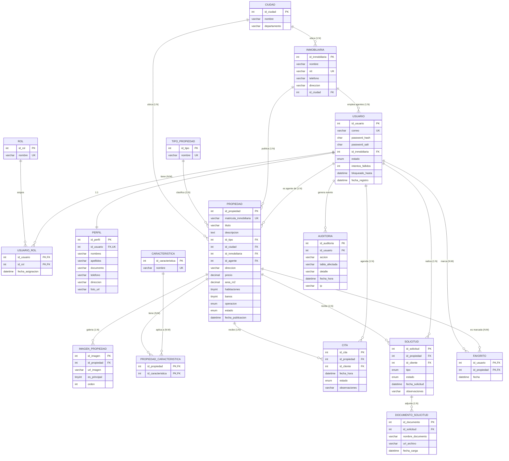

# Modelo Entidad-Relación (MER) - TerraNova Bienes Raíces

Diagrama en formato Mermaid (GitHub lo renderiza automaticamente al ver este
archivo en el repositorio). Si el docente pide una imagen o PDF suelto,
puedes abrir este bloque en https://mermaid.live y exportarlo como PNG/SVG.

## Relaciones exigidas por el enunciado y donde se materializan

| Tipo | Tablas | Como se garantiza |
|------|--------|--------------------|
| **1:1** | `usuario` &harr; `perfil` | `perfil.id_usuario` es `FOREIGN KEY` y ademas `UNIQUE`: un usuario nunca puede tener dos perfiles. |
| **1:N** | `inmobiliaria` &rarr; `propiedad`, `inmobiliaria` &rarr; `usuario` (agentes), `ciudad` &rarr; `propiedad`, `tipo_propiedad` &rarr; `propiedad`, `propiedad` &rarr; `imagen_propiedad`, `usuario` &rarr; `cita`, `usuario` &rarr; `solicitud`, `solicitud` &rarr; `documento_solicitud` | La llave foranea vive siempre en la tabla "muchos"; cada una declara `ON DELETE`/`ON UPDATE` explicito (ver `02_modelo_relacional.md`). |
| **N:M** | `usuario` &harr; `rol` via `usuario_rol`; `propiedad` &harr; `caracteristica` via `propiedad_caracteristica`; `usuario` &harr; `propiedad` via `favorito` | Las tres tablas intermedias tienen **llave primaria compuesta** por las dos llaves foraneas. `usuario_rol` ademas guarda `fecha_asignacion` como atributo propio de la relacion. |

El caso de uso real de la N:M `usuario_rol` esta en los datos de prueba: el
usuario `director@terranova.com` tiene **simultaneamente** los roles
`ADMINISTRADOR` e `INMOBILIARIA` (ver `sql/02_dml_inmobiliaria.sql`), lo que
demuestra que un usuario puede tener mas de un rol al mismo tiempo.
