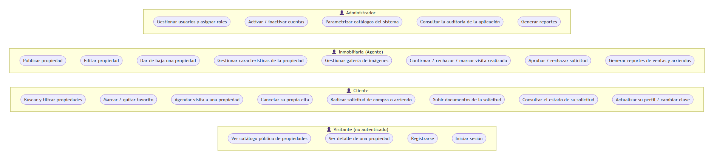
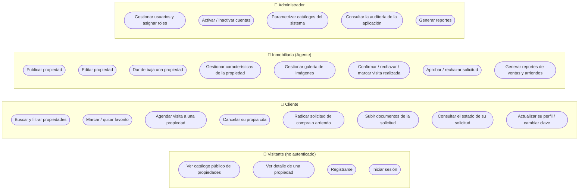

# Diagrama de casos de uso - TerraNova Bienes Raíces

Diagrama en formato Mermaid (GitHub lo renderiza automáticamente al ver este
archivo en el repositorio). La versión exportada como imagen está en
[`docs/diagramas/casos_uso.png`](diagramas/casos_uso.png).

## Notas sobre casos de uso compartidos

- **Iniciar sesión** lo hacen los cuatro roles con el mismo formulario
  (`login.jsp` → `AuthServlet`); el sistema redirige a un panel distinto
  según el rol que traiga la sesión (`panelAdmin.jsp`, `panelInmobiliaria.jsp`
  o `panelCliente.jsp`). El Visitante es el único que puede usar el sistema
  sin haber iniciado sesión.
- **Generar reportes** lo hacen tanto el Administrador como la Inmobiliaria
  (mismas 7 consultas de `reportes/reportes.jsp`); el Administrador ve el
  panorama completo y la Inmobiliaria ve el recorte de sus propias
  propiedades.
- El **Administrador tiene acceso total**: además de sus casos de uso
  propios, puede hacer cualquier operación de Cliente e Inmobiliaria (lo
  refleja `AccesoFilter.java`, cuyas reglas de `propiedades/`, `citas/` y
  `solicitudes/` incluyen explícitamente el rol `ADMINISTRADOR` junto al
  rol dueño de cada módulo).
- Los casos de uso de **Cliente** que dependen de una propiedad concreta
  (agendar visita, radicar solicitud, marcar favorito) requieren primero
  haber usado **Ver detalle de una propiedad**, heredado del Visitante.
