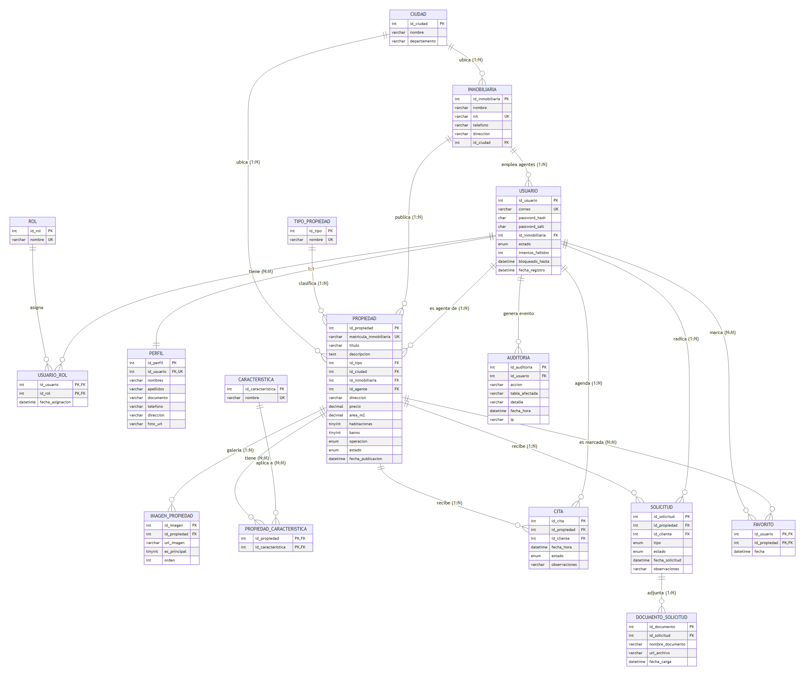
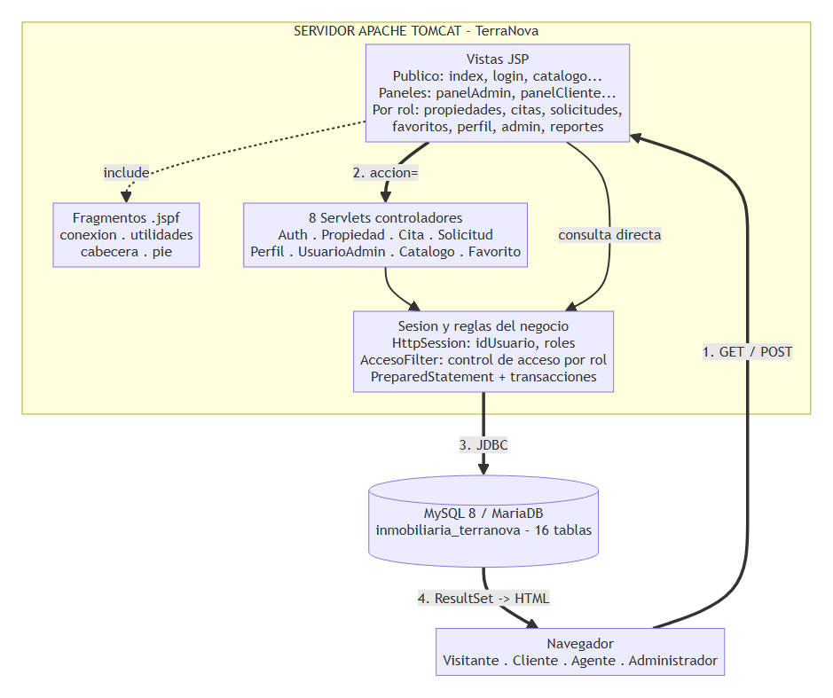

# PARCIAL PRÁCTICO — APLICACIÓN WEB EN JSP
## TerraNova Bienes Raíces — Marketplace inmobiliario multi-agencia

Versión exportada en PDF (documento único, listo para entregar):
[`MANUAL_TECNICO_TERRANOVA.pdf`](../MANUAL_TECNICO_TERRANOVA.pdf).

| Elemento | Detalle |
|---|---|
| Asignatura | Programación Java (Java EE) |
| Tipo de entrega | Parcial práctico — taller guiado paso a paso, proyecto completo |
| Arquitectura | JSP + Servlets Java (un controlador por entidad) + fragmentos reutilizables `.jspf` |
| Base de datos | MySQL / MariaDB (XAMPP) — esquema `inmobiliaria_terranova` (16 tablas) |
| Conexión | `WEB-INF/jspf/conexionInmobiliaria.jspf` (vistas) y `com.terranova.util.ConexionUtil` (Servlets), ambos con JDBC y `PreparedStatement` |
| Interfaz | Bootstrap 5.3 desde CDN, diseño responsivo, paleta morado + dorado |
| Servidor | Apache Tomcat 8.5 (paquete `javax.servlet`) |
| Archivos del proyecto | 46 archivos: 24 JSP, 4 fragmentos JSPF, 8 Servlets, 3 utilidades Java, 1 Filter, CSS, 2 JS, 2 SQL, `web.xml` |
| Estudiantes | Mariana del Pilar Forero Jiménez, Mariana Alzate Meneses |

---

## Contenido

1. Presentación del proyecto
2. Herramientas y requisitos
3. La base de datos del proyecto
4. Arquitectura de la aplicación
5. Módulo de conexión y utilidades
6. Plantilla visual
7. Control de acceso
8. Módulo de autenticación
9. Landing page
10. Catálogo público y detalle de propiedad
11. Paneles por rol
12. Módulo de propiedades
13. Módulo de citas
14. Módulo de solicitudes
15. Módulo de favoritos
16. Módulo de perfil
17. Módulo de administración
18. Módulo de reportes
19. Validaciones en el navegador
20. Configuración final del proyecto (`web.xml`)
21. Desplegar y probar la aplicación
22. Errores frecuentes y cómo resolverlos
23. Anexo A. Inventario de archivos entregados

---

## 1. Presentación del proyecto

### 1.1 Qué se construyó

TerraNova Bienes Raíces es un marketplace inmobiliario: varias agencias
("inmobiliarias") publican sus propiedades en una sola plataforma, y los
clientes buscan, agendan visitas y radican solicitudes de compra o arriendo
sin importar cuál agencia sea la dueña del inmueble. El sistema maneja
cuatro roles con permisos completamente distintos: **Visitante** (navega el
catálogo público sin cuenta), **Cliente** (busca, agenda, radica y hace
seguimiento a sus trámites), **Inmobiliaria/Agente** (publica y administra
su propio inventario) y **Administrador** (control total: usuarios, roles,
catálogos y auditoría).

### 1.2 Competencias que se practican

- Separar la aplicación en capas: vista (JSP), controlador (Servlets Java)
  y fragmentos reutilizables (`.jspf`) incluidos con la directiva `include`.
- Conectar la aplicación a MySQL con JDBC, `PreparedStatement` y el driver
  `mysql-connector-j`, evitando la inyección SQL en todas las consultas.
- Manejar transacciones (`commit`/`rollback`) cuando una operación toca
  varias tablas (registrar un usuario nuevo, reemplazar las características
  de una propiedad, reasignar los roles de un usuario).
- Controlar el acceso con sesiones HTTP, un `Filter` de servlet como única
  fuente de verdad, y ocho Servlets como controladores por entidad.
- Cifrar contraseñas con SHA-256 + salt aleatorio por usuario (nunca texto
  plano).
- Traducir los errores de las restricciones `UNIQUE` de la base de datos a
  mensajes claros para el usuario final, en vez de una excepción de Java.
- Construir una interfaz responsiva con Bootstrap 5 que se ve bien en
  computador, tableta y celular.

### 1.3 Entregables

| # | Entregable | Descripción |
|---|---|---|
| 1 | Scripts de base de datos | `01_ddl_inmobiliaria.sql` (16 tablas, llaves y restricciones) y `02_dml_inmobiliaria.sql` (datos de prueba). |
| 2 | Proyecto web | Carpeta `Parcial 1/Inmobiliaria` con los 24 JSP, los 4 fragmentos `.jspf`, el CSS y los dos JS. |
| 3 | Controladores Java | 8 Servlets + 3 clases de utilidad + el `Filter` de acceso, en `WEB-INF/classes/com/terranova`. |
| 4 | Documentación | MER, modelo relacional, diccionario de datos, consultas documentadas, diagrama de casos de uso y este manual técnico. |
| 5 | Documentación Scrum | Product backlog y planning/review/retrospective de los 3 sprints (`docs/scrum/`). Tablero de seguimiento en Trello: https://trello.com/invite/b/6aaa0aa5077ec652d3cbdcea/ATTI612380f68d1957aa0ba14a29c81e6df0DF77D29A/terranova-bienes-raices-parcial-java |
| 6 | Repositorio Git | Historial de commits descriptivo, público. |

### 1.4 Plan de trabajo por sprints

| Sprint | Enfoque | Resultado esperado |
|---|---|---|
| Sprint 1 — Cimientos y acceso | MER, modelo relacional, datos de prueba, conexión JDBC, landing page, registro e inicio de sesión con contraseñas cifradas y control de acceso por rol. | Base de datos funcionando, login con roles operativo. |
| Sprint 2 — Núcleo del negocio | CRUD de propiedades con imágenes (1:N) y características (N:M), buscador con filtros, perfil del usuario (1:1), paneles diferenciados por rol. | Catálogo navegable y agentes publicando inventario. |
| Sprint 3 — Operación y cierre | Citas, solicitudes y documentos, favoritos, reportes con consultas de agregación, refactor a Servlets, documentación final. | Aplicación completa y verificada de punta a punta. |

---

## 2. Herramientas y requisitos

| Herramienta | Versión usada | Para qué se usa |
|---|---|---|
| JDK | 17 | Compilar los Servlets y las páginas JSP. |
| Apache Tomcat | 8.5.x (paquete `javax.servlet`) | Servidor de aplicaciones. |
| MySQL / MariaDB | 8.x / 10.x (XAMPP) | Motor de la base de datos. |
| Driver JDBC | `mysql-connector-j-9.7.0.jar` | Permite que Java hable con MySQL, va en `WEB-INF/lib`. |
| IDE | Visual Studio Code | Editar el proyecto y desplegar en Tomcat. |
| Bootstrap | 5.3.3 desde CDN | Estilos y componentes de la interfaz. |
| Bootstrap Icons | 1.11.3 desde CDN | Iconografía de toda la aplicación. |
| Navegador | Chrome / Edge | Probar la aplicación. |

**Importante:** este Tomcat 8.5 con JDK 17 tiene un comportamiento particular: cualquier
página JSP que referencie la clase `System` (por ejemplo `System.currentTimeMillis()`)
falla al compilar con "System cannot be resolved". Por eso, en toda la aplicación las
fechas relativas se calculan con `new java.util.Date().getTime()` en vez de `System.*`
(ver `tiempoRelativo()` en `admin/auditoria.jsp`).

---

## 3. La base de datos del proyecto

La aplicación trabaja sobre el esquema `inmobiliaria_terranova`, con **16 tablas**.

| Tabla | Qué guarda | Módulo que la usa |
|---|---|---|
| `rol` | Los cuatro roles: ADMINISTRADOR, INMOBILIARIA, CLIENTE (y la fila técnica para futuros roles). | Autenticación, administración de usuarios. |
| `usuario` | Credenciales (correo, hash+salt), estado de la cuenta y control de intentos fallidos. | Autenticación, control de acceso. |
| `usuario_rol` | Relación N:M entre `usuario` y `rol` (un usuario puede tener más de un rol). | Autenticación, administración. |
| `perfil` | Datos personales del usuario (nombres, documento, teléfono, dirección, foto) — relación 1:1 con `usuario`. | Perfil, panel, todas las vistas que muestran el nombre del usuario. |
| `inmobiliaria` | Las agencias aliadas (nombre, NIT, teléfono, ciudad). | Propiedades, panel de agente, reportes. |
| `ciudad` | Ciudades donde hay operación (Bucaramanga, Floridablanca, Girón, etc.). | Catálogo, propiedades, filtros. |
| `tipo_propiedad` | Tipos de inmueble (casa, apartamento, local, oficina, lote, etc.). | Catálogo, propiedades, filtros. |
| `caracteristica` | Catálogo de características (piscina, parqueadero, ascensor, balcón...). | Ficha de propiedad, formulario de características. |
| `propiedad` | El inmueble: matrícula, título, precio, tipo, ciudad, agente, estado. | Catálogo, panel de agente, reportes, citas, solicitudes. |
| `imagen_propiedad` | Galería de fotos de cada propiedad — relación 1:N con `propiedad`. | Ficha de detalle, galería del agente. |
| `propiedad_caracteristica` | Relación N:M entre `propiedad` y `caracteristica`. | Ficha de detalle, formulario de características. |
| `cita` | Visitas agendadas por un cliente a una propiedad. | Módulo de citas. |
| `solicitud` | Trámite de compra o arriendo radicado por un cliente. | Módulo de solicitudes. |
| `documento_solicitud` | Documentos adjuntos a una solicitud — relación 1:N. | Subir documentos. |
| `favorito` | Relación N:M entre `usuario` (cliente) y `propiedad`. | Favoritos. |
| `auditoria` | Bitácora de eventos de todo el sistema (quién hizo qué y cuándo). | Auditoría del administrador. |

### 3.1 Las cuatro restricciones UNIQUE que se notan en la aplicación

| Restricción | Qué impide | Dónde se nota en el código |
|---|---|---|
| `usuario.correo` | Dos cuentas con el mismo correo. | `AuthServlet` captura `SQLIntegrityConstraintViolationException` y redirige con `error=correo_duplicado`; `registro.jsp` muestra "El correo ya se encuentra registrado". |
| `propiedad.matricula_inmobiliaria` | Dos propiedades con la misma matrícula. | `PropiedadServlet.guardar()` captura la excepción y redirige con `error=matricula_duplicada`. |
| `perfil.id_usuario` (UNIQUE + FK) | Que un usuario tenga dos perfiles — materializa la relación 1:1. | Se garantiza a nivel de esquema; nunca se ejecuta un `INSERT` doble en `perfil`. |
| `usuario_rol(id_usuario, id_rol)` (PK compuesta) | Que un usuario tenga el mismo rol repetido — materializa la N:M. | `UsuarioAdminServlet.guardarRol()` primero hace `DELETE` de los roles actuales y luego inserta los nuevos, evitando el choque. |
| `cita(id_propiedad, fecha_hora)` (sugerida) | Dos visitas a la misma propiedad en el mismo horario. | `CitaServlet.guardarCita()` captura la excepción y redirige con `error=horario_ocupado`. |
| `admin/guardarCatalogo` (ciudad/tipo/característica) | Un valor de catálogo duplicado. | `CatalogoServlet` captura la excepción y redirige con `error=duplicado`; `admin/catalogos.jsp` muestra "Ese nombre ya existe en el catálogo". |

### 3.2 Modelo entidad-relación

El diagrama completo tiene las 16 entidades, todos los atributos, las llaves
PK/FK/UK y las cardinalidades de cada relación:



También está disponible como diagrama Mermaid editable en
[`docs/01_MER.md`](01_MER.md) y como archivo de imagen suelto en
[`docs/diagramas/mer.png`](diagramas/mer.png). El modelo relacional normalizado a
3FN, con la justificación de cada `ON DELETE`/`ON UPDATE`, está en
[`docs/02_modelo_relacional.md`](02_modelo_relacional.md) y exportado en PDF en
[`docs/diagramas/modelo_relacional.pdf`](diagramas/modelo_relacional.pdf).

---

## 4. Arquitectura de la aplicación

El siguiente diagrama resume cómo viaja una petición desde el navegador
hasta la base de datos y de vuelta:



### 4.1 Qué es un archivo `.jspf` y por qué se usa

Un `.jspf` (JSP Fragment) es un pedazo de página que no se ejecuta por sí
solo: se pega dentro de otra página en el momento de compilar, mediante la
directiva de inclusión estática `<%@ include file="..." %>`. Como la unión
ocurre antes de compilar, la página final es una sola clase Java, y por
eso los métodos declarados en el fragmento (como `abrirConexion()` o
`escapar()`) quedan disponibles directamente en cualquier página que lo
incluya.

### 4.2 Por qué hay Servlets además de JSP

A diferencia de un proyecto "Modelo 1" puro (donde toda la lógica —vista y
control— vive en archivos `.jsp`), TerraNova separa el **control** en 8
clases Java (`Servlet`) registradas en `web.xml`, una por entidad del
negocio: `AuthServlet`, `PerfilServlet`, `UsuarioAdminServlet`,
`PropiedadServlet`, `CitaServlet`, `SolicitudServlet`, `CatalogoServlet` y
`FavoritoServlet`. Cada uno se mapea a la **misma ruta `.jsp`** que antes
usaban los formularios (por ejemplo `propiedades/guardar.jsp` sigue siendo
la URL, pero ahora la responde `PropiedadServlet`), así que ningún
`action=""` ni `href=""` del resto del proyecto tuvo que cambiar. Esto
cumple de forma literal el requisito de "un controlador por entidad" del
enunciado, sin dejar de reutilizar toda la capa de vista en JSP.

Como un Servlet **no puede** incluir un `.jspf` (esa directiva solo existe
en JSP), la lógica de conexión y de utilidades se duplicó en dos clases
Java equivalentes, usadas solo por los Servlets: `ConexionUtil` y
`Utilidades`. Las páginas JSP de solo-vista siguen usando los `.jspf`
originales sin ningún cambio.

### 4.3 Archivos del proyecto

| Archivo | Rol | Qué hace |
|---|---|---|
| `index.jsp` | Vista | Landing page pública con buscador rápido y propiedades destacadas. |
| `login.jsp` | Vista | Formulario de acceso + tarjetas de acceso rápido de prueba. |
| `registro.jsp` | Vista | Formulario de registro de cliente. |
| `accesoDenegado.jsp` | Vista | Página a la que redirige el `Filter` cuando el rol no alcanza. |
| `catalogo.jsp` | Vista | Catálogo público con filtros (ciudad, tipo, operación, precio, texto). |
| `detallePropiedad.jsp` | Vista | Ficha de una propiedad: galería, características, datos de contacto. |
| `panel/panelAdmin.jsp` | Vista | Panel del administrador con KPIs y accesos directos. |
| `panel/panelCliente.jsp` | Vista | Panel del cliente con KPIs y accesos directos. |
| `panel/panelInmobiliaria.jsp` | Vista | Panel del agente con KPIs y accesos directos. |
| `propiedades/listar.jsp` | Vista | Listado de propiedades del agente (o de todas, si es admin). |
| `propiedades/formulario.jsp` | Vista | Formulario de creación/edición de propiedad. |
| `propiedades/caracteristicas.jsp` | Vista | Checklist de características de una propiedad. |
| `propiedades/imagenes.jsp` | Vista | Galería de imágenes de una propiedad. |
| `citas/agendar.jsp` | Vista | Formulario para agendar una visita. |
| `citas/listar.jsp` | Vista | Listado de citas (con acciones según el rol). |
| `solicitudes/radicar.jsp` | Vista | Formulario para radicar una solicitud de compra/arriendo. |
| `solicitudes/listar.jsp` | Vista | Listado de solicitudes (con acciones según el rol). |
| `solicitudes/subirDocumentoVista.jsp` | Vista | Lista de documentos + formulario de carga (a la que reenvía `SolicitudServlet`). |
| `favoritos/listar.jsp` | Vista | Propiedades marcadas como favoritas por el cliente. |
| `perfil/verPerfil.jsp` | Vista | Datos personales + formulario de cambio de clave. |
| `admin/usuarios.jsp` | Vista | Listado de usuarios con asignación de roles y estado. |
| `admin/catalogos.jsp` | Vista | Administración de ciudades, tipos y características. |
| `admin/auditoria.jsp` | Vista | Bitácora de actividad con KPIs y filtros. |
| `reportes/reportes.jsp` | Vista | Las 7 consultas SQL documentadas, con KPIs y gráficas de barras en CSS puro. |
| `WEB-INF/jspf/conexionInmobiliaria.jspf` | Fragmento | Conexión JDBC centralizada (para las vistas). |
| `WEB-INF/jspf/utilidadesInmobiliaria.jspf` | Fragmento | Formato de moneda, escape HTML, `tieneRol()`, auditoría (para las vistas). |
| `WEB-INF/jspf/cabeceraInmobiliaria.jspf` | Fragmento | HTML inicial y barra de navegación dinámica por rol. |
| `WEB-INF/jspf/pieInmobiliaria.jspf` | Fragmento | Footer y carga de JavaScript. |
| `WEB-INF/classes/.../filter/AccesoFilter.java` | Filter | Única fuente de verdad del control de acceso por rol. |
| `WEB-INF/classes/.../util/ConexionUtil.java` | Utilidad | Conexión JDBC centralizada (para los Servlets). |
| `WEB-INF/classes/.../util/Utilidades.java` | Utilidad | `tieneRol()`, `estaAutenticado()`, auditoría (para los Servlets). |
| `WEB-INF/classes/.../util/PasswordUtil.java` | Utilidad | Hash SHA-256 + salt de contraseñas. |
| `WEB-INF/classes/.../servlet/AuthServlet.java` | Controlador | Login, registro y logout — entidad Usuario/Sesión. |
| `WEB-INF/classes/.../servlet/PerfilServlet.java` | Controlador | Actualizar perfil y cambiar clave — entidad Perfil. |
| `WEB-INF/classes/.../servlet/UsuarioAdminServlet.java` | Controlador | Asignar roles y activar/inactivar cuentas — entidad Usuario (admin). |
| `WEB-INF/classes/.../servlet/PropiedadServlet.java` | Controlador | CRUD de propiedad, imágenes y características. |
| `WEB-INF/classes/.../servlet/CitaServlet.java` | Controlador | Agendar y cambiar estado de citas. |
| `WEB-INF/classes/.../servlet/SolicitudServlet.java` | Controlador | Radicar, subir documentos y cambiar estado de solicitudes. |
| `WEB-INF/classes/.../servlet/CatalogoServlet.java` | Controlador | Agregar valores a los catálogos (ciudad, tipo, característica). |
| `WEB-INF/classes/.../servlet/FavoritoServlet.java` | Controlador | Alternar favorito (AJAX). |
| `css/estilo.css` | Estilos | Paleta morado+dorado, tarjetas, KPIs, reportes, responsivo. |
| `js/validaciones.js` | JavaScript | Validación de formularios en el navegador (complementa la del servidor). |
| `js/favoritos.js` | JavaScript | Alternar favorito por AJAX sin recargar la página. |
| `WEB-INF/web.xml` | Configuración | Filtro, Servlets, codificación, sesión. |

### 4.4 Estructura de carpetas del proyecto

```
Inmobiliaria/                          <-- raiz publica de la aplicacion
├── index.jsp
├── login.jsp
├── registro.jsp
├── accesoDenegado.jsp
├── catalogo.jsp
├── detallePropiedad.jsp
├── MANUAL_TECNICO_TERRANOVA.pdf
├── panel/
│   ├── panelAdmin.jsp
│   ├── panelCliente.jsp
│   └── panelInmobiliaria.jsp
├── propiedades/
│   ├── listar.jsp
│   ├── formulario.jsp
│   ├── caracteristicas.jsp
│   └── imagenes.jsp
├── citas/
│   ├── agendar.jsp
│   └── listar.jsp
├── solicitudes/
│   ├── radicar.jsp
│   ├── listar.jsp
│   └── subirDocumentoVista.jsp
├── favoritos/
│   └── listar.jsp
├── perfil/
│   └── verPerfil.jsp
├── admin/
│   ├── usuarios.jsp
│   ├── catalogos.jsp
│   └── auditoria.jsp
├── reportes/
│   └── reportes.jsp
├── css/
│   └── estilo.css
├── js/
│   ├── validaciones.js
│   └── favoritos.js
├── sql/
│   ├── 01_ddl_inmobiliaria.sql
│   └── 02_dml_inmobiliaria.sql
├── docs/
│   ├── 01_MER.md
│   ├── 02_modelo_relacional.md
│   ├── 03_diccionario_datos.md
│   ├── 04_consultas.md
│   ├── 05_casos_uso.md
│   ├── 06_manual_tecnico.md
│   ├── diagramas/
│   │   ├── mer.png
│   │   ├── arquitectura.png
│   │   ├── casos_uso.png
│   │   └── modelo_relacional.pdf
│   └── scrum/
│       ├── 00_product_backlog.md
│       └── sprint{1,2,3}_{planning,review,retrospective}.md
└── WEB-INF/                           <-- invisible desde el navegador
    ├── web.xml
    ├── lib/
    │   └── mysql-connector-j-9.7.0.jar
    ├── jspf/
    │   ├── conexionInmobiliaria.jspf
    │   ├── utilidadesInmobiliaria.jspf
    │   ├── cabeceraInmobiliaria.jspf
    │   └── pieInmobiliaria.jspf
    └── classes/com/terranova/
        ├── filter/AccesoFilter.java
        ├── util/ConexionUtil.java
        ├── util/Utilidades.java
        ├── util/PasswordUtil.java
        └── servlet/
            ├── AuthServlet.java
            ├── PerfilServlet.java
            ├── UsuarioAdminServlet.java
            ├── PropiedadServlet.java
            ├── CitaServlet.java
            ├── SolicitudServlet.java
            ├── CatalogoServlet.java
            └── FavoritoServlet.java
```

| Carpeta | Para qué sirve | ¿Visible desde el navegador? |
|---|---|---|
| raíz (`Inmobiliaria/`) | Páginas que el usuario abre directamente. | Sí |
| `admin`, `citas`, `solicitudes`, `propiedades`, `favoritos`, `perfil`, `panel`, `reportes` | Un módulo por funcionalidad; facilita el control de acceso por prefijo en `AccesoFilter`. | Sí |
| `css`, `js` | Estilos y JavaScript propios. | Sí |
| `docs` | Toda la documentación del parcial (MER, modelo relacional, consultas, Scrum, este manual). | Sí (son archivos, pero no forman parte de la aplicación en ejecución) |
| `WEB-INF` | Configuración, fragmentos y clases Java. | No — nadie puede abrir estos archivos escribiendo su URL. |
| `WEB-INF/lib` | Librerías `.jar` que usa la aplicación. | No |
| `WEB-INF/jspf` | Fragmentos reutilizables. | No |
| `WEB-INF/classes` | Los 8 Servlets, el Filter y las utilidades ya compilados. | No |

### 4.5 Recorrido de una petición

Cuando un agente publica una propiedad nueva, ocurre lo siguiente en orden:

1. El navegador envía un `POST` a `propiedades/guardar.jsp` con los datos del formulario.
2. Tomcat, por el `<servlet-mapping>` de `web.xml`, entrega la petición a `PropiedadServlet.doPost()`.
3. `AccesoFilter` ya validó, antes de llegar aquí, que hay sesión activa y que el rol es `INMOBILIARIA` o `ADMINISTRADOR` (la regla de prefijo `propiedades/`).
4. El Servlet valida los campos, calcula `id_inmobiliaria` a partir del agente, y ejecuta el `INSERT` (o `UPDATE`) con `PreparedStatement`.
5. Si la matrícula ya existe, MySQL lanza `SQLIntegrityConstraintViolationException`; el Servlet la captura y redirige con `error=matricula_duplicada`.
6. Si todo sale bien, llama a `Utilidades.registrarAuditoria(...)` y redirige (`sendRedirect`) a `propiedades/listar.jsp?msg=guardado`, de modo que al recargar el navegador no se repita el `INSERT`.

---

## 5. Módulo de conexión y utilidades

### 5.1 `WEB-INF/jspf/conexionInmobiliaria.jspf`

```jsp
<%@ page import="java.sql.*" %>
<%!
    public static final String DB_DRIVER = "com.mysql.cj.jdbc.Driver";
    public static final String DB_URL =
        "jdbc:mysql://localhost:3306/inmobiliaria_terranova"
        + "?useSSL=false&allowPublicKeyRetrieval=true"
        + "&serverTimezone=America/Bogota&characterEncoding=UTF-8";
    public static final String DB_USUARIO = "root";
    public static final String DB_CLAVE   = "";

    public Connection abrirConexion() throws SQLException {
        try {
            Class.forName(DB_DRIVER);
        } catch (ClassNotFoundException ex) {
            throw new SQLException(
                "No se encontro el driver de MySQL. Agregue mysql-connector-j-x.x.x.jar "
                + "a la carpeta WEB-INF/lib del proyecto.", ex);
        }
        return DriverManager.getConnection(DB_URL, DB_USUARIO, DB_CLAVE);
    }

    public void cerrar(AutoCloseable... recursos) {
        for (int i = recursos.length - 1; i >= 0; i--) {
            if (recursos[i] != null) {
                try { recursos[i].close(); } catch (Exception ignorada) { }
            }
        }
    }

    public void deshacer(Connection con) {
        if (con != null) {
            try { con.rollback(); } catch (SQLException ignorada) { }
        }
    }
%>
```

| Elemento | Explicación |
|---|---|
| `useSSL=false` | Evita la advertencia de conexión no cifrada en un entorno local. |
| `allowPublicKeyRetrieval=true` | Necesario con la autenticación por defecto de MySQL 8. |
| `serverTimezone=America/Bogota` | Sin este parámetro MySQL 8 puede lanzar un error de zona horaria. |
| `characterEncoding=UTF-8` | Permite guardar tildes y la letra ñ correctamente. |
| `cerrar(AutoCloseable...)` | Cierra en orden inverso cualquier cantidad de recursos JDBC, ignorando errores de cierre, para no repetir bloques `finally` enormes. |
| `deshacer(Connection)` | Ejecuta `rollback()` de forma segura cuando una transacción falla. |

### 5.2 `WEB-INF/classes/com/terranova/util/ConexionUtil.java`

Réplica exacta de la lógica anterior como clase Java estática, para que los
8 Servlets puedan usarla (un `.jspf` no se puede incluir desde un `.java`).

```java
package com.terranova.util;

import java.sql.Connection;
import java.sql.DriverManager;
import java.sql.SQLException;

public final class ConexionUtil {

    private ConexionUtil() { }

    public static final String DB_DRIVER = "com.mysql.cj.jdbc.Driver";
    public static final String DB_URL =
        "jdbc:mysql://localhost:3306/inmobiliaria_terranova"
        + "?useSSL=false&allowPublicKeyRetrieval=true"
        + "&serverTimezone=America/Bogota&characterEncoding=UTF-8";
    public static final String DB_USUARIO = "root";
    public static final String DB_CLAVE   = "";

    public static Connection abrirConexion() throws SQLException {
        try {
            Class.forName(DB_DRIVER);
        } catch (ClassNotFoundException ex) {
            throw new SQLException("No se encontro el driver de MySQL.", ex);
        }
        return DriverManager.getConnection(DB_URL, DB_USUARIO, DB_CLAVE);
    }

    public static void cerrar(AutoCloseable... recursos) {
        for (int i = recursos.length - 1; i >= 0; i--) {
            if (recursos[i] != null) {
                try { recursos[i].close(); } catch (Exception ignorada) { }
            }
        }
    }

    public static void deshacer(Connection con) {
        if (con != null) {
            try { con.rollback(); } catch (SQLException ignorada) { }
        }
    }
}
```

### 5.3 `WEB-INF/jspf/utilidadesInmobiliaria.jspf`

```jsp
<%@ page import="java.sql.*, java.util.*, java.text.NumberFormat, java.util.Locale" %>
<%!
    public String formatoCOP(double valor) {
        NumberFormat nf = NumberFormat.getCurrencyInstance(new Locale("es", "CO"));
        nf.setMaximumFractionDigits(0);
        return nf.format(valor);
    }

    public String escapar(String texto) {
        if (texto == null) return "";
        return texto.replace("&", "&amp;")
                     .replace("<", "&lt;")
                     .replace(">", "&gt;")
                     .replace("\"", "&quot;")
                     .replace("'", "&#39;");
    }

    public boolean tieneRol(HttpSession sesion, String... rolesPermitidos) {
        if (sesion == null) return false;
        Object rolesObj = sesion.getAttribute("roles");
        if (!(rolesObj instanceof Set)) return false;
        Set<String> roles = (Set<String>) rolesObj;
        for (String r : rolesPermitidos) {
            if (roles.contains(r)) return true;
        }
        return false;
    }

    public boolean estaAutenticado(HttpSession sesion) {
        return sesion != null && sesion.getAttribute("idUsuario") != null;
    }

    public void registrarAuditoria(Connection con, Integer idUsuario, String accion,
                                    String tabla, String detalle, String ip) {
        String sql = "INSERT INTO auditoria (id_usuario, accion, tabla_afectada, detalle, ip) VALUES (?,?,?,?,?)";
        try (PreparedStatement ps = con.prepareStatement(sql)) {
            if (idUsuario != null) ps.setInt(1, idUsuario); else ps.setNull(1, Types.INTEGER);
            ps.setString(2, accion);
            ps.setString(3, tabla);
            ps.setString(4, detalle);
            ps.setString(5, ip);
            ps.executeUpdate();
        } catch (SQLException ignorada) { }
    }
%>
```

| Método | Uso en la aplicación |
|---|---|
| `formatoCOP(valor)` | Convierte `420000000` en "$ 420.000.000". Se usa en catálogo, detalle, reportes y paneles. |
| `escapar(texto)` | Reemplaza `< > & " '` por sus entidades HTML antes de imprimir cualquier dato escrito por el usuario (título, descripción, observaciones), evitando XSS. |
| `tieneRol(sesion, roles...)` | Solo para decidir qué botones/menús mostrar. **No es** el control de acceso real — eso lo hace `AccesoFilter` en el servidor. |
| `estaAutenticado(sesion)` | Usado en `detallePropiedad.jsp` para decidir si mostrar los datos de contacto completos del agente (regla del Visitante). |
| `registrarAuditoria(...)` | Inserta un evento en `auditoria`. Nunca lanza excepción hacia afuera: una falla al auditar jamás debe tumbar la operación principal. |

### 5.4 `WEB-INF/classes/com/terranova/util/Utilidades.java`

Réplica en Java de `tieneRol`, `estaAutenticado` y `registrarAuditoria`
para uso exclusivo de los Servlets (misma lógica, ahora como métodos
estáticos):

```java
package com.terranova.util;

import java.sql.Connection;
import java.sql.PreparedStatement;
import java.sql.SQLException;
import java.sql.Types;
import java.util.Set;
import javax.servlet.http.HttpSession;

public final class Utilidades {

    private Utilidades() { }

    public static boolean tieneRol(HttpSession sesion, String... rolesPermitidos) {
        if (sesion == null) return false;
        @SuppressWarnings("unchecked")
        Set<String> roles = (Set<String>) sesion.getAttribute("roles");
        if (roles == null) return false;
        for (String r : rolesPermitidos) {
            if (roles.contains(r)) return true;
        }
        return false;
    }

    public static boolean estaAutenticado(HttpSession sesion) {
        return sesion != null && sesion.getAttribute("idUsuario") != null;
    }

    public static void registrarAuditoria(Connection con, Integer idUsuario, String accion,
                                           String tabla, String detalle, String ip) {
        try (PreparedStatement ps = con.prepareStatement(
                "INSERT INTO auditoria (id_usuario, accion, tabla_afectada, detalle, ip) VALUES (?,?,?,?,?)")) {
            if (idUsuario != null) ps.setInt(1, idUsuario); else ps.setNull(1, Types.INTEGER);
            ps.setString(2, accion);
            ps.setString(3, tabla);
            ps.setString(4, detalle);
            ps.setString(5, ip);
            ps.executeUpdate();
        } catch (SQLException ignorada) { }
    }
}
```

### 5.5 `WEB-INF/classes/com/terranova/util/PasswordUtil.java`

```java
package com.terranova.util;

import java.security.MessageDigest;
import java.security.NoSuchAlgorithmException;
import java.security.SecureRandom;

public final class PasswordUtil {

    private static final SecureRandom RNG = new SecureRandom();

    private PasswordUtil() { }

    public static String generarSalt() {
        byte[] bytes = new byte[16];
        RNG.nextBytes(bytes);
        return aHex(bytes);
    }

    public static String calcularHash(String salt, String claveTextoPlano) {
        try {
            MessageDigest md = MessageDigest.getInstance("SHA-256");
            md.update((salt + ":" + claveTextoPlano).getBytes("UTF-8"));
            return aHex(md.digest());
        } catch (NoSuchAlgorithmException | java.io.UnsupportedEncodingException ex) {
            throw new RuntimeException("No se pudo calcular el hash de la clave", ex);
        }
    }

    public static boolean verificar(String claveTextoPlano, String salt, String hashEsperado) {
        String calculado = calcularHash(salt, claveTextoPlano);
        return constantTimeEquals(calculado, hashEsperado);
    }

    private static boolean constantTimeEquals(String a, String b) {
        if (a == null || b == null || a.length() != b.length()) return false;
        int resultado = 0;
        for (int i = 0; i < a.length(); i++) {
            resultado |= a.charAt(i) ^ b.charAt(i);
        }
        return resultado == 0;
    }

    private static String aHex(byte[] datos) {
        StringBuilder sb = new StringBuilder(datos.length * 2);
        for (byte b : datos) {
            sb.append(Character.forDigit((b >> 4) & 0xF, 16));
            sb.append(Character.forDigit(b & 0xF, 16));
        }
        return sb.toString();
    }
}
```

| Elemento | Explicación |
|---|---|
| `generarSalt()` | 16 bytes aleatorios por usuario, en hexadecimal. Dos usuarios con la misma clave nunca producen el mismo hash. |
| `calcularHash(salt, clave)` | `SHA-256(salt + ":" + clave)`. La clave en texto plano nunca se guarda ni viaja después del `POST` inicial. |
| `verificar(...)` | Recalcula el hash y lo compara **en tiempo constante** (`constantTimeEquals`) para no filtrar por temporización cuánto del hash coincide — mitiga ataques de timing. |

---

## 6. Plantilla visual

### 6.1 `WEB-INF/jspf/cabeceraInmobiliaria.jspf`

Encabezado HTML + barra de navegación. La página que lo incluye debe haber
definido antes `ctx` y `tituloPagina`. El menú se arma dinámicamente según
el rol de la sesión (`tieneRol(session, "...")`), pero como dice el propio
comentario del archivo: *"este fragmento solo decide qué MOSTRAR; el
control de acceso real está en `AccesoFilter`"*.

```jsp
<%--
    cabeceraInmobiliaria.jspf - Encabezado HTML + barra de navegacion Bootstrap 5
    del proyecto TerraNova Bienes Raíces.
    La página debe definir antes las variables tituloPagina y ctx.
    Este fragmento solo decide que MOSTRAR; el control de acceso real
    esta en com.terranova.filter.AccesoFilter.
--%>
<%
    boolean logueado = estaAutenticado(session);
    String nombreSesion = logueado ? (String) session.getAttribute("nombreCompleto") : null;
    @SuppressWarnings("unchecked")
    java.util.Set<String> rolesSesion = logueado
        ? (java.util.Set<String>) session.getAttribute("roles") : java.util.Collections.<String>emptySet();
%>
<!DOCTYPE html>
<html lang="es">
<head>
    <meta charset="UTF-8">
    <meta name="viewport" content="width=device-width, initial-scale=1">
    <title><%= tituloPagina %> | TerraNova Bienes Raíces</title>

    <link href="https://cdn.jsdelivr.net/npm/bootstrap@5.3.3/dist/css/bootstrap.min.css"
          rel="stylesheet">
    <link href="https://cdn.jsdelivr.net/npm/bootstrap-icons@1.11.3/font/bootstrap-icons.css"
          rel="stylesheet">
    <link rel="preconnect" href="https://fonts.googleapis.com">
    <link href="https://fonts.googleapis.com/css2?family=Inter:wght@400;500;600&family=Poppins:wght@600;700&display=swap"
          rel="stylesheet">
    <link href="<%= ctx %>/css/estilo.css" rel="stylesheet">
</head>
<body data-ctx="<%= ctx %>">
<nav class="navbar navbar-expand-lg navbar-dark shadow-sm" style="background-color:var(--tn-oscuro);">
  <div class="container">
    <a class="navbar-brand fw-bold" href="<%= ctx %>/index.jsp">
        <i class="bi bi-building text-warning"></i> TerraNova
    </a>
    <button class="navbar-toggler" type="button" data-bs-toggle="collapse"
            data-bs-target="#menu">
        <span class="navbar-toggler-icon"></span>
    </button>

    <div class="collapse navbar-collapse" id="menu">
      <ul class="navbar-nav me-auto">
        <li class="nav-item">
          <a class="nav-link" href="<%= ctx %>/index.jsp">
            <i class="bi bi-house"></i> Inicio</a></li>
        <li class="nav-item">
          <a class="nav-link" href="<%= ctx %>/catalogo.jsp">
            <i class="bi bi-search"></i> Catalogo</a></li>

        <% if (tieneRol(session, "CLIENTE")) { %>
        <li class="nav-item">
          <a class="nav-link" href="<%= ctx %>/panel/panelCliente.jsp">
            <i class="bi bi-speedometer2"></i> Mi panel</a></li>
        <li class="nav-item">
          <a class="nav-link" href="<%= ctx %>/favoritos/listar.jsp">
            <i class="bi bi-heart"></i> Favoritos</a></li>
        <li class="nav-item">
          <a class="nav-link" href="<%= ctx %>/solicitudes/listar.jsp">
            <i class="bi bi-file-earmark-text"></i> Mis solicitudes</a></li>
        <% } %>

        <% if (tieneRol(session, "INMOBILIARIA")) { %>
        <li class="nav-item">
          <a class="nav-link" href="<%= ctx %>/panel/panelInmobiliaria.jsp">
            <i class="bi bi-speedometer2"></i> Mi panel</a></li>
        <li class="nav-item">
          <a class="nav-link" href="<%= ctx %>/propiedades/listar.jsp">
            <i class="bi bi-houses"></i> Mis propiedades</a></li>
        <li class="nav-item">
          <a class="nav-link" href="<%= ctx %>/citas/listar.jsp">
            <i class="bi bi-calendar-check"></i> Citas</a></li>
        <li class="nav-item">
          <a class="nav-link" href="<%= ctx %>/solicitudes/listar.jsp">
            <i class="bi bi-file-earmark-text"></i> Solicitudes</a></li>
        <li class="nav-item">
          <a class="nav-link" href="<%= ctx %>/reportes/reportes.jsp">
            <i class="bi bi-bar-chart"></i> Reportes</a></li>
        <% } %>

        <% if (tieneRol(session, "ADMINISTRADOR")) { %>
        <li class="nav-item">
          <a class="nav-link" href="<%= ctx %>/panel/panelAdmin.jsp">
            <i class="bi bi-speedometer2"></i> Panel admin</a></li>
        <li class="nav-item">
          <a class="nav-link" href="<%= ctx %>/admin/usuarios.jsp">
            <i class="bi bi-people"></i> Usuarios</a></li>
        <li class="nav-item">
          <a class="nav-link" href="<%= ctx %>/admin/catalogos.jsp">
            <i class="bi bi-tags"></i> Catálogos</a></li>
        <li class="nav-item">
          <a class="nav-link" href="<%= ctx %>/admin/auditoria.jsp">
            <i class="bi bi-shield-check"></i> Auditoría</a></li>
        <li class="nav-item">
          <a class="nav-link" href="<%= ctx %>/reportes/reportes.jsp">
            <i class="bi bi-bar-chart"></i> Reportes</a></li>
        <% } %>
      </ul>

      <% if (logueado) { %>
        <span class="navbar-text text-white me-3">
          <i class="bi bi-person-circle"></i> <%= escapar(nombreSesion) %>
          <% for (String r : rolesSesion) { %>
            <span class="badge text-bg-warning text-dark ms-1"><%= r %></span>
          <% } %>
        </span>
        <a class="btn btn-outline-light btn-sm" href="<%= ctx %>/logout.jsp">
          <i class="bi bi-box-arrow-right"></i> Salir</a>
      <% } else { %>
        <a class="btn btn-outline-light btn-sm me-2" href="<%= ctx %>/login.jsp">
          <i class="bi bi-box-arrow-in-right"></i> Ingresar</a>
        <a class="btn btn-warning btn-sm text-dark fw-semibold" href="<%= ctx %>/registro.jsp">
          <i class="bi bi-person-plus"></i> Registrarme</a>
      <% } %>
    </div>
  </div>
</nav>

<main class="container my-4">
```

| Elemento | Explicación |
|---|---|
| `data-ctx="<%= ctx %>"` en el `<body>` | Guarda la ruta base para que `favoritos.js` pueda construir la URL del `fetch()` sin repetir el context path a mano. |
| Bloques `<% if (tieneRol(session, "...")) { %>` | Cada rol ve solo sus propios enlaces (Mi panel, Mis propiedades, Auditoría, etc.). |
| `<%= escapar(nombreSesion) %>` | El nombre del usuario logueado se escapa antes de imprimirlo (defensa en profundidad contra XSS aunque venga de un campo ya validado al registrarse). |

### 6.2 `WEB-INF/jspf/pieInmobiliaria.jspf`

Cierra `<main>`, imprime el footer con información de contacto y tipos de
inmueble, y carga los dos scripts propios **al final del documento**
(`validaciones.js` y `favoritos.js`), después del bundle de Bootstrap, para
que el DOM ya exista cuando se ejecutan.

```jsp
<%-- pieInmobiliaria.jspf - Cierre de la página, footer y carga del JavaScript de Bootstrap. --%>
</main>

<footer class="footer-terranova mt-5 pt-5 pb-3">
    <div class="container">
        <div class="row g-4">
            <div class="col-md-4">
                <h6><i class="bi bi-building text-warning"></i> TerraNova Bienes Raíces</h6>
                <p class="small mb-0">Marketplace inmobiliario que reúne propiedades en venta y
                    arriendo de varias inmobiliarias aliadas del área metropolitana de
                    Bucaramanga.</p>
            </div>
            <div class="col-md-2">
                <h6>Explorar</h6>
                <ul class="list-unstyled small">
                    <li><a href="<%= ctx %>/index.jsp">Inicio</a></li>
                    <li><a href="<%= ctx %>/catalogo.jsp">Catalogo</a></li>
                    <li><a href="<%= ctx %>/registro.jsp">Crear cuenta</a></li>
                    <li><a href="<%= ctx %>/login.jsp">Ingresar</a></li>
                </ul>
            </div>
            <div class="col-md-3">
                <h6>Tipos de inmueble</h6>
                <ul class="list-unstyled small">
                    <li><i class="bi bi-house-door"></i> Casas y apartamentos</li>
                    <li><i class="bi bi-shop"></i> Locales y oficinas</li>
                    <li><i class="bi bi-tree"></i> Fincas y lotes</li>
                    <li><i class="bi bi-building-gear"></i> Bodegas</li>
                </ul>
            </div>
            <div class="col-md-3">
                <h6>Contacto</h6>
                <ul class="list-unstyled small">
                    <li><i class="bi bi-geo-alt"></i> Bucaramanga, Santander</li>
                    <li><i class="bi bi-telephone"></i> (607) 000 0000</li>
                    <li><i class="bi bi-envelope"></i> contacto@terranova.com</li>
                </ul>
            </div>
        </div>
        <div class="footer-bottom text-center mt-4 pt-3">
            TerraNova Bienes Raíces &middot; Aplicación web JSP + JDBC + MySQL &middot;
            Parcial Práctico Programación Java - UTS
        </div>
    </div>
</footer>

<script src="https://cdn.jsdelivr.net/npm/bootstrap@5.3.3/dist/js/bootstrap.bundle.min.js">
</script>
<script src="<%= ctx %>/js/validaciones.js"></script>
<script src="<%= ctx %>/js/favoritos.js"></script>
</body>
</html>
```

### 6.3 `css/estilo.css`

Hoja de estilos propia sobre Bootstrap 5, con la paleta definitiva
(morado + dorado sobre blanco) declarada como variables CSS y reutilizada
en todo el archivo.

```css
/* TerraNova Bienes Raíces - estilos propios (complementan Bootstrap 5) */

:root {
    --tn-oscuro: #4C1D95;        /* morado oscuro: navbar, footer, hero, titulos */
    --tn-verde: #6D28D9;         /* morado: color principal, botones, links */
    --tn-verde-suave: #8B5CF6;   /* morado claro: gradientes/hover */
    --tn-dorado: #C9A227;        /* dorado: detalles pequeños/premium */
    --tn-dorado-suave: #DCB955;  /* dorado claro: gradientes */
    --tn-crema: #FFFFFF;         /* fondo general */
    --tn-texto: #171717;         /* texto principal */
    --tn-gris-seccion: #F5F5F5;  /* fondo de secciones/paneles distinguidos del blanco */

    --bs-primary: var(--tn-verde);
    --bs-primary-rgb: 109,40,217;
    --bs-success: var(--tn-verde);
    --bs-success-rgb: 109,40,217;
    --bs-warning: var(--tn-dorado);
    --bs-warning-rgb: 201,162,39;
    --bs-danger: #a13a3a;
    --bs-danger-rgb: 161,58,58;
    --bs-link-color: var(--tn-verde);
    --bs-link-color-rgb: 109,40,217;
    --bs-link-hover-color: var(--tn-oscuro);
    --bs-link-hover-color-rgb: 76,29,149;
    --bs-body-bg: var(--tn-crema);
    --bs-body-color: var(--tn-texto);
    --bs-light: var(--tn-gris-seccion);
    --bs-light-rgb: 245,245,245;
}

body {
    font-family: 'Inter', -apple-system, BlinkMacSystemFont, "Segoe UI", sans-serif;
}
h1, h2, h3, h4, h5, h6, .navbar-brand {
    font-family: 'Poppins', 'Inter', sans-serif;
}
.badge.text-bg-warning { color: #fff !important; }

/* Bootstrap 5.3 NO lee el color de fondo de .btn-success/.btn-warning/etc.
   desde --bs-success/--bs-warning (esas solo alimentan utilidades como
   .text-success o .badge.text-bg-success): cada variante de boton trae
   su propio color ya compilado en variables --bs-btn-*. Para retemarlas
   hay que sobreescribir esas variables por componente, no las de arriba. */
.btn-success, .btn-outline-primary.active {
    --bs-btn-bg: var(--tn-verde);
    --bs-btn-border-color: var(--tn-verde);
    --bs-btn-hover-bg: var(--tn-oscuro);
    --bs-btn-hover-border-color: var(--tn-oscuro);
    --bs-btn-active-bg: var(--tn-oscuro);
    --bs-btn-active-border-color: var(--tn-oscuro);
    --bs-btn-disabled-bg: var(--tn-verde);
    --bs-btn-disabled-border-color: var(--tn-verde);
}
.btn-outline-success, .btn-outline-primary {
    --bs-btn-color: var(--tn-verde);
    --bs-btn-border-color: var(--tn-verde);
    --bs-btn-hover-bg: var(--tn-verde);
    --bs-btn-hover-border-color: var(--tn-verde);
    --bs-btn-active-bg: var(--tn-verde);
    --bs-btn-active-border-color: var(--tn-verde);
}
.btn-warning {
    --bs-btn-color: #fff;
    --bs-btn-bg: var(--tn-dorado);
    --bs-btn-border-color: var(--tn-dorado);
    --bs-btn-hover-color: #fff;
    --bs-btn-hover-bg: var(--tn-oscuro);
    --bs-btn-hover-border-color: var(--tn-oscuro);
    --bs-btn-active-color: #fff;
    --bs-btn-active-bg: var(--tn-oscuro);
    --bs-btn-active-border-color: var(--tn-oscuro);
    --bs-btn-disabled-color: #fff;
    --bs-btn-disabled-bg: var(--tn-dorado);
    --bs-btn-disabled-border-color: var(--tn-dorado);
}
.btn-outline-warning {
    --bs-btn-color: var(--tn-dorado);
    --bs-btn-border-color: var(--tn-dorado);
    --bs-btn-hover-color: #fff;
    --bs-btn-hover-bg: var(--tn-dorado);
    --bs-btn-hover-border-color: var(--tn-dorado);
    --bs-btn-active-bg: var(--tn-dorado);
    --bs-btn-active-border-color: var(--tn-dorado);
}
.btn-danger, .btn-outline-danger {
    --bs-btn-bg: #a13a3a;
    --bs-btn-border-color: #a13a3a;
    --bs-btn-color: #fff;
    --bs-btn-hover-bg: #7f2e2e;
    --bs-btn-hover-border-color: #7f2e2e;
}
.btn-outline-danger {
    --bs-btn-bg: transparent;
    --bs-btn-color: #a13a3a;
    --bs-btn-hover-color: #fff;
}

/* ---------- Landing: hero con foto de fondo ---------- */
.hero-terranova {
    position: relative;
    color: #fff;
    border-radius: 1rem;
    padding: 4.5rem 2rem 3.5rem;
    background: linear-gradient(135deg, rgba(30,10,64,0.93) 0%, rgba(76,29,149,0.90) 55%, rgba(109,40,217,0.80) 100%),
                url('https://images.unsplash.com/photo-1600585154340-be6161a56a0c?w=1600&q=70&auto=format&fit=crop') center/cover no-repeat;
    overflow: hidden;
}
.hero-terranova .container-inner { position: relative; z-index: 1; }
.hero-terranova .lead { color: rgba(255,255,255,0.90); }
.hero-terranova h1 { letter-spacing: -0.01em; }

.stats-strip {
    background: var(--tn-gris-seccion);
    border-radius: 0.9rem;
    padding: 0.5rem 0;
}
.stats-strip .stat-item { padding: 1.1rem 0.5rem; text-align: center; }
.stats-strip .stat-numero {
    font-family: 'Poppins', sans-serif;
    font-size: 1.75rem;
    font-weight: 700;
    color: var(--tn-oscuro);
}
.stats-strip .stat-numero i { color: var(--tn-dorado); font-size: 1.2rem; margin-right: 0.25rem; }
.stats-strip .stat-label { font-size: 0.82rem; color: #6b7280; }

.seccion-titulo {
    text-align: center;
    margin-bottom: 2rem;
}
.seccion-titulo h4 { font-weight: 700; color: var(--tn-oscuro); }
.seccion-titulo p { color: #6b7280; max-width: 560px; margin: 0.4rem auto 0; }

.feature-card { text-align: center; padding: 0 0.5rem; }
.feature-icono {
    width: 56px; height: 56px;
    border-radius: 50%;
    display: flex; align-items: center; justify-content: center;
    background: rgba(109,40,217,0.10);
    color: var(--tn-verde);
    font-size: 1.4rem;
    margin: 0 auto 0.85rem;
}
.feature-card h6 { font-weight: 600; color: var(--tn-texto); }

.cta-terranova {
    background: linear-gradient(135deg, var(--tn-oscuro), var(--tn-verde));
    color: #fff;
    border-radius: 1rem;
    padding: 2.5rem 2rem;
}

/* ---------- Tarjetas de propiedad (landing, catalogo, favoritos) ---------- */
.tarjeta-propiedad {
    transition: transform 0.15s ease, box-shadow 0.15s ease;
    height: 100%;
    border: none;
    overflow: hidden;
    display: flex;
    flex-direction: column;
}
.tarjeta-propiedad:hover {
    transform: translateY(-4px);
    box-shadow: 0 0.75rem 1.5rem rgba(76,29,149,0.14);
}
.tarjeta-propiedad .card-body {
    display: flex;
    flex-direction: column;
    flex-grow: 1;
}
.tarjeta-propiedad .card-body .btn { margin-top: auto; }
.tarjeta-propiedad .titulo-propiedad {
    display: -webkit-box;
    -webkit-line-clamp: 2;
    line-clamp: 2;
    -webkit-box-orient: vertical;
    overflow: hidden;
    min-height: 2.6em;
    line-height: 1.3em;
}
.tarjeta-propiedad .tarjeta-img-wrap { position: relative; }
.tarjeta-propiedad img {
    height: 200px;
    width: 100%;
    object-fit: cover;
}
.tarjeta-propiedad .ribbon-destacado {
    position: absolute; top: 0.6rem; left: 0.6rem;
    background: var(--tn-dorado);
    color: #fff;
    font-size: 0.72rem;
    font-weight: 700;
    padding: 0.25rem 0.6rem;
    border-radius: 0.35rem;
    text-transform: uppercase;
    letter-spacing: 0.03em;
}

.btn-favorito-card {
    position: absolute; top: 0.5rem; right: 0.5rem;
    width: 36px; height: 36px;
    border-radius: 50%;
    background: rgba(255,255,255,0.92);
    border: none;
    display: flex; align-items: center; justify-content: center;
    color: #a13a3a;
    font-size: 1.05rem;
    box-shadow: 0 0.15rem 0.4rem rgba(0,0,0,0.2);
    transition: transform 0.1s ease, background 0.15s ease, color 0.15s ease;
    cursor: pointer;
}
.btn-favorito-card:hover { transform: scale(1.1); color: #7f2e2e; }
.btn-favorito-card.es-favorito { background: #a13a3a; color: #fff; }
.btn-favorito-card.es-favorito:hover { color: #fff; }

.precio-destacado {
    font-size: 1.35rem;
    font-weight: 700;
    color: var(--tn-oscuro);
}

.badge-estado-DISPONIBLE { background-color: var(--tn-verde) !important; }
.badge-estado-RESERVADO  { background-color: var(--tn-dorado) !important; color:#fff; }
.badge-estado-VENDIDO,
.badge-estado-ARRENDADO  { background-color: #6c757d !important; }
.badge-estado-INACTIVO   { background-color: #adb5bd !important; color:#222; }

.badge-cita-PENDIENTE, .badge-solicitud-PENDIENTE     { background-color: var(--tn-dorado) !important; color:#fff; }
.badge-cita-CONFIRMADA, .badge-solicitud-APROBADA     { background-color: var(--tn-verde) !important; }
.badge-cita-RECHAZADA,  .badge-solicitud-RECHAZADA    { background-color: #a13a3a !important; }
.badge-cita-REALIZADA                                 { background-color: var(--tn-oscuro) !important; }
.badge-cita-CANCELADA                                 { background-color:#6c757d !important; }
.badge-solicitud-EN_REVISION                          { background-color:#2f5f7a !important; }

.galeria-miniatura {
    width: 90px;
    height: 70px;
    object-fit: cover;
    border-radius: 0.375rem;
}

/* ---------- Catalogo: barra lateral de filtros ---------- */
.filtros-catalogo { position: sticky; top: 1rem; }
.filtros-catalogo .card-header {
    background: var(--tn-oscuro);
    color: #fff;
    font-weight: 600;
}
.filtros-catalogo .card-body { background: var(--tn-gris-seccion); }
.resultado-contador { color: #6b7280; font-size: 0.95rem; }

/* ---------- Tarjetas KPI (reportes y paneles) ---------- */
.kpi-card {
    border-radius: 0.75rem;
    padding: 1.1rem 1rem;
    color: #fff;
    height: 100%;
}
.kpi-card .kpi-valor { font-family:'Poppins',sans-serif; font-size: 1.9rem; font-weight: 700; line-height: 1.15; }
.kpi-card .kpi-label { font-size: 0.82rem; opacity: 0.92; }
.kpi-card.kpi-verde   { background: linear-gradient(135deg,var(--tn-oscuro),var(--tn-verde)); }
.kpi-card.kpi-dorado  { background: linear-gradient(135deg,#7a621a,var(--tn-dorado)); }
.kpi-card.kpi-azul    { background: linear-gradient(135deg,#1c3a4a,#2f5f7a); }
.kpi-card.kpi-gris    { background: linear-gradient(135deg,#495057,#6c757d); }

/* ---------- Reportes ---------- */
.reporte-card {
    background: #fff;
    border-radius: 0.75rem;
    box-shadow: 0 0.25rem 0.75rem rgba(76,29,149,0.07);
    padding: 1.25rem;
    height: 100%;
}
.reporte-card h5 { margin-bottom: 0.2rem; color: var(--tn-oscuro); }
.reporte-card .reporte-desc { color: #6b7280; font-size: 0.86rem; min-height: 2.6em; }
.reporte-insight {
    background: rgba(109,40,217,0.08);
    border-left: 3px solid var(--tn-verde);
    padding: 0.5rem 0.75rem;
    border-radius: 0.35rem;
    font-size: 0.86rem;
    color: #3b1670;
    margin: 0.75rem 0 0.25rem;
}
.barra-fila { margin-bottom: 0.6rem; }
.barra-fila .barra-etiqueta {
    display: flex; justify-content: space-between;
    font-size: 0.84rem; margin-bottom: 0.2rem;
}
.barra-pista { background: #eceee9; border-radius: 0.5rem; height: 0.85rem; overflow: hidden; }
.barra-relleno { height: 100%; border-radius: 0.5rem; background: linear-gradient(90deg, var(--tn-verde), var(--tn-verde-suave)); }

/* ---------- Tarjetas de acceso rapido (login.jsp) ---------- */
.rol-rapido-card {
    display: flex;
    flex-direction: column;
    align-items: center;
    gap: 0.35rem;
    padding: 0.9rem 0.25rem;
    border-radius: 0.75rem;
    border: 1px solid #e4e1d8;
    background: #fff;
    color: var(--tn-texto);
    font-size: 0.8rem;
    font-weight: 600;
    white-space: nowrap;
    text-align: center;
    cursor: pointer;
    transition: transform 0.12s ease, box-shadow 0.12s ease, border-color 0.12s ease, background 0.12s ease;
}
.rol-rapido-card i { font-size: 1.5rem; color: var(--tn-verde); }
.rol-rapido-card:hover {
    transform: translateY(-3px);
    box-shadow: 0 0.5rem 1rem rgba(76,29,149,0.12);
    border-color: var(--tn-verde);
    background: rgba(109,40,217,0.06);
}

.separador-o {
    display: flex;
    align-items: center;
    text-align: center;
    color: #9aa39c;
    font-size: 0.8rem;
    margin: 0.5rem 0;
}
.separador-o::before, .separador-o::after {
    content: "";
    flex: 1;
    border-bottom: 1px solid #e4e1d8;
}
.separador-o span { padding: 0 0.75rem; }

/* ---------- Auditoria: lista de actividad ---------- */
.auditoria-item {
    display: flex;
    gap: 0.9rem;
    padding: 0.75rem 0.25rem;
    border-bottom: 1px solid #eee;
}
.auditoria-item:last-child { border-bottom: none; }
.auditoria-icono {
    flex-shrink: 0;
    width: 40px; height: 40px;
    border-radius: 50%;
    background: var(--tn-gris-seccion);
    display: flex; align-items: center; justify-content: center;
    font-size: 1.1rem;
}
.auditoria-cuerpo { flex-grow: 1; min-width: 0; }

/* ---------- Paneles (dashboards por rol) ---------- */
.panel-titulo { color: var(--tn-oscuro); font-weight: 700; }
.panel-accion {
    border-radius: 0.75rem;
    border: 1px solid #e4e1d8;
    background: #fff;
    color: var(--tn-texto) !important;
    padding: 1.1rem 0.5rem;
    transition: transform 0.12s ease, box-shadow 0.12s ease, border-color 0.12s ease;
}
.panel-accion i { font-size: 1.6rem; color: var(--tn-verde); display: block; margin-bottom: 0.4rem; }
.panel-accion:hover {
    transform: translateY(-3px);
    box-shadow: 0 0.5rem 1rem rgba(76,29,149,0.1);
    border-color: var(--tn-verde);
}

/* ---------- Alertas / toasts ---------- */
.alerta-flotante { animation: aparecer 0.2s ease-out; }
@keyframes aparecer { from { opacity:0; transform: translateY(-6px);} to { opacity:1; transform: translateY(0);} }

.toast-favoritos-contenedor {
    position: fixed;
    top: 5.2rem;
    right: 1rem;
    z-index: 2000;
    display: flex;
    flex-direction: column;
    gap: 0.5rem;
}
.toast-favoritos {
    background: var(--tn-oscuro);
    color: #fff;
    padding: 0.6rem 1rem;
    border-radius: 0.5rem;
    font-size: 0.88rem;
    box-shadow: 0 0.4rem 1rem rgba(0,0,0,0.25);
    transition: opacity 0.25s ease, transform 0.25s ease;
}
.toast-favoritos-salir { opacity: 0; transform: translateX(15px); }

/* ---------- Footer ---------- */
.footer-terranova { background: var(--tn-oscuro); color: rgba(255,255,255,0.82); }
.footer-terranova h6 { color: #fff; font-weight: 600; }
.footer-terranova a { color: rgba(255,255,255,0.72); text-decoration: none; }
.footer-terranova a:hover { color: #fff; text-decoration: underline; }
.footer-terranova .footer-bottom {
    border-top: 1px solid rgba(255,255,255,0.15);
    font-size: 0.82rem;
    color: rgba(255,255,255,0.58);
}

/* Responsivo */
@media (max-width: 576px) {
    .hero-terranova { padding: 2.5rem 1.25rem; }
    .precio-destacado { font-size: 1.1rem; }
}
```

| Elemento | Explicación |
|---|---|
| Variables `--bs-*` sobrescritas en `:root` | Retema automáticamente utilidades como `.text-success`, `.badge.text-bg-warning` o los enlaces, en toda la aplicación, sin tocar cada clase una por una. |
| Bloques `.btn-success { --bs-btn-bg: ...}` | Bootstrap 5.3 **no** lee el color de fondo de `.btn-success`/`.btn-warning` desde `--bs-success`/`--bs-warning` (esas solo alimentan utilidades de texto/badge); cada variante de botón trae sus propias variables `--bs-btn-*` ya compiladas, así que hay que sobrescribirlas por componente. Este fue un hallazgo real durante el desarrollo, documentado en el comentario del archivo. |
| `.tarjeta-propiedad` (`display:flex` + `.btn{margin-top:auto}`) | Garantiza que el botón "Ver detalle" quede a la misma altura en todas las tarjetas de una fila, sin importar si el título ocupa 1 o 2 líneas. |
| `.btn-favorito-card` como `<button>`, no `<a>` | Un enlace visitado cambia de color en CSS (`a:visited`); un botón nunca, así que el corazón de favorito no se pone "azul visitado" después del primer clic. |
| Media query `@media (max-width: 576px)` | Ajusta el padding del hero y el tamaño del precio destacado en celular. |

---

## 7. Control de acceso

### 7.1 `WEB-INF/classes/com/terranova/filter/AccesoFilter.java`

Es la **única fuente de verdad** del control de acceso: se registra en
`web.xml` con `url-pattern` `/Parcial 1/Inmobiliaria/*`, así que intercepta
absolutamente todas las peticiones del proyecto antes de que lleguen a
cualquier JSP o Servlet.

```java
package com.terranova.filter;

import java.io.IOException;
import java.util.Arrays;
import java.util.HashSet;
import java.util.Set;

import javax.servlet.Filter;
import javax.servlet.FilterChain;
import javax.servlet.FilterConfig;
import javax.servlet.ServletException;
import javax.servlet.ServletRequest;
import javax.servlet.ServletResponse;
import javax.servlet.http.HttpServletRequest;
import javax.servlet.http.HttpServletResponse;
import javax.servlet.http.HttpSession;

/**
 * Filtro de control de acceso por rol para el proyecto TerraNova
 * (Parcial Práctico - Programación Java).
 *
 * Se registra en /WEB-INF/web.xml con url-pattern "/Parcial 1/Inmobiliaria/*".
 * Es la unica fuente de verdad del control de acceso: la interfaz oculta
 * botones/menus segun el rol solo por comodidad visual, pero si alguien
 * escribe la URL directamente este filtro es quien realmente bloquea.
 */
public class AccesoFilter implements Filter {

    private static final String BASE = "/Parcial 1/Inmobiliaria/";

    /** Una regla de acceso: prefijo o ruta exacta -> roles permitidos (null = solo exige login). */
    private static final class Regla {
        final String ruta;
        final boolean prefijo;
        final Set<String> roles; // null = cualquier usuario autenticado

        Regla(String ruta, boolean prefijo, String... roles) {
            this.ruta = ruta;
            this.prefijo = prefijo;
            this.roles = (roles == null || roles.length == 0)
                    ? null
                    : new HashSet<>(Arrays.asList(roles));
        }

        boolean coincide(String subRuta) {
            return prefijo ? subRuta.startsWith(ruta) : subRuta.equals(ruta);
        }
    }

    // El orden importa: la primera regla que coincida es la que aplica.
    private static final Regla[] REGLAS = new Regla[] {
        new Regla("citas/agendar.jsp",           false, "CLIENTE"),
        new Regla("citas/guardarCita.jsp",        false, "CLIENTE"),
        // cambiarEstado.jsp lo usan tanto el agente/admin (confirmar/rechazar/marcar
        // realizada) como el cliente (cancelar su propia cita): solo exige login,
        // la propiedad y el rol de cada quien se valida dentro de la pagina.
        new Regla("citas/cambiarEstado.jsp",      false),
        new Regla("citas/",                       true),

        new Regla("solicitudes/radicar.jsp",        false, "CLIENTE"),
        new Regla("solicitudes/guardarSolicitud.jsp", false, "CLIENTE"),
        new Regla("solicitudes/subirDocumento.jsp", false, "CLIENTE"),
        new Regla("solicitudes/cambiarEstado.jsp",  false, "ADMINISTRADOR", "INMOBILIARIA"),
        new Regla("solicitudes/",                   true),

        new Regla("propiedades/",  true, "ADMINISTRADOR", "INMOBILIARIA"),
        new Regla("favoritos/",    true, "CLIENTE"),
        new Regla("reportes/",     true, "ADMINISTRADOR", "INMOBILIARIA"),
        new Regla("admin/",        true, "ADMINISTRADOR"),
        new Regla("perfil/",       true),

        new Regla("panel/panelAdmin.jsp",        false, "ADMINISTRADOR"),
        new Regla("panel/panelInmobiliaria.jsp", false, "INMOBILIARIA"),
        new Regla("panel/panelCliente.jsp",      false, "CLIENTE"),
    };

    @Override
    public void init(FilterConfig filterConfig) { }

    @Override
    public void destroy() { }

    @Override
    @SuppressWarnings("unchecked")
    public void doFilter(ServletRequest req, ServletResponse res, FilterChain chain)
            throws IOException, ServletException {

        HttpServletRequest request = (HttpServletRequest) req;
        HttpServletResponse response = (HttpServletResponse) res;

        String servletPath = request.getServletPath();
        String subRuta = servletPath.startsWith(BASE)
                ? servletPath.substring(BASE.length())
                : servletPath;

        Regla regla = buscarRegla(subRuta);

        if (regla == null) {
            // Ruta publica (landing, catalogo, login, registro, css/js, etc.)
            chain.doFilter(req, res);
            return;
        }

        HttpSession sesion = request.getSession(false);
        Object idUsuario = (sesion != null) ? sesion.getAttribute("idUsuario") : null;

        if (idUsuario == null) {
            String destino = request.getContextPath() + BASE.replace(" ", "%20") + "login.jsp";
            response.sendRedirect(destino);
            return;
        }

        if (regla.roles != null) {
            Set<String> rolesSesion = (Set<String>) sesion.getAttribute("roles");
            boolean autorizado = rolesSesion != null && !java.util.Collections.disjoint(rolesSesion, regla.roles);
            if (!autorizado) {
                String destino = request.getContextPath() + BASE.replace(" ", "%20") + "accesoDenegado.jsp";
                response.sendRedirect(destino);
                return;
            }
        }

        chain.doFilter(req, res);
    }

    private Regla buscarRegla(String subRuta) {
        for (Regla r : REGLAS) {
            if (r.coincide(subRuta)) return r;
        }
        return null;
    }
}
```

| Elemento | Explicación |
|---|---|
| El orden de `REGLAS` importa | La primera regla que coincida es la que aplica; por eso las rutas específicas (`citas/agendar.jsp`) van antes que el prefijo genérico (`citas/`). |
| `Regla(ruta, prefijo, roles...)` | `roles == null` significa "cualquier usuario autenticado, sin importar el rol" (ejemplo: `perfil/`). |
| Dos destinos distintos | Si no hay sesión, redirige a `login.jsp`; si hay sesión pero el rol no alcanza, redirige a `accesoDenegado.jsp`. El enunciado exige justo esta distinción. |
| Le da igual JSP o Servlet | El filtro compara `request.getServletPath()` (un `String`); nunca le importa si la respuesta la genera un `.jsp` o un `.java`, por eso no hubo que tocarlo al convertir los controladores a Servlets (solo se limpiaron 2 reglas muertas que apuntaban a archivos que nunca se construyeron: `citas/gestionar.jsp` y `solicitudes/gestionar.jsp`). |

### 7.2 `accesoDenegado.jsp`

```jsp
<%@ page contentType="text/html; charset=UTF-8" pageEncoding="UTF-8" %>
<%@ include file="/WEB-INF/jspf/conexionInmobiliaria.jspf" %>
<%@ include file="/WEB-INF/jspf/utilidadesInmobiliaria.jspf" %>
<%
    String ctx = request.getContextPath() + "/Parcial%201/Inmobiliaria";
    String tituloPagina = "Acceso denegado";
%>
<%@ include file="/WEB-INF/jspf/cabeceraInmobiliaria.jspf" %>
<div class="text-center py-5">
    <i class="bi bi-shield-lock text-danger" style="font-size:4rem;"></i>
    <h3 class="mt-3">Acceso denegado</h3>
    <p class="text-muted">Tu cuenta no tiene el rol necesario para ver esta página.</p>
    <a class="btn btn-success" href="<%= ctx %>/index.jsp"><i class="bi bi-house"></i> Volver al inicio</a>
</div>
<%@ include file="/WEB-INF/jspf/pieInmobiliaria.jspf" %>
```

Página simple, sin lógica: solo un mensaje y un botón de regreso. Es el
destino que usa `AccesoFilter` cuando el usuario está autenticado pero su
rol no está en la lista de roles permitidos de la ruta.

---

## 8. Módulo de autenticación

### 8.1 `login.jsp`

Formulario de acceso con cuatro tarjetas de "acceso rápido de prueba"
(Admin, Agente, Cliente y Director), cada una un formulario `POST` con
correo/clave ya rellenos como campos ocultos, útiles para la sustentación.

```jsp
<%@ page contentType="text/html; charset=UTF-8" pageEncoding="UTF-8" %>
<%@ include file="/WEB-INF/jspf/conexionInmobiliaria.jspf" %>
<%@ include file="/WEB-INF/jspf/utilidadesInmobiliaria.jspf" %>
<%
    String ctx = request.getContextPath() + "/Parcial%201/Inmobiliaria";
    String tituloPagina = "Iniciar sesión";
    String error = request.getParameter("error");
%>
<%@ include file="/WEB-INF/jspf/cabeceraInmobiliaria.jspf" %>

<div class="row justify-content-center">
    <div class="col-md-5">
        <div class="card shadow-sm">
            <div class="card-body p-4">
                <h4 class="mb-3"><i class="bi bi-box-arrow-in-right"></i> Iniciar sesión</h4>

                <% if ("credenciales".equals(error)) { %>
                    <div class="alert alert-danger">Usuario o clave incorrectos.</div>
                <% } else if ("inactivo".equals(error)) { %>
                    <div class="alert alert-warning">Tu cuenta se encuentra inactiva. Comunícate con el administrador.</div>
                <% } else if ("bloqueado".equals(error)) { %>
                    <div class="alert alert-warning">Tu cuenta está bloqueada temporalmente por varios intentos fallidos. Intenta en unos minutos.</div>
                <% } else if ("sesion".equals(error)) { %>
                    <div class="alert alert-warning">Debes iniciar sesión para continuar.</div>
                <% } %>

                <form method="post" action="<%= ctx %>/procesarLogin.jsp" data-validar novalidate>
                    <div class="mb-3">
                        <label class="form-label">Correo</label>
                        <input type="email" name="correo" class="form-control" required autofocus>
                        <div class="invalid-feedback"></div>
                    </div>
                    <div class="mb-3">
                        <label class="form-label">Clave</label>
                        <input type="password" name="clave" class="form-control" required>
                        <div class="invalid-feedback"></div>
                    </div>
                    <button type="submit" class="btn btn-success w-100"><i class="bi bi-box-arrow-in-right"></i> Ingresar</button>
                </form>
                <p class="text-center mt-3 mb-0">
                    ¿No tienes cuenta? <a href="<%= ctx %>/registro.jsp">Regístrate</a></p>

                <div class="separador-o"><span>acceso rápido de prueba</span></div>

                <div class="row g-2 mb-2">
                    <div class="col-4">
                        <form method="post" action="<%= ctx %>/procesarLogin.jsp">
                            <input type="hidden" name="correo" value="admin@terranova.com">
                            <input type="hidden" name="clave" value="1234">
                            <button type="submit" class="rol-rapido-card w-100">
                                <i class="bi bi-shield-lock"></i>
                                <span>Admin</span>
                            </button>
                        </form>
                    </div>
                    <div class="col-4">
                        <form method="post" action="<%= ctx %>/procesarLogin.jsp">
                            <input type="hidden" name="correo" value="agente.garcia@terranova.com">
                            <input type="hidden" name="clave" value="1234">
                            <button type="submit" class="rol-rapido-card w-100">
                                <i class="bi bi-building"></i>
                                <span>Agente</span>
                            </button>
                        </form>
                    </div>
                    <div class="col-4">
                        <form method="post" action="<%= ctx %>/procesarLogin.jsp">
                            <input type="hidden" name="correo" value="cliente.torres@gmail.com">
                            <input type="hidden" name="clave" value="1234">
                            <button type="submit" class="rol-rapido-card w-100">
                                <i class="bi bi-person"></i>
                                <span>Cliente</span>
                            </button>
                        </form>
                    </div>
                </div>
                <div class="row g-2 justify-content-center mb-1">
                    <div class="col-4">
                        <form method="post" action="<%= ctx %>/procesarLogin.jsp">
                            <input type="hidden" name="correo" value="director@terranova.com">
                            <input type="hidden" name="clave" value="1234">
                            <button type="submit" class="rol-rapido-card w-100">
                                <i class="bi bi-person-badge"></i>
                                <span>Director</span>
                            </button>
                        </form>
                    </div>
                </div>
                <p class="small text-muted text-center mb-0">Director tiene doble rol
                    (Administrador + Inmobiliaria) para demostrar la relación N:M.</p>
            </div>
        </div>
    </div>
</div>

<%@ include file="/WEB-INF/jspf/pieInmobiliaria.jspf" %>
```

| Parámetro `error` | Mensaje mostrado |
|---|---|
| `credenciales` | "Usuario o clave incorrectos." |
| `inactivo` | "Tu cuenta se encuentra inactiva. Comunícate con el administrador." |
| `bloqueado` | "Tu cuenta está bloqueada temporalmente por varios intentos fallidos. Intenta en unos minutos." |
| `sesion` | "Debes iniciar sesión para continuar." |

### 8.2 `registro.jsp`

Formulario de registro de cliente: nombres, apellidos, documento,
teléfono, dirección, correo y clave (con confirmación). Los mensajes de
error (`correo_duplicado`, `clave_no_coincide`, `campos_invalidos`) los
genera `AuthServlet.procesarRegistro()`.

```jsp
<%@ page contentType="text/html; charset=UTF-8" pageEncoding="UTF-8" %>
<%@ include file="/WEB-INF/jspf/conexionInmobiliaria.jspf" %>
<%@ include file="/WEB-INF/jspf/utilidadesInmobiliaria.jspf" %>
<%
    String ctx = request.getContextPath() + "/Parcial%201/Inmobiliaria";
    String tituloPagina = "Crear cuenta";
    String error = request.getParameter("error");
%>
<%@ include file="/WEB-INF/jspf/cabeceraInmobiliaria.jspf" %>

<div class="row justify-content-center">
    <div class="col-md-7">
        <div class="card shadow-sm">
            <div class="card-body p-4">
                <h4 class="mb-3"><i class="bi bi-person-plus"></i> Crear cuenta de cliente</h4>

                <% if ("correo_duplicado".equals(error)) { %>
                    <div class="alert alert-danger">El correo ya se encuentra registrado. Intenta con otro o inicia sesión.</div>
                <% } else if ("clave_no_coincide".equals(error)) { %>
                    <div class="alert alert-danger">Las claves no coinciden.</div>
                <% } else if ("campos_invalidos".equals(error)) { %>
                    <div class="alert alert-danger">Revisa los campos marcados: hay datos obligatorios o con formato inválido.</div>
                <% } %>

                <form method="post" action="<%= ctx %>/procesarRegistro.jsp" data-validar novalidate>
                    <div class="row g-3">
                        <div class="col-md-6">
                            <label class="form-label">Nombres</label>
                            <input type="text" name="nombres" class="form-control" required>
                            <div class="invalid-feedback"></div>
                        </div>
                        <div class="col-md-6">
                            <label class="form-label">Apellidos</label>
                            <input type="text" name="apellidos" class="form-control" required>
                            <div class="invalid-feedback"></div>
                        </div>
                        <div class="col-md-6">
                            <label class="form-label">Documento</label>
                            <input type="text" name="documento" class="form-control" required>
                            <div class="invalid-feedback"></div>
                        </div>
                        <div class="col-md-6">
                            <label class="form-label">Teléfono</label>
                            <input type="text" name="telefono" class="form-control" data-tipo="telefono">
                            <div class="invalid-feedback"></div>
                        </div>
                        <div class="col-12">
                            <label class="form-label">Dirección</label>
                            <input type="text" name="direccion" class="form-control">
                        </div>
                        <div class="col-md-6">
                            <label class="form-label">Correo electrónico</label>
                            <input type="email" name="correo" class="form-control" required>
                            <div class="invalid-feedback"></div>
                        </div>
                        <div class="col-md-3">
                            <label class="form-label">Clave</label>
                            <input type="password" name="clave" class="form-control" required minlength="4">
                            <div class="invalid-feedback"></div>
                        </div>
                        <div class="col-md-3">
                            <label class="form-label">Confirmar clave</label>
                            <input type="password" name="confirmarClave" class="form-control" required minlength="4">
                            <div class="invalid-feedback"></div>
                        </div>
                    </div>
                    <button type="submit" class="btn btn-success w-100 mt-4">
                        <i class="bi bi-check-circle"></i> Crear cuenta</button>
                </form>
                <p class="text-center mt-3 mb-0">
                    ¿Ya tienes cuenta? <a href="<%= ctx %>/login.jsp">Inicia sesión</a></p>
            </div>
        </div>
    </div>
</div>

<%@ include file="/WEB-INF/jspf/pieInmobiliaria.jspf" %>
```

### 8.3 `WEB-INF/classes/com/terranova/servlet/AuthServlet.java`

Controlador de la entidad Usuario/Sesión. Maneja tres rutas mapeadas en
`web.xml`: `procesarLogin.jsp` (POST), `procesarRegistro.jsp` (POST) y
`logout.jsp` (GET).

```java
package com.terranova.servlet;

import java.io.IOException;
import java.sql.Connection;
import java.sql.PreparedStatement;
import java.sql.ResultSet;
import java.sql.SQLException;
import java.sql.SQLIntegrityConstraintViolationException;
import java.sql.Statement;
import java.sql.Timestamp;
import java.util.HashSet;
import java.util.Set;

import javax.servlet.ServletException;
import javax.servlet.http.HttpServlet;
import javax.servlet.http.HttpServletRequest;
import javax.servlet.http.HttpServletResponse;
import javax.servlet.http.HttpSession;

import com.terranova.util.ConexionUtil;
import com.terranova.util.PasswordUtil;
import com.terranova.util.Utilidades;

public class AuthServlet extends HttpServlet {

    private static final int MAX_INTENTOS = 5;
    private static final int MINUTOS_BLOQUEO = 15;

    @Override
    protected void doGet(HttpServletRequest request, HttpServletResponse response)
            throws ServletException, IOException {
        if (request.getServletPath().endsWith("logout.jsp")) {
            String ctx = request.getContextPath() + "/Parcial%201/Inmobiliaria";
            HttpSession sesion = request.getSession(false);
            if (sesion != null) sesion.invalidate();
            response.sendRedirect(ctx + "/index.jsp");
        }
    }

    @Override
    protected void doPost(HttpServletRequest request, HttpServletResponse response)
            throws ServletException, IOException {
        request.setCharacterEncoding("UTF-8");
        String ruta = request.getServletPath();
        if (ruta.endsWith("procesarLogin.jsp")) {
            procesarLogin(request, response);
        } else if (ruta.endsWith("procesarRegistro.jsp")) {
            procesarRegistro(request, response);
        }
    }

    private void procesarLogin(HttpServletRequest request, HttpServletResponse response) throws IOException {
        String ctx = request.getContextPath() + "/Parcial%201/Inmobiliaria";
        String correo = request.getParameter("correo");
        String clave  = request.getParameter("clave");

        if (correo == null || clave == null || correo.trim().isEmpty() || clave.isEmpty()) {
            response.sendRedirect(ctx + "/login.jsp?error=credenciales");
            return;
        }
        correo = correo.trim().toLowerCase();

        try (Connection con = ConexionUtil.abrirConexion()) {
            String sql = "SELECT id_usuario, password_hash, password_salt, estado, intentos_fallidos, bloqueado_hasta " +
                         "FROM usuario WHERE correo = ?";
            try (PreparedStatement ps = con.prepareStatement(sql)) {
                ps.setString(1, correo);
                try (ResultSet rs = ps.executeQuery()) {
                    if (!rs.next()) {
                        response.sendRedirect(ctx + "/login.jsp?error=credenciales");
                        return;
                    }

                    int idUsuario   = rs.getInt("id_usuario");
                    String hash     = rs.getString("password_hash");
                    String salt     = rs.getString("password_salt");
                    String estado   = rs.getString("estado");
                    Timestamp bloqueadoHasta = rs.getTimestamp("bloqueado_hasta");

                    if (bloqueadoHasta != null && bloqueadoHasta.after(new java.util.Date())) {
                        response.sendRedirect(ctx + "/login.jsp?error=bloqueado");
                        return;
                    }
                    if (!"ACTIVO".equals(estado)) {
                        response.sendRedirect(ctx + "/login.jsp?error=inactivo");
                        return;
                    }

                    if (!PasswordUtil.verificar(clave, salt, hash)) {
                        try (PreparedStatement psFallo = con.prepareStatement(
                                "UPDATE usuario SET intentos_fallidos = intentos_fallidos + 1, " +
                                "bloqueado_hasta = IF(intentos_fallidos + 1 >= ?, DATE_ADD(NOW(), INTERVAL ? MINUTE), bloqueado_hasta) " +
                                "WHERE id_usuario = ?")) {
                            psFallo.setInt(1, MAX_INTENTOS);
                            psFallo.setInt(2, MINUTOS_BLOQUEO);
                            psFallo.setInt(3, idUsuario);
                            psFallo.executeUpdate();
                        }
                        Utilidades.registrarAuditoria(con, idUsuario, "LOGIN_FALLIDO", "usuario", "Clave incorrecta", request.getRemoteAddr());
                        response.sendRedirect(ctx + "/login.jsp?error=credenciales");
                        return;
                    }

                    try (PreparedStatement psOk = con.prepareStatement(
                            "UPDATE usuario SET intentos_fallidos = 0, bloqueado_hasta = NULL WHERE id_usuario = ?")) {
                        psOk.setInt(1, idUsuario);
                        psOk.executeUpdate();
                    }

                    String nombreCompleto = "";
                    try (PreparedStatement psPerfil = con.prepareStatement(
                            "SELECT nombres, apellidos FROM perfil WHERE id_usuario = ?")) {
                        psPerfil.setInt(1, idUsuario);
                        try (ResultSet rsPerfil = psPerfil.executeQuery()) {
                            if (rsPerfil.next()) {
                                nombreCompleto = rsPerfil.getString("nombres") + " " + rsPerfil.getString("apellidos");
                            }
                        }
                    }

                    Set<String> roles = new HashSet<>();
                    try (PreparedStatement psRoles = con.prepareStatement(
                            "SELECT r.nombre FROM usuario_rol ur JOIN rol r ON r.id_rol = ur.id_rol WHERE ur.id_usuario = ?")) {
                        psRoles.setInt(1, idUsuario);
                        try (ResultSet rsRoles = psRoles.executeQuery()) {
                            while (rsRoles.next()) roles.add(rsRoles.getString("nombre"));
                        }
                    }

                    Utilidades.registrarAuditoria(con, idUsuario, "LOGIN", "usuario", "Inicio de sesión exitoso", request.getRemoteAddr());

                    HttpSession sesionVieja = request.getSession(false);
                    if (sesionVieja != null) sesionVieja.invalidate();
                    HttpSession nuevaSesion = request.getSession(true);
                    nuevaSesion.setAttribute("idUsuario", idUsuario);
                    nuevaSesion.setAttribute("correo", correo);
                    nuevaSesion.setAttribute("nombreCompleto", nombreCompleto);
                    nuevaSesion.setAttribute("roles", roles);

                    if (roles.contains("ADMINISTRADOR")) {
                        response.sendRedirect(ctx + "/panel/panelAdmin.jsp");
                    } else if (roles.contains("INMOBILIARIA")) {
                        response.sendRedirect(ctx + "/panel/panelInmobiliaria.jsp");
                    } else {
                        response.sendRedirect(ctx + "/panel/panelCliente.jsp");
                    }
                }
            }
        } catch (SQLException ex) {
            response.sendRedirect(ctx + "/login.jsp?error=credenciales");
        }
    }

    private void procesarRegistro(HttpServletRequest request, HttpServletResponse response) throws IOException {
        String ctx = request.getContextPath() + "/Parcial%201/Inmobiliaria";

        String nombres        = request.getParameter("nombres");
        String apellidos      = request.getParameter("apellidos");
        String documento      = request.getParameter("documento");
        String telefono       = request.getParameter("telefono");
        String direccion      = request.getParameter("direccion");
        String correo         = request.getParameter("correo");
        String clave          = request.getParameter("clave");
        String confirmarClave = request.getParameter("confirmarClave");

        boolean invalido = nombres == null || nombres.trim().isEmpty()
                || apellidos == null || apellidos.trim().isEmpty()
                || documento == null || documento.trim().isEmpty()
                || correo == null || correo.trim().isEmpty()
                || clave == null || clave.length() < 4;

        if (invalido) {
            response.sendRedirect(ctx + "/registro.jsp?error=campos_invalidos");
            return;
        }
        if (!clave.equals(confirmarClave)) {
            response.sendRedirect(ctx + "/registro.jsp?error=clave_no_coincide");
            return;
        }

        Connection con = null;
        try {
            con = ConexionUtil.abrirConexion();
            con.setAutoCommit(false);

            String salt = PasswordUtil.generarSalt();
            String hash = PasswordUtil.calcularHash(salt, clave);

            int idUsuarioNuevo;
            String sqlUsuario = "INSERT INTO usuario (correo, password_hash, password_salt) VALUES (?,?,?)";
            try (PreparedStatement ps = con.prepareStatement(sqlUsuario, Statement.RETURN_GENERATED_KEYS)) {
                ps.setString(1, correo.trim().toLowerCase());
                ps.setString(2, hash);
                ps.setString(3, salt);
                ps.executeUpdate();
                try (ResultSet keys = ps.getGeneratedKeys()) {
                    keys.next();
                    idUsuarioNuevo = keys.getInt(1);
                }
            }

            try (PreparedStatement ps = con.prepareStatement(
                    "INSERT INTO perfil (id_usuario, nombres, apellidos, documento, telefono, direccion) VALUES (?,?,?,?,?,?)")) {
                ps.setInt(1, idUsuarioNuevo);
                ps.setString(2, nombres.trim());
                ps.setString(3, apellidos.trim());
                ps.setString(4, documento.trim());
                ps.setString(5, telefono);
                ps.setString(6, direccion);
                ps.executeUpdate();
            }

            try (PreparedStatement ps = con.prepareStatement(
                    "INSERT INTO usuario_rol (id_usuario, id_rol) SELECT ?, id_rol FROM rol WHERE nombre='CLIENTE'")) {
                ps.setInt(1, idUsuarioNuevo);
                ps.executeUpdate();
            }

            Utilidades.registrarAuditoria(con, idUsuarioNuevo, "REGISTRO", "usuario", "Nueva cuenta cliente: " + correo, request.getRemoteAddr());

            con.commit();

            HttpSession sesionVieja = request.getSession(false);
            if (sesionVieja != null) sesionVieja.invalidate();
            HttpSession nuevaSesion = request.getSession(true);
            nuevaSesion.setAttribute("idUsuario", idUsuarioNuevo);
            nuevaSesion.setAttribute("correo", correo.trim().toLowerCase());
            nuevaSesion.setAttribute("nombreCompleto", nombres.trim() + " " + apellidos.trim());
            Set<String> roles = new HashSet<>();
            roles.add("CLIENTE");
            nuevaSesion.setAttribute("roles", roles);

            response.sendRedirect(ctx + "/panel/panelCliente.jsp");
        } catch (SQLIntegrityConstraintViolationException dup) {
            ConexionUtil.deshacer(con);
            response.sendRedirect(ctx + "/registro.jsp?error=correo_duplicado");
        } catch (SQLException ex) {
            ConexionUtil.deshacer(con);
            response.sendRedirect(ctx + "/registro.jsp?error=campos_invalidos");
        } finally {
            ConexionUtil.cerrar(con);
        }
    }
}
```

| Elemento | Explicación |
|---|---|
| Bloqueo temporal (valor agregado opcional) | `UPDATE usuario SET intentos_fallidos = intentos_fallidos + 1, bloqueado_hasta = IF(intentos_fallidos+1 >= 5, DATE_ADD(NOW(), INTERVAL 15 MINUTE), bloqueado_hasta)`. Todo en una sola sentencia SQL, sin necesidad de leer y volver a escribir. |
| `session.invalidate()` + `getSession(true)` | Se destruye cualquier sesión anterior antes de crear la nueva, para no arrastrar datos de una sesión previa (fijación de sesión). |
| Redirección según rol | `ADMINISTRADOR` → `panelAdmin.jsp`; `INMOBILIARIA` → `panelInmobiliaria.jsp`; cualquier otro caso → `panelCliente.jsp`. Un usuario con doble rol (como `director@terranova.com`) siempre cae en el primero que coincida en ese orden. |
| Transacción de registro | `con.setAutoCommit(false)` antes de los tres `INSERT`; si cualquiera falla, `deshacer(con)` revierte los tres — nunca queda un usuario sin perfil o sin rol. |

---

## 9. Landing page

### `index.jsp`

Página pública con buscador rápido (ciudad, tipo, operación), una franja
de estadísticas (propiedades publicadas, ciudades cubiertas, inmobiliarias
aliadas, clientes registrados — cada una una consulta `COUNT(*)` distinta),
una sección "por qué elegirnos" y las 6 propiedades más recientes
disponibles.

```jsp
<%@ page contentType="text/html; charset=UTF-8" pageEncoding="UTF-8" %>
<%@ include file="/WEB-INF/jspf/conexionInmobiliaria.jspf" %>
<%@ include file="/WEB-INF/jspf/utilidadesInmobiliaria.jspf" %>
<%
    String ctx = request.getContextPath() + "/Parcial%201/Inmobiliaria";
    String tituloPagina = "Inicio";

    boolean esCliente = tieneRol(session, "CLIENTE");
    Integer idUsuario = esCliente ? (Integer) session.getAttribute("idUsuario") : null;
    java.util.Set<Integer> misFavoritos = new java.util.HashSet<>();
    if (esCliente) {
        try (Connection con = abrirConexion();
             PreparedStatement ps = con.prepareStatement("SELECT id_propiedad FROM favorito WHERE id_usuario=?")) {
            ps.setInt(1, idUsuario);
            try (ResultSet rs = ps.executeQuery()) { while (rs.next()) misFavoritos.add(rs.getInt(1)); }
        } catch (SQLException ex) { }
    }
%>
<%@ include file="/WEB-INF/jspf/cabeceraInmobiliaria.jspf" %>

<!-- ================= Hero + buscador rapido ================= -->
<div class="hero-terranova mb-4">
    <div class="container-inner">
    <div class="row align-items-center">
        <div class="col-lg-8">
            <h1 class="fw-bold">Encuentra el inmueble que estás buscando</h1>
            <p class="lead">TerraNova reúne las mejores propiedades en venta y arriendo
                del area metropolitana de Bucaramanga, publicadas por varias
                inmobiliarias aliadas.</p>
        </div>
    </div>
    <form class="row g-2 bg-white p-3 rounded-3 shadow-sm mt-3" method="get"
          action="<%= ctx %>/catalogo.jsp">
        <div class="col-md-3">
            <select class="form-select" name="idCiudad">
                <option value="">Cualquier ciudad</option>
                <%
                    try (Connection con = abrirConexion();
                         PreparedStatement ps = con.prepareStatement(
                             "SELECT id_ciudad, nombre FROM ciudad ORDER BY nombre");
                         ResultSet rs = ps.executeQuery()) {
                        while (rs.next()) {
                %>
                <option value="<%= rs.getInt("id_ciudad") %>"><%= escapar(rs.getString("nombre")) %></option>
                <%
                        }
                    } catch (SQLException ex) {
                %>
                <option value="">(no se pudieron cargar las ciudades)</option>
                <% } %>
            </select>
        </div>
        <div class="col-md-3">
            <select class="form-select" name="idTipo">
                <option value="">Cualquier tipo</option>
                <%
                    try (Connection con = abrirConexion();
                         PreparedStatement ps = con.prepareStatement(
                             "SELECT id_tipo, nombre FROM tipo_propiedad ORDER BY nombre");
                         ResultSet rs = ps.executeQuery()) {
                        while (rs.next()) {
                %>
                <option value="<%= rs.getInt("id_tipo") %>"><%= escapar(rs.getString("nombre")) %></option>
                <%
                        }
                    } catch (SQLException ex) {
                %>
                <option value="">(no se pudieron cargar los tipos)</option>
                <% } %>
            </select>
        </div>
        <div class="col-md-3">
            <select class="form-select" name="operacion">
                <option value="">Comprar o arrendar</option>
                <option value="VENTA">Venta</option>
                <option value="ARRIENDO">Arriendo</option>
            </select>
        </div>
        <div class="col-md-3 d-grid">
            <button type="submit" class="btn btn-warning fw-semibold">
                <i class="bi bi-search"></i> Buscar propiedades</button>
        </div>
    </form>
    </div>
</div>

<!-- ================= Estadisticas ================= -->
<div class="stats-strip mb-5">
    <div class="row g-0 text-center">
    <%
        String[][] stats = {
            {"SELECT COUNT(*) FROM propiedad WHERE estado <> 'INACTIVO'", "Propiedades publicadas", "bi-houses"},
            {"SELECT COUNT(DISTINCT id_ciudad) FROM propiedad", "Ciudades cubiertas", "bi-geo-alt"},
            {"SELECT COUNT(*) FROM inmobiliaria", "Inmobiliarias aliadas", "bi-building"},
            {"SELECT COUNT(*) FROM usuario u JOIN usuario_rol ur ON ur.id_usuario=u.id_usuario " +
             "JOIN rol r ON r.id_rol=ur.id_rol WHERE r.nombre='CLIENTE'", "Clientes registrados", "bi-people"}
        };
        try (Connection con = abrirConexion()) {
            for (String[] s : stats) {
                int valor = 0;
                try (PreparedStatement ps = con.prepareStatement(s[0]); ResultSet rs = ps.executeQuery()) {
                    if (rs.next()) valor = rs.getInt(1);
                }
    %>
        <div class="col-6 col-md-3 stat-item">
            <div class="stat-numero"><i class="bi <%= s[2] %>"></i><%= valor %></div>
            <div class="stat-label"><%= s[1] %></div>
        </div>
    <%      }
        } catch (SQLException ex) { } %>
    </div>
</div>

<!-- ================= Por que elegirnos ================= -->
<div class="seccion-titulo">
    <h4>¿Por que elegir TerraNova?</h4>
    <p>Un marketplace pensado para que buscar, agendar y tramitar tu próximo inmueble sea simple.</p>
</div>
<div class="row g-4 mb-5">
    <div class="col-md-3 feature-card">
        <div class="feature-icono"><i class="bi bi-buildings"></i></div>
        <h6>Varias inmobiliarias</h6>
        <p class="text-muted small">Comparamos propiedades de distintas agencias aliadas en un
            solo lugar, sin favorecer a ninguna.</p>
    </div>
    <div class="col-md-3 feature-card">
        <div class="feature-icono"><i class="bi bi-patch-check"></i></div>
        <h6>Publicaciones verificadas</h6>
        <p class="text-muted small">Cada inmueble tiene una matrícula inmobiliaria única y un
            agente responsable identificado.</p>
    </div>
    <div class="col-md-3 feature-card">
        <div class="feature-icono"><i class="bi bi-shield-lock"></i></div>
        <h6>Cuentas seguras</h6>
        <p class="text-muted small">Contraseñas cifradas y control de acceso por rol en cada
            paso del proceso.</p>
    </div>
    <div class="col-md-3 feature-card">
        <div class="feature-icono"><i class="bi bi-calendar2-check"></i></div>
        <h6>Agenda en minutos</h6>
        <p class="text-muted small">Solicita una visita o radica tu trámite de compra/arriendo
            sin llamadas ni filas.</p>
    </div>
</div>

<!-- ================= Propiedades destacadas ================= -->
<div class="seccion-titulo">
    <h4><i class="bi bi-star-fill text-warning"></i> Propiedades destacadas</h4>
    <p>Las publicaciones mas recientes disponibles ahora mismo.</p>
</div>
<div class="row g-4 mb-5">
<%
    String sqlDestacadas =
        "SELECT p.id_propiedad, p.titulo, p.precio, p.operacion, p.estado, " +
        "       c.nombre AS ciudad, t.nombre AS tipo, " +
        "       (SELECT url_imagen FROM imagen_propiedad ip " +
        "          WHERE ip.id_propiedad = p.id_propiedad " +
        "          ORDER BY ip.es_principal DESC, ip.orden ASC LIMIT 1) AS imagen " +
        "FROM propiedad p " +
        "JOIN ciudad c ON c.id_ciudad = p.id_ciudad " +
        "JOIN tipo_propiedad t ON t.id_tipo = p.id_tipo " +
        "WHERE p.estado = 'DISPONIBLE' " +
        "ORDER BY p.fecha_publicacion DESC LIMIT 6";
    try (Connection con = abrirConexion();
         PreparedStatement ps = con.prepareStatement(sqlDestacadas);
         ResultSet rs = ps.executeQuery()) {
        boolean alguna = false;
        while (rs.next()) {
            alguna = true;
            int idProp = rs.getInt("id_propiedad");
            boolean esFav = misFavoritos.contains(idProp);
%>
    <div class="col-md-6 col-lg-4">
        <div class="card tarjeta-propiedad shadow-sm">
            <div class="tarjeta-img-wrap">
                " class="card-img-top" alt="<%= escapar(rs.getString("tipo")) %>">
                <span class="ribbon-destacado">Destacado</span>
                <% if (esCliente) { %>
                <button type="button" class="btn-favorito-card <%= esFav ? "es-favorito" : "" %>"
                        data-id="<%= idProp %>"
                        title="<%= esFav ? "Quitar de favoritos" : "Agregar a favoritos" %>">
                    <i class="bi <%= esFav ? "bi-heart-fill" : "bi-heart" %>"></i>
                </button>
                <% } %>
            </div>
            <div class="card-body">
                <div>
                    <span class="badge badge-estado-<%= rs.getString("estado") %>"><%= rs.getString("estado") %></span>
                    <span class="badge text-bg-secondary"><%= rs.getString("operacion") %></span>
                </div>
                <h6 class="mt-2 titulo-propiedad"><%= escapar(rs.getString("titulo")) %></h6>
                <p class="text-muted mb-1"><i class="bi bi-geo-alt"></i> <%= escapar(rs.getString("ciudad")) %>
                    &middot; <%= escapar(rs.getString("tipo")) %></p>
                <p class="precio-destacado"><%= formatoCOP(rs.getDouble("precio")) %></p>
                <a class="btn btn-outline-success btn-sm w-100"
                   href="<%= ctx %>/detallePropiedad.jsp?id=<%= idProp %>">
                    Ver detalle</a>
            </div>
        </div>
    </div>
<%
        }
        if (!alguna) {
%>
    <div class="col-12"><p class="text-muted">Aun no hay propiedades disponibles.</p></div>
<% } } catch (SQLException ex) { %>
    <div class="col-12"><p class="text-danger">No se pudieron cargar las propiedades destacadas.</p></div>
<% } %>
</div>

<!-- ================= CTA de cierre ================= -->
<div class="cta-terranova text-center mb-4">
    <h4 class="fw-bold">¿Eres agente inmobiliario?</h4>
    <p class="mb-3">Regístrate, publica tus propiedades y gestiona citas y solicitudes desde un
        solo panel.</p>
    <a class="btn btn-warning fw-semibold" href="<%= ctx %>/registro.jsp">
        <i class="bi bi-person-plus"></i> Crear una cuenta</a>
</div>

<%@ include file="/WEB-INF/jspf/pieInmobiliaria.jspf" %>
```

| Elemento | Explicación |
|---|---|
| Arreglo `String[][] stats` | En vez de repetir cuatro bloques de conexión casi idénticos, se recorre un arreglo de `{sql, etiqueta, icono}` una sola vez. |
| Favoritos del cliente en la landing | Si el visitante es CLIENTE, se precarga el conjunto de sus IDs favoritos (`misFavoritos`) para pintar el corazón lleno o vacío en cada tarjeta sin una consulta por tarjeta. |
| `¿Eres agente inmobiliario?` (CTA) | Enlaza a `registro.jsp`; aunque el registro público solo crea cuentas CLIENTE, es la llamada a la acción de cierre de la landing. |

---

## 10. Catálogo público y detalle de propiedad

### 10.1 `catalogo.jsp`

Catálogo con barra lateral de filtros (ciudad, tipo, operación, rango de
precio, texto libre) y orden configurable (recientes / precio asc / precio
desc). La consulta se arma dinámicamente con `StringBuilder` agregando
`AND` solo por los filtros que sí llegaron:

```jsp
<%@ page contentType="text/html; charset=UTF-8" pageEncoding="UTF-8" %>
<%@ include file="/WEB-INF/jspf/conexionInmobiliaria.jspf" %>
<%@ include file="/WEB-INF/jspf/utilidadesInmobiliaria.jspf" %>
<%
    String ctx = request.getContextPath() + "/Parcial%201/Inmobiliaria";
    String tituloPagina = "Catálogo de propiedades";

    String idCiudad   = request.getParameter("idCiudad");
    String idTipo     = request.getParameter("idTipo");
    String operacion  = request.getParameter("operacion");
    String precioMin  = request.getParameter("precioMin");
    String precioMax  = request.getParameter("precioMax");
    String q          = request.getParameter("q");
    String orden      = request.getParameter("orden");
    if (orden == null || orden.isEmpty()) orden = "recientes";

    boolean esCliente = tieneRol(session, "CLIENTE");
    Integer idUsuario = esCliente ? (Integer) session.getAttribute("idUsuario") : null;
    java.util.Set<Integer> misFavoritos = new java.util.HashSet<>();
    if (esCliente) {
        try (Connection con = abrirConexion();
             PreparedStatement ps = con.prepareStatement("SELECT id_propiedad FROM favorito WHERE id_usuario=?")) {
            ps.setInt(1, idUsuario);
            try (ResultSet rs = ps.executeQuery()) { while (rs.next()) misFavoritos.add(rs.getInt(1)); }
        } catch (SQLException ex) { }
    }
%>
<%@ include file="/WEB-INF/jspf/cabeceraInmobiliaria.jspf" %>

<div class="row g-4">
<div class="col-lg-3">
    <div class="card shadow-sm filtros-catalogo">
        <div class="card-header"><i class="bi bi-filter"></i> Filtrar propiedades</div>
        <div class="card-body">
            <form method="get" action="<%= ctx %>/catalogo.jsp">
                <input type="hidden" name="orden" value="<%= escapar(orden) %>">
                <div class="mb-3">
                    <label class="form-label small fw-semibold">Buscar</label>
                    <input type="text" class="form-control" name="q" placeholder="Título o dirección"
                           value="<%= q != null ? escapar(q) : "" %>">
                </div>
                <div class="mb-3">
                    <label class="form-label small fw-semibold">Ciudad</label>
                    <select class="form-select" name="idCiudad">
                        <option value="">Cualquiera</option>
                        <%
                            try (Connection con = abrirConexion();
                                 PreparedStatement ps = con.prepareStatement("SELECT id_ciudad, nombre FROM ciudad ORDER BY nombre");
                                 ResultSet rs = ps.executeQuery()) {
                                while (rs.next()) {
                                    String sel = String.valueOf(rs.getInt("id_ciudad")).equals(idCiudad) ? "selected" : "";
                        %>
                        <option value="<%= rs.getInt("id_ciudad") %>" <%= sel %>><%= escapar(rs.getString("nombre")) %></option>
                        <% } } catch (SQLException ex) { } %>
                    </select>
                </div>
                <div class="mb-3">
                    <label class="form-label small fw-semibold">Tipo de inmueble</label>
                    <select class="form-select" name="idTipo">
                        <option value="">Cualquiera</option>
                        <%
                            try (Connection con = abrirConexion();
                                 PreparedStatement ps = con.prepareStatement("SELECT id_tipo, nombre FROM tipo_propiedad ORDER BY nombre");
                                 ResultSet rs = ps.executeQuery()) {
                                while (rs.next()) {
                                    String sel = String.valueOf(rs.getInt("id_tipo")).equals(idTipo) ? "selected" : "";
                        %>
                        <option value="<%= rs.getInt("id_tipo") %>" <%= sel %>><%= escapar(rs.getString("nombre")) %></option>
                        <% } } catch (SQLException ex) { } %>
                    </select>
                </div>
                <div class="mb-3">
                    <label class="form-label small fw-semibold">Operacion</label>
                    <select class="form-select" name="operacion">
                        <option value="">Venta o arriendo</option>
                        <option value="VENTA" <%= "VENTA".equals(operacion) ? "selected" : "" %>>Venta</option>
                        <option value="ARRIENDO" <%= "ARRIENDO".equals(operacion) ? "selected" : "" %>>Arriendo</option>
                    </select>
                </div>
                <div class="mb-3">
                    <label class="form-label small fw-semibold">Rango de precio (COP)</label>
                    <div class="d-flex gap-2">
                        <input type="number" class="form-control" name="precioMin" placeholder="Min"
                               value="<%= precioMin != null ? escapar(precioMin) : "" %>">
                        <input type="number" class="form-control" name="precioMax" placeholder="Max"
                               value="<%= precioMax != null ? escapar(precioMax) : "" %>">
                    </div>
                </div>
                <button type="submit" class="btn btn-success w-100"><i class="bi bi-search"></i> Aplicar filtros</button>
                <a href="<%= ctx %>/catalogo.jsp" class="btn btn-outline-secondary w-100 mt-2">Limpiar</a>
            </form>
        </div>
    </div>
</div>

<div class="col-lg-9">
<%
    StringBuilder sql = new StringBuilder(
        "SELECT p.id_propiedad, p.titulo, p.precio, p.operacion, p.estado, p.direccion, p.fecha_publicacion, " +
        "       c.nombre AS ciudad, t.nombre AS tipo, " +
        "       (SELECT url_imagen FROM imagen_propiedad ip " +
        "          WHERE ip.id_propiedad = p.id_propiedad " +
        "          ORDER BY ip.es_principal DESC, ip.orden ASC LIMIT 1) AS imagen " +
        "FROM propiedad p " +
        "JOIN ciudad c ON c.id_ciudad = p.id_ciudad " +
        "JOIN tipo_propiedad t ON t.id_tipo = p.id_tipo " +
        "WHERE p.estado IN ('DISPONIBLE','RESERVADO') ");
    java.util.List<Object> parametros = new java.util.ArrayList<>();

    if (idCiudad != null && !idCiudad.isEmpty()) {
        sql.append(" AND p.id_ciudad = ? ");
        parametros.add(Integer.parseInt(idCiudad));
    }
    if (idTipo != null && !idTipo.isEmpty()) {
        sql.append(" AND p.id_tipo = ? ");
        parametros.add(Integer.parseInt(idTipo));
    }
    if (operacion != null && !operacion.isEmpty()) {
        sql.append(" AND p.operacion = ? ");
        parametros.add(operacion);
    }
    if (precioMin != null && !precioMin.isEmpty()) {
        sql.append(" AND p.precio >= ? ");
        parametros.add(Double.parseDouble(precioMin));
    }
    if (precioMax != null && !precioMax.isEmpty()) {
        sql.append(" AND p.precio <= ? ");
        parametros.add(Double.parseDouble(precioMax));
    }
    if (q != null && !q.trim().isEmpty()) {
        sql.append(" AND (p.titulo LIKE ? OR p.direccion LIKE ?) ");
        parametros.add("%" + q.trim() + "%");
        parametros.add("%" + q.trim() + "%");
    }
    if ("precio_asc".equals(orden)) sql.append(" ORDER BY p.precio ASC");
    else if ("precio_desc".equals(orden)) sql.append(" ORDER BY p.precio DESC");
    else sql.append(" ORDER BY p.fecha_publicacion DESC");

    java.util.List<java.util.Map<String,Object>> resultados = new java.util.ArrayList<>();
    try (Connection con = abrirConexion();
         PreparedStatement ps = con.prepareStatement(sql.toString())) {
        for (int i = 0; i < parametros.size(); i++) ps.setObject(i + 1, parametros.get(i));
        try (ResultSet rs = ps.executeQuery()) {
            while (rs.next()) {
                java.util.Map<String,Object> fila = new java.util.HashMap<>();
                fila.put("id", rs.getInt("id_propiedad"));
                fila.put("titulo", rs.getString("titulo"));
                fila.put("precio", rs.getDouble("precio"));
                fila.put("operacion", rs.getString("operacion"));
                fila.put("estado", rs.getString("estado"));
                fila.put("ciudad", rs.getString("ciudad"));
                fila.put("tipo", rs.getString("tipo"));
                fila.put("imagen", rs.getString("imagen"));
                resultados.add(fila);
            }
        }
    } catch (SQLException ex) {
%>
    <div class="alert alert-danger">Error al consultar el catálogo: <%= escapar(ex.getMessage()) %></div>
<%  } %>

<div class="d-flex justify-content-between align-items-center mb-3 flex-wrap gap-2">
    <span class="resultado-contador"><strong><%= resultados.size() %></strong> propiedad<%= resultados.size() == 1 ? "" : "es" %> encontrada<%= resultados.size() == 1 ? "" : "s" %></span>
    <form method="get" action="<%= ctx %>/catalogo.jsp" class="d-flex align-items-center gap-2">
        <% for (String p : new String[]{"q","idCiudad","idTipo","operacion","precioMin","precioMax"}) {
               String v = request.getParameter(p);
               if (v != null && !v.isEmpty()) { %>
        <input type="hidden" name="<%= p %>" value="<%= escapar(v) %>">
        <% } } %>
        <label class="small text-muted mb-0">Ordenar por</label>
        <select name="orden" class="form-select form-select-sm" style="width:auto;" onchange="this.form.submit()">
            <option value="recientes" <%= "recientes".equals(orden) ? "selected" : "" %>>Más recientes</option>
            <option value="precio_asc" <%= "precio_asc".equals(orden) ? "selected" : "" %>>Precio: menor a mayor</option>
            <option value="precio_desc" <%= "precio_desc".equals(orden) ? "selected" : "" %>>Precio: mayor a menor</option>
        </select>
    </form>
</div>

<div class="row g-3">
<% if (resultados.isEmpty()) { %>
    <div class="col-12"><p class="text-muted">No se encontraron propiedades con esos filtros.</p></div>
<% }
   for (java.util.Map<String,Object> f : resultados) {
       int idProp = (Integer) f.get("id");
       boolean esFav = misFavoritos.contains(idProp);
%>
    <div class="col-md-6 col-xl-4">
        <div class="card tarjeta-propiedad shadow-sm">
            <div class="tarjeta-img-wrap">
                " class="card-img-top" alt="<%= escapar((String) f.get("tipo")) %>">
                <% if (esCliente) { %>
                <button type="button" class="btn-favorito-card <%= esFav ? "es-favorito" : "" %>"
                        data-id="<%= idProp %>"
                        title="<%= esFav ? "Quitar de favoritos" : "Agregar a favoritos" %>">
                    <i class="bi <%= esFav ? "bi-heart-fill" : "bi-heart" %>"></i>
                </button>
                <% } %>
            </div>
            <div class="card-body">
                <div>
                <span class="badge badge-estado-<%= f.get("estado") %>"><%= f.get("estado") %></span>
                <span class="badge text-bg-secondary"><%= f.get("operacion") %></span>
                </div>
                <h6 class="mt-2 titulo-propiedad"><%= escapar((String) f.get("titulo")) %></h6>
                <p class="text-muted mb-1"><i class="bi bi-geo-alt"></i> <%= escapar((String) f.get("ciudad")) %>
                    &middot; <%= escapar((String) f.get("tipo")) %></p>
                <p class="precio-destacado"><%= formatoCOP((Double) f.get("precio")) %></p>
                <a class="btn btn-outline-success btn-sm w-100"
                   href="<%= ctx %>/detallePropiedad.jsp?id=<%= idProp %>">
                    Ver detalle</a>
            </div>
        </div>
    </div>
<% } %>
</div>
</div>
</div>

<%@ include file="/WEB-INF/jspf/pieInmobiliaria.jspf" %>
```

| Elemento | Explicación |
|---|---|
| `parametros` como `List<Object>` | Cada filtro agrega su `?` y su valor en el mismo orden, así que el `for` final (`ps.setObject(i+1, parametros.get(i))`) siempre coincide sin importar cuántos filtros llegaron. |
| Campos ocultos en el formulario de orden | Reenvían los filtros activos (`q`, `idCiudad`, etc.) para que cambiar el orden no borre la búsqueda. |
| Acceso público | Esta página **no** está protegida por `AccesoFilter` (no coincide ninguna regla), así que un Visitante puede filtrar y ver resultados sin iniciar sesión. |

### 10.2 `detallePropiedad.jsp`

Ficha completa de una propiedad: carrusel de imágenes, características,
precio, y datos de contacto **condicionados** a si hay sesión:

```jsp
<%@ page contentType="text/html; charset=UTF-8" pageEncoding="UTF-8" %>
<%@ include file="/WEB-INF/jspf/conexionInmobiliaria.jspf" %>
<%@ include file="/WEB-INF/jspf/utilidadesInmobiliaria.jspf" %>
<%
    String ctx = request.getContextPath() + "/Parcial%201/Inmobiliaria";
    String tituloPagina = "Detalle de propiedad";
    int idPropiedad = 0;
    try { idPropiedad = Integer.parseInt(request.getParameter("id")); } catch (Exception ex) { }

    boolean esCliente = tieneRol(session, "CLIENTE");
    boolean esFavorito = false;
    if (esCliente) {
        int idUsuarioFav = (Integer) session.getAttribute("idUsuario");
        try (Connection con = abrirConexion();
             PreparedStatement ps = con.prepareStatement(
                 "SELECT COUNT(*) FROM favorito WHERE id_usuario=? AND id_propiedad=?")) {
            ps.setInt(1, idUsuarioFav);
            ps.setInt(2, idPropiedad);
            try (ResultSet rs = ps.executeQuery()) { if (rs.next()) esFavorito = rs.getInt(1) > 0; }
        } catch (SQLException ex) { }
    }
%>
<%@ include file="/WEB-INF/jspf/cabeceraInmobiliaria.jspf" %>

<%
    String sql =
        "SELECT p.*, c.nombre AS ciudad, t.nombre AS tipo, i.nombre AS inmobiliaria, " +
        "       i.telefono AS telefono_inmobiliaria, " +
        "       pf.nombres AS agente_nombres, pf.apellidos AS agente_apellidos, pf.telefono AS telefono_agente " +
        "FROM propiedad p " +
        "JOIN ciudad c ON c.id_ciudad = p.id_ciudad " +
        "JOIN tipo_propiedad t ON t.id_tipo = p.id_tipo " +
        "JOIN inmobiliaria i ON i.id_inmobiliaria = p.id_inmobiliaria " +
        "JOIN usuario u ON u.id_usuario = p.id_agente " +
        "JOIN perfil pf ON pf.id_usuario = u.id_usuario " +
        "WHERE p.id_propiedad = ?";
    boolean encontrada = false;
    try (Connection con = abrirConexion();
         PreparedStatement ps = con.prepareStatement(sql)) {
        ps.setInt(1, idPropiedad);
        try (ResultSet rs = ps.executeQuery()) {
            if (rs.next()) {
                encontrada = true;
%>
<div class="row g-4">
    <div class="col-lg-7">
        <div id="carrusel" class="carousel slide shadow-sm rounded-3 overflow-hidden" data-bs-ride="carousel">
            <div class="carousel-inner">
                <%
                    try (PreparedStatement psImg = con.prepareStatement(
                            "SELECT url_imagen FROM imagen_propiedad WHERE id_propiedad=? ORDER BY es_principal DESC, orden ASC")) {
                        psImg.setInt(1, idPropiedad);
                        try (ResultSet rsImg = psImg.executeQuery()) {
                            boolean primero = true;
                            while (rsImg.next()) {
                %>
                <div class="carousel-item <%= primero ? "active" : "" %>">
                    " class="d-block w-100" style="height:380px;object-fit:cover;">
                </div>
                <% primero = false; } } } %>
            </div>
            <button class="carousel-control-prev" type="button" data-bs-target="#carrusel" data-bs-slide="prev">
                <span class="carousel-control-prev-icon"></span></button>
            <button class="carousel-control-next" type="button" data-bs-target="#carrusel" data-bs-slide="next">
                <span class="carousel-control-next-icon"></span></button>
        </div>

        <h4 class="mt-3"><%= escapar(rs.getString("titulo")) %></h4>
        <p class="text-muted"><i class="bi bi-geo-alt"></i> <%= escapar(rs.getString("direccion")) %>,
            <%= escapar(rs.getString("ciudad")) %></p>
        <p><%= escapar(rs.getString("descripcion")) %></p>

        <h6 class="mt-3">Características</h6>
        <div class="d-flex flex-wrap gap-2 mb-3">
            <%
                try (PreparedStatement psCar = con.prepareStatement(
                        "SELECT ca.nombre FROM propiedad_caracteristica pc " +
                        "JOIN caracteristica ca ON ca.id_caracteristica = pc.id_caracteristica " +
                        "WHERE pc.id_propiedad = ? ORDER BY ca.nombre")) {
                    psCar.setInt(1, idPropiedad);
                    try (ResultSet rsCar = psCar.executeQuery()) {
                        boolean alguna = false;
                        while (rsCar.next()) {
                            alguna = true;
            %>
            <span class="badge text-bg-light border"><i class="bi bi-check2-circle text-success"></i> <%= escapar(rsCar.getString("nombre")) %></span>
            <% } if (!alguna) { %>
            <span class="text-muted">Sin características registradas.</span>
            <% } } } %>
        </div>
    </div>

    <div class="col-lg-5">
        <div class="card shadow-sm">
            <div class="card-body">
                <span class="badge badge-estado-<%= rs.getString("estado") %>"><%= rs.getString("estado") %></span>
                <span class="badge text-bg-secondary"><%= rs.getString("operacion") %></span>
                <h3 class="precio-destacado mt-2"><%= formatoCOP(rs.getDouble("precio")) %></h3>
                <ul class="list-unstyled small text-muted">
                    <li><i class="bi bi-rulers"></i> Área: <%= rs.getObject("area_m2") != null ? rs.getDouble("area_m2") + " m2" : "N/D" %></li>
                    <li><i class="bi bi-door-closed"></i> Habitaciones: <%= rs.getObject("habitaciones") != null ? rs.getInt("habitaciones") : "N/D" %></li>
                    <li><i class="bi bi-droplet"></i> Baños: <%= rs.getObject("banos") != null ? rs.getInt("banos") : "N/D" %></li>
                    <li><i class="bi bi-hash"></i> Matrícula: <%= escapar(rs.getString("matricula_inmobiliaria")) %></li>
                </ul>
                <hr>
                <p class="mb-1"><strong><i class="bi bi-building"></i> <%= escapar(rs.getString("inmobiliaria")) %></strong></p>
                <% if (estaAutenticado(session)) { %>
                    <p class="mb-1">Agente: <%= escapar(rs.getString("agente_nombres")) %> <%= escapar(rs.getString("agente_apellidos")) %></p>
                    <p class="mb-3"><i class="bi bi-telephone"></i> <%= escapar(rs.getString("telefono_agente")) %>
                        &middot; <%= escapar(rs.getString("telefono_inmobiliaria")) %></p>
                <% } else { %>
                    <p class="text-muted small mb-3">
                        <i class="bi bi-lock"></i> Inicia sesión para ver los datos de contacto completos del agente.</p>
                <% } %>

                <% if (tieneRol(session, "CLIENTE")) { %>
                    <div class="d-grid gap-2">
                        <a class="btn btn-success" href="<%= ctx %>/citas/agendar.jsp?idPropiedad=<%= idPropiedad %>">
                            <i class="bi bi-calendar-plus"></i> Agendar visita</a>
                        <a class="btn btn-outline-success" href="<%= ctx %>/solicitudes/radicar.jsp?idPropiedad=<%= idPropiedad %>">
                            <i class="bi bi-file-earmark-plus"></i> Solicitar compra/arriendo</a>
                        <button type="button" class="btn-favorito-detalle <%= esFavorito ? "btn-danger" : "btn-outline-danger" %>"
                                data-id="<%= idPropiedad %>">
                            <i class="bi <%= esFavorito ? "bi-heart-fill" : "bi-heart" %>"></i><%= esFavorito ? " Quitar de favoritos" : " Agregar a favoritos" %></button>
                    </div>
                <% } else if (!estaAutenticado(session)) { %>
                    <a class="btn btn-success w-100" href="<%= ctx %>/login.jsp">
                        <i class="bi bi-box-arrow-in-right"></i> Inicia sesión para agendar o solicitar</a>
                <% } %>
            </div>
        </div>
    </div>
</div>
<%
            }
        }
    } catch (SQLException ex) {
%>
        <p class="text-danger">Error al consultar la propiedad: <%= escapar(ex.getMessage()) %></p>
<%
    }
    if (!encontrada) {
%>
        <div class="alert alert-warning">La propiedad solicitada no existe o ya no esta disponible.
            <a href="<%= ctx %>/catalogo.jsp">Volver al catálogo</a></div>
<% } %>

<%@ include file="/WEB-INF/jspf/pieInmobiliaria.jspf" %>
```

Esto materializa exactamente la regla del enunciado: *"El Visitante... no
accede... a los datos de contacto completos"*. Si el usuario es CLIENTE,
además aparecen los botones "Agendar visita", "Solicitar compra/arriendo"
y el corazón de favorito.

---

## 11. Paneles por rol

Los tres paneles (`panel/panelAdmin.jsp`, `panel/panelCliente.jsp`,
`panel/panelInmobiliaria.jsp`) comparten la misma estructura — una fila de
tarjetas KPI seguida de una fila de accesos directos — pero cada uno
consulta indicadores distintos, relevantes para su rol.

### 11.1 `panel/panelAdmin.jsp`

```jsp
<%@ page contentType="text/html; charset=UTF-8" pageEncoding="UTF-8" %>
<%@ include file="/WEB-INF/jspf/conexionInmobiliaria.jspf" %>
<%@ include file="/WEB-INF/jspf/utilidadesInmobiliaria.jspf" %>
<%
    String ctx = request.getContextPath() + "/Parcial%201/Inmobiliaria";
    String tituloPagina = "Panel administrador";
%>
<%@ include file="/WEB-INF/jspf/cabeceraInmobiliaria.jspf" %>

<h3 class="panel-titulo mb-4"><i class="bi bi-speedometer2"></i> Panel administrador</h3>

<div class="row g-3 mb-4">
<%
    String[][] tarjetas = {
        {"Usuarios activos", "SELECT COUNT(*) FROM usuario WHERE estado='ACTIVO'", "bi-people", "kpi-verde"},
        {"Propiedades publicadas", "SELECT COUNT(*) FROM propiedad WHERE estado <> 'INACTIVO'", "bi-houses", "kpi-dorado"},
        {"Citas pendientes", "SELECT COUNT(*) FROM cita WHERE estado='PENDIENTE'", "bi-calendar-event", "kpi-azul"},
        {"Solicitudes pendientes", "SELECT COUNT(*) FROM solicitud WHERE estado IN ('PENDIENTE','EN_REVISION')", "bi-file-earmark-text", "kpi-gris"}
    };
    try (Connection con = abrirConexion()) {
        for (String[] t : tarjetas) {
            int valor = 0;
            try (PreparedStatement ps = con.prepareStatement(t[1]); ResultSet rs = ps.executeQuery()) {
                if (rs.next()) valor = rs.getInt(1);
            }
%>
    <div class="col-6 col-lg-3">
        <div class="kpi-card <%= t[3] %> d-flex align-items-center gap-3">
            <i class="bi <%= t[2] %>" style="font-size:1.7rem;opacity:0.85;"></i>
            <div><div class="kpi-valor"><%= valor %></div><div class="kpi-label"><%= t[0] %></div></div>
        </div>
    </div>
<%      }
    } catch (SQLException ex) { %>
    <div class="col-12 text-danger">No se pudieron cargar las métricas: <%= escapar(ex.getMessage()) %></div>
<%  } %>
</div>

<div class="row g-3">
    <div class="col-6 col-md-3">
        <a class="panel-accion d-block text-center text-decoration-none" href="<%= ctx %>/admin/usuarios.jsp">
            <i class="bi bi-people"></i> Usuarios y roles</a>
    </div>
    <div class="col-6 col-md-3">
        <a class="panel-accion d-block text-center text-decoration-none" href="<%= ctx %>/admin/catalogos.jsp">
            <i class="bi bi-tags"></i> Catálogos</a>
    </div>
    <div class="col-6 col-md-3">
        <a class="panel-accion d-block text-center text-decoration-none" href="<%= ctx %>/admin/auditoria.jsp">
            <i class="bi bi-shield-check"></i> Auditoría</a>
    </div>
    <div class="col-6 col-md-3">
        <a class="panel-accion d-block text-center text-decoration-none" href="<%= ctx %>/reportes/reportes.jsp">
            <i class="bi bi-bar-chart"></i> Reportes</a>
    </div>
</div>

<%@ include file="/WEB-INF/jspf/pieInmobiliaria.jspf" %>
```

### 11.2 `panel/panelCliente.jsp`

```jsp
<%@ page contentType="text/html; charset=UTF-8" pageEncoding="UTF-8" %>
<%@ include file="/WEB-INF/jspf/conexionInmobiliaria.jspf" %>
<%@ include file="/WEB-INF/jspf/utilidadesInmobiliaria.jspf" %>
<%
    String ctx = request.getContextPath() + "/Parcial%201/Inmobiliaria";
    String tituloPagina = "Panel cliente";
    int idUsuario = (Integer) session.getAttribute("idUsuario");
%>
<%@ include file="/WEB-INF/jspf/cabeceraInmobiliaria.jspf" %>

<h3 class="panel-titulo mb-4"><i class="bi bi-speedometer2"></i> Mi panel</h3>

<div class="row g-3 mb-4">
<%
    String[][] tarjetas = {
        {"Favoritos", "SELECT COUNT(*) FROM favorito WHERE id_usuario=?", "bi-heart", "kpi-verde"},
        {"Mis citas", "SELECT COUNT(*) FROM cita WHERE id_cliente=?", "bi-calendar-event", "kpi-dorado"},
        {"Mis solicitudes", "SELECT COUNT(*) FROM solicitud WHERE id_cliente=?", "bi-file-earmark-text", "kpi-azul"}
    };
    try (Connection con = abrirConexion()) {
        for (String[] t : tarjetas) {
            int valor = 0;
            try (PreparedStatement ps = con.prepareStatement(t[1])) {
                ps.setInt(1, idUsuario);
                try (ResultSet rs = ps.executeQuery()) { if (rs.next()) valor = rs.getInt(1); }
            }
%>
    <div class="col-md-4">
        <div class="kpi-card <%= t[3] %> d-flex align-items-center gap-3">
            <i class="bi <%= t[2] %>" style="font-size:1.7rem;opacity:0.85;"></i>
            <div><div class="kpi-valor"><%= valor %></div><div class="kpi-label"><%= t[0] %></div></div>
        </div>
    </div>
<%      }
    } catch (SQLException ex) { %>
    <div class="col-12 text-danger">No se pudieron cargar las métricas: <%= escapar(ex.getMessage()) %></div>
<%  } %>
</div>

<div class="row g-3">
    <div class="col-6 col-md-3">
        <a class="panel-accion d-block text-center text-decoration-none" href="<%= ctx %>/catalogo.jsp">
            <i class="bi bi-search"></i> Buscar propiedades</a>
    </div>
    <div class="col-6 col-md-3">
        <a class="panel-accion d-block text-center text-decoration-none" href="<%= ctx %>/favoritos/listar.jsp">
            <i class="bi bi-heart"></i> Mis favoritos</a>
    </div>
    <div class="col-6 col-md-3">
        <a class="panel-accion d-block text-center text-decoration-none" href="<%= ctx %>/citas/listar.jsp">
            <i class="bi bi-calendar-check"></i> Mis citas</a>
    </div>
    <div class="col-6 col-md-3">
        <a class="panel-accion d-block text-center text-decoration-none" href="<%= ctx %>/perfil/verPerfil.jsp">
            <i class="bi bi-person"></i> Mi perfil</a>
    </div>
</div>

<%@ include file="/WEB-INF/jspf/pieInmobiliaria.jspf" %>
```

### 11.3 `panel/panelInmobiliaria.jsp`

```jsp
<%@ page contentType="text/html; charset=UTF-8" pageEncoding="UTF-8" %>
<%@ include file="/WEB-INF/jspf/conexionInmobiliaria.jspf" %>
<%@ include file="/WEB-INF/jspf/utilidadesInmobiliaria.jspf" %>
<%
    String ctx = request.getContextPath() + "/Parcial%201/Inmobiliaria";
    String tituloPagina = "Panel inmobiliaria";
    int idUsuario = (Integer) session.getAttribute("idUsuario");
%>
<%@ include file="/WEB-INF/jspf/cabeceraInmobiliaria.jspf" %>

<h3 class="panel-titulo mb-4"><i class="bi bi-speedometer2"></i> Panel de agente</h3>

<div class="row g-3 mb-4">
<%
    String[][] tarjetas = {
        {"Mis propiedades", "SELECT COUNT(*) FROM propiedad WHERE id_agente=? AND estado <> 'INACTIVO'", "bi-houses", "kpi-verde"},
        {"Citas pendientes", "SELECT COUNT(*) FROM cita c JOIN propiedad p ON p.id_propiedad=c.id_propiedad WHERE p.id_agente=? AND c.estado='PENDIENTE'", "bi-calendar-event", "kpi-dorado"},
        {"Solicitudes pendientes", "SELECT COUNT(*) FROM solicitud s JOIN propiedad p ON p.id_propiedad=s.id_propiedad WHERE p.id_agente=? AND s.estado IN ('PENDIENTE','EN_REVISION')", "bi-file-earmark-text", "kpi-azul"}
    };
    try (Connection con = abrirConexion()) {
        for (String[] t : tarjetas) {
            int valor = 0;
            try (PreparedStatement ps = con.prepareStatement(t[1])) {
                ps.setInt(1, idUsuario);
                try (ResultSet rs = ps.executeQuery()) { if (rs.next()) valor = rs.getInt(1); }
            }
%>
    <div class="col-md-4">
        <div class="kpi-card <%= t[3] %> d-flex align-items-center gap-3">
            <i class="bi <%= t[2] %>" style="font-size:1.7rem;opacity:0.85;"></i>
            <div><div class="kpi-valor"><%= valor %></div><div class="kpi-label"><%= t[0] %></div></div>
        </div>
    </div>
<%      }
    } catch (SQLException ex) { %>
    <div class="col-12 text-danger">No se pudieron cargar las métricas: <%= escapar(ex.getMessage()) %></div>
<%  } %>
</div>

<div class="row g-3">
    <div class="col-6 col-md-3">
        <a class="panel-accion d-block text-center text-decoration-none" href="<%= ctx %>/propiedades/listar.jsp">
            <i class="bi bi-houses"></i> Mis propiedades</a>
    </div>
    <div class="col-6 col-md-3">
        <a class="panel-accion d-block text-center text-decoration-none" href="<%= ctx %>/propiedades/formulario.jsp">
            <i class="bi bi-plus-circle"></i> Publicar propiedad</a>
    </div>
    <div class="col-6 col-md-3">
        <a class="panel-accion d-block text-center text-decoration-none" href="<%= ctx %>/citas/listar.jsp">
            <i class="bi bi-calendar-check"></i> Citas</a>
    </div>
    <div class="col-6 col-md-3">
        <a class="panel-accion d-block text-center text-decoration-none" href="<%= ctx %>/solicitudes/listar.jsp">
            <i class="bi bi-file-earmark-text"></i> Solicitudes</a>
    </div>
</div>

<%@ include file="/WEB-INF/jspf/pieInmobiliaria.jspf" %>
```

| Panel | KPIs que muestra | Consultas filtradas por |
|---|---|---|
| `panelAdmin.jsp` | Usuarios activos, propiedades publicadas, citas pendientes, solicitudes pendientes. | Nada — visión global del sistema. |
| `panelCliente.jsp` | Favoritos, mis citas, mis solicitudes. | `WHERE id_usuario = ?` / `WHERE id_cliente = ?`. |
| `panelInmobiliaria.jsp` | Mis propiedades, citas pendientes (de mis propiedades), solicitudes pendientes (de mis propiedades). | `JOIN propiedad p ... WHERE p.id_agente = ?`. |

Los tres capturan `SQLException` de la misma forma ("No se pudieron
cargar las métricas...") para que un problema de base de datos nunca deje
al usuario con una pantalla en blanco.

---

## 12. Módulo de propiedades

### 12.1 `propiedades/listar.jsp`

Tabla de propiedades: todas si el usuario es ADMINISTRADOR, o solo las
propias si es INMOBILIARIA (`WHERE p.id_agente = ?`). Cada fila tiene
accesos a editar, galería, características y dar de baja (con
confirmación `onclick="return confirm('¿Dar de baja esta propiedad?');"`).

```jsp
<%@ page contentType="text/html; charset=UTF-8" pageEncoding="UTF-8" %>
<%@ include file="/WEB-INF/jspf/conexionInmobiliaria.jspf" %>
<%@ include file="/WEB-INF/jspf/utilidadesInmobiliaria.jspf" %>
<%
    String ctx = request.getContextPath() + "/Parcial%201/Inmobiliaria";
    String tituloPagina = "Mis propiedades";
    int idUsuario = (Integer) session.getAttribute("idUsuario");
    boolean esAdmin = tieneRol(session, "ADMINISTRADOR");
    String msg = request.getParameter("msg");
%>
<%@ include file="/WEB-INF/jspf/cabeceraInmobiliaria.jspf" %>

<div class="d-flex justify-content-between align-items-center mb-3">
    <h3 class="mb-0"><i class="bi bi-houses"></i> <%= esAdmin ? "Todas las propiedades" : "Mis propiedades" %></h3>
    <a class="btn btn-success" href="<%= ctx %>/propiedades/formulario.jsp"><i class="bi bi-plus-circle"></i> Publicar</a>
</div>

<% if ("guardado".equals(msg)) { %><div class="alert alert-success">Propiedad guardada correctamente.</div><% } %>
<% if ("baja".equals(msg)) { %><div class="alert alert-success">Propiedad dada de baja (inactivada).</div><% } %>
<% if ("caracteristicas".equals(msg)) { %><div class="alert alert-success">Características actualizadas.</div><% } %>
<% if ("imagen_agregada".equals(msg)) { %><div class="alert alert-success">Imagen agregada.</div><% } %>
<% if ("imagen_eliminada".equals(msg)) { %><div class="alert alert-success">Imagen eliminada.</div><% } %>
<% if ("matricula_duplicada".equals(msg)) { %><div class="alert alert-danger">Esa matrícula inmobiliaria ya está registrada en otra propiedad.</div><% } %>

<div class="table-responsive">
<table class="table table-hover bg-white align-middle">
<thead><tr>
    <th>Matrícula</th><th>Título</th><th>Ciudad</th><th>Tipo</th>
    <% if (esAdmin) { %><th>Agente</th><% } %>
    <th>Precio</th><th>Operación</th><th>Estado</th><th></th>
</tr></thead>
<tbody>
<%
    String sql = "SELECT p.*, c.nombre AS ciudad, t.nombre AS tipo, pf.nombres, pf.apellidos " +
                 "FROM propiedad p " +
                 "JOIN ciudad c ON c.id_ciudad = p.id_ciudad " +
                 "JOIN tipo_propiedad t ON t.id_tipo = p.id_tipo " +
                 "JOIN usuario u ON u.id_usuario = p.id_agente " +
                 "JOIN perfil pf ON pf.id_usuario = u.id_usuario " +
                 (esAdmin ? "" : "WHERE p.id_agente = ? ") +
                 "ORDER BY p.fecha_publicacion DESC";
    try (Connection con = abrirConexion();
         PreparedStatement ps = con.prepareStatement(sql)) {
        if (!esAdmin) ps.setInt(1, idUsuario);
        try (ResultSet rs = ps.executeQuery()) {
            boolean alguna = false;
            while (rs.next()) {
                alguna = true;
                int idProp = rs.getInt("id_propiedad");
%>
    <tr>
        <td><%= escapar(rs.getString("matricula_inmobiliaria")) %></td>
        <td><%= escapar(rs.getString("titulo")) %></td>
        <td><%= escapar(rs.getString("ciudad")) %></td>
        <td><%= escapar(rs.getString("tipo")) %></td>
        <% if (esAdmin) { %><td><%= escapar(rs.getString("nombres")) %> <%= escapar(rs.getString("apellidos")) %></td><% } %>
        <td><%= formatoCOP(rs.getDouble("precio")) %></td>
        <td><%= rs.getString("operacion") %></td>
        <td><span class="badge badge-estado-<%= rs.getString("estado") %>"><%= rs.getString("estado") %></span></td>
        <td class="text-nowrap">
            <a class="btn btn-sm btn-outline-primary" href="<%= ctx %>/propiedades/formulario.jsp?id=<%= idProp %>" title="Editar"><i class="bi bi-pencil"></i></a>
            <a class="btn btn-sm btn-outline-secondary" href="<%= ctx %>/propiedades/imagenes.jsp?id=<%= idProp %>" title="Galería"><i class="bi bi-images"></i></a>
            <a class="btn btn-sm btn-outline-secondary" href="<%= ctx %>/propiedades/caracteristicas.jsp?id=<%= idProp %>" title="Características"><i class="bi bi-tags"></i></a>
            <% if (!"INACTIVO".equals(rs.getString("estado"))) { %>
            <a class="btn btn-sm btn-outline-danger" href="<%= ctx %>/propiedades/baja.jsp?id=<%= idProp %>"
               onclick="return confirm('¿Dar de baja esta propiedad?');" title="Dar de baja"><i class="bi bi-trash"></i></a>
            <% } %>
        </td>
    </tr>
<%      }
        if (!alguna) { %>
    <tr><td colspan="9" class="text-center text-muted py-4">No hay propiedades registradas todavia.</td></tr>
<%      }
    }
} catch (SQLException ex) { %>
    <tr><td colspan="9" class="text-danger">Error: <%= escapar(ex.getMessage()) %></td></tr>
<% } %>
</tbody>
</table>
</div>

<%@ include file="/WEB-INF/jspf/pieInmobiliaria.jspf" %>
```

### 12.2 `propiedades/formulario.jsp`

Formulario único para crear y editar (`esEdicion = idPropiedad != null`).
Si es edición, precarga los valores actuales con un `SELECT` que respeta
el mismo criterio de propiedad (`WHERE id_propiedad=? AND id_agente=?`,
salvo que sea admin). El campo "Agente responsable" solo aparece si el que
edita es ADMINISTRADOR (un agente no puede reasignarse la propiedad a otro).

```jsp
<%@ page contentType="text/html; charset=UTF-8" pageEncoding="UTF-8" %>
<%@ include file="/WEB-INF/jspf/conexionInmobiliaria.jspf" %>
<%@ include file="/WEB-INF/jspf/utilidadesInmobiliaria.jspf" %>
<%
    String ctx = request.getContextPath() + "/Parcial%201/Inmobiliaria";
    boolean esAdmin = tieneRol(session, "ADMINISTRADOR");
    int idUsuario = (Integer) session.getAttribute("idUsuario");

    Integer idPropiedad = null;
    try { idPropiedad = Integer.parseInt(request.getParameter("id")); } catch (Exception ex) { }
    boolean esEdicion = idPropiedad != null;
    String tituloPagina = esEdicion ? "Editar propiedad" : "Publicar propiedad";

    // Valores por defecto (creacion) o cargados (edicion)
    String matricula = "", titulo = "", descripcion = "", direccion = "", operacion = "VENTA", estado = "DISPONIBLE";
    int idTipoSel = 0, idCiudadSel = 0, idAgenteSel = idUsuario;
    double precio = 0; Double areaM2 = null; Integer habitaciones = null, banos = null;

    if (esEdicion) {
        String sqlCarga = "SELECT * FROM propiedad WHERE id_propiedad = ?" + (esAdmin ? "" : " AND id_agente = ?");
        try (Connection con = abrirConexion(); PreparedStatement ps = con.prepareStatement(sqlCarga)) {
            ps.setInt(1, idPropiedad);
            if (!esAdmin) ps.setInt(2, idUsuario);
            try (ResultSet rs = ps.executeQuery()) {
                if (rs.next()) {
                    matricula = rs.getString("matricula_inmobiliaria");
                    titulo = rs.getString("titulo");
                    descripcion = rs.getString("descripcion");
                    direccion = rs.getString("direccion");
                    operacion = rs.getString("operacion");
                    estado = rs.getString("estado");
                    idTipoSel = rs.getInt("id_tipo");
                    idCiudadSel = rs.getInt("id_ciudad");
                    idAgenteSel = rs.getInt("id_agente");
                    precio = rs.getDouble("precio");
                    if (rs.getObject("area_m2") != null) areaM2 = rs.getDouble("area_m2");
                    if (rs.getObject("habitaciones") != null) habitaciones = rs.getInt("habitaciones");
                    if (rs.getObject("banos") != null) banos = rs.getInt("banos");
                } else {
                    esEdicion = false;
                    idPropiedad = null;
                }
            }
        } catch (SQLException ex) { }
    }
%>
<%@ include file="/WEB-INF/jspf/cabeceraInmobiliaria.jspf" %>

<h3 class="mb-3"><i class="bi bi-house-add"></i> <%= tituloPagina %></h3>

<%
    String errorForm = request.getParameter("error");
    if ("matricula_duplicada".equals(errorForm)) {
%>
<div class="alert alert-danger">Esa matrícula inmobiliaria ya está registrada en otra propiedad.</div>
<% } else if ("campos_invalidos".equals(errorForm)) { %>
<div class="alert alert-danger">Revisa los campos: hay datos obligatorios, numéricos o de precio inválidos.</div>
<% } %>

<form method="post" action="<%= ctx %>/propiedades/guardar.jsp" data-validar novalidate>
    <% if (idPropiedad != null) { %><input type="hidden" name="id" value="<%= idPropiedad %>"><% } %>
    <div class="row g-3">
        <div class="col-md-4">
            <label class="form-label">Matrícula inmobiliaria</label>
            <input type="text" name="matricula" class="form-control" required value="<%= escapar(matricula) %>">
            <div class="invalid-feedback"></div>
        </div>
        <div class="col-md-8">
            <label class="form-label">Título</label>
            <input type="text" name="titulo" class="form-control" required value="<%= escapar(titulo) %>">
            <div class="invalid-feedback"></div>
        </div>
        <div class="col-12">
            <label class="form-label">Descripción</label>
            <textarea name="descripcion" class="form-control" rows="3"><%= escapar(descripcion) %></textarea>
        </div>
        <div class="col-md-4">
            <label class="form-label">Dirección</label>
            <input type="text" name="direccion" class="form-control" required value="<%= escapar(direccion) %>">
            <div class="invalid-feedback"></div>
        </div>
        <div class="col-md-4">
            <label class="form-label">Ciudad</label>
            <select name="idCiudad" class="form-select" required>
                <% try (Connection con = abrirConexion();
                        PreparedStatement ps = con.prepareStatement("SELECT id_ciudad, nombre FROM ciudad ORDER BY nombre");
                        ResultSet rs = ps.executeQuery()) {
                    while (rs.next()) {
                        String sel = rs.getInt("id_ciudad") == idCiudadSel ? "selected" : ""; %>
                <option value="<%= rs.getInt("id_ciudad") %>" <%= sel %>><%= escapar(rs.getString("nombre")) %></option>
                <% } } catch (SQLException ex) { } %>
            </select>
        </div>
        <div class="col-md-4">
            <label class="form-label">Tipo de propiedad</label>
            <select name="idTipo" class="form-select" required>
                <% try (Connection con = abrirConexion();
                        PreparedStatement ps = con.prepareStatement("SELECT id_tipo, nombre FROM tipo_propiedad ORDER BY nombre");
                        ResultSet rs = ps.executeQuery()) {
                    while (rs.next()) {
                        String sel = rs.getInt("id_tipo") == idTipoSel ? "selected" : ""; %>
                <option value="<%= rs.getInt("id_tipo") %>" <%= sel %>><%= escapar(rs.getString("nombre")) %></option>
                <% } } catch (SQLException ex) { } %>
            </select>
        </div>

        <div class="col-md-3">
            <label class="form-label">Precio (COP)</label>
            <input type="number" name="precio" class="form-control" data-tipo="precio" required
                   value="<%= precio > 0 ? precio : "" %>">
            <div class="invalid-feedback"></div>
        </div>
        <div class="col-md-3">
            <label class="form-label">Área (m2)</label>
            <input type="number" step="0.01" name="areaM2" class="form-control" value="<%= areaM2 != null ? areaM2 : "" %>">
        </div>
        <div class="col-md-3">
            <label class="form-label">Habitaciones</label>
            <input type="number" name="habitaciones" class="form-control" value="<%= habitaciones != null ? habitaciones : "" %>">
        </div>
        <div class="col-md-3">
            <label class="form-label">Baños</label>
            <input type="number" name="banos" class="form-control" value="<%= banos != null ? banos : "" %>">
        </div>

        <div class="col-md-4">
            <label class="form-label">Operacion</label>
            <select name="operacion" class="form-select">
                <option value="VENTA" <%= "VENTA".equals(operacion) ? "selected" : "" %>>Venta</option>
                <option value="ARRIENDO" <%= "ARRIENDO".equals(operacion) ? "selected" : "" %>>Arriendo</option>
            </select>
        </div>
        <div class="col-md-4">
            <label class="form-label">Estado</label>
            <select name="estado" class="form-select">
                <% for (String e : new String[]{"DISPONIBLE","RESERVADO","VENDIDO","ARRENDADO","INACTIVO"}) { %>
                <option value="<%= e %>" <%= e.equals(estado) ? "selected" : "" %>><%= e %></option>
                <% } %>
            </select>
        </div>
        <% if (esAdmin) { %>
        <div class="col-md-4">
            <label class="form-label">Agente responsable</label>
            <select name="idAgente" class="form-select">
                <% try (Connection con = abrirConexion();
                        PreparedStatement ps = con.prepareStatement(
                            "SELECT u.id_usuario, pf.nombres, pf.apellidos, i.nombre AS inmob " +
                            "FROM usuario u JOIN perfil pf ON pf.id_usuario=u.id_usuario " +
                            "JOIN usuario_rol ur ON ur.id_usuario=u.id_usuario JOIN rol r ON r.id_rol=ur.id_rol " +
                            "JOIN inmobiliaria i ON i.id_inmobiliaria=u.id_inmobiliaria " +
                            "WHERE r.nombre='INMOBILIARIA' ORDER BY pf.nombres");
                        ResultSet rs = ps.executeQuery()) {
                    while (rs.next()) {
                        String sel = rs.getInt("id_usuario") == idAgenteSel ? "selected" : ""; %>
                <option value="<%= rs.getInt("id_usuario") %>" <%= sel %>>
                    <%= escapar(rs.getString("nombres")) %> <%= escapar(rs.getString("apellidos")) %>
                    (<%= escapar(rs.getString("inmob")) %>)</option>
                <% } } catch (SQLException ex) { } %>
            </select>
        </div>
        <% } %>
    </div>
    <button type="submit" class="btn btn-success mt-4"><i class="bi bi-check-circle"></i> Guardar</button>
    <a class="btn btn-outline-secondary mt-4" href="<%= ctx %>/propiedades/listar.jsp">Cancelar</a>
</form>

<%@ include file="/WEB-INF/jspf/pieInmobiliaria.jspf" %>
```

### 12.3 `propiedades/caracteristicas.jsp`

Checklist de todas las características del catálogo, con las que ya tiene
la propiedad pre-marcadas (`checked`), enviado como un arreglo
`caracteristicas[]` al controlador.

```jsp
<%@ page contentType="text/html; charset=UTF-8" pageEncoding="UTF-8" %>
<%@ include file="/WEB-INF/jspf/conexionInmobiliaria.jspf" %>
<%@ include file="/WEB-INF/jspf/utilidadesInmobiliaria.jspf" %>
<%
    String ctx = request.getContextPath() + "/Parcial%201/Inmobiliaria";
    String tituloPagina = "Características";
    boolean esAdmin = tieneRol(session, "ADMINISTRADOR");
    int idUsuario = (Integer) session.getAttribute("idUsuario");
    int idPropiedad = 0;
    try { idPropiedad = Integer.parseInt(request.getParameter("id")); } catch (Exception ex) { }
%>
<%@ include file="/WEB-INF/jspf/cabeceraInmobiliaria.jspf" %>

<h3 class="mb-3"><i class="bi bi-tags"></i> Características de la propiedad</h3>

<%
    String sqlProp = "SELECT titulo FROM propiedad WHERE id_propiedad=?" + (esAdmin ? "" : " AND id_agente=?");
    String tituloProp = null;
    java.util.Set<Integer> seleccionadas = new java.util.HashSet<>();
    try (Connection con = abrirConexion()) {
        try (PreparedStatement ps = con.prepareStatement(sqlProp)) {
            ps.setInt(1, idPropiedad);
            if (!esAdmin) ps.setInt(2, idUsuario);
            try (ResultSet rs = ps.executeQuery()) { if (rs.next()) tituloProp = rs.getString("titulo"); }
        }
        if (tituloProp != null) {
            try (PreparedStatement ps = con.prepareStatement(
                    "SELECT id_caracteristica FROM propiedad_caracteristica WHERE id_propiedad=?")) {
                ps.setInt(1, idPropiedad);
                try (ResultSet rs = ps.executeQuery()) { while (rs.next()) seleccionadas.add(rs.getInt(1)); }
            }
        }
    } catch (SQLException ex) { }

    if (tituloProp == null) {
%>
    <div class="alert alert-warning">Propiedad no encontrada.</div>
<%
    } else {
%>
<h5><%= escapar(tituloProp) %></h5>
<form method="post" action="<%= ctx %>/propiedades/guardarCaracteristicas.jsp">
    <input type="hidden" name="idPropiedad" value="<%= idPropiedad %>">
    <div class="row g-2 bg-white p-3 rounded-3 shadow-sm">
    <%
        try (Connection con = abrirConexion();
             PreparedStatement ps = con.prepareStatement("SELECT id_caracteristica, nombre FROM caracteristica ORDER BY nombre");
             ResultSet rs = ps.executeQuery()) {
            while (rs.next()) {
                int idc = rs.getInt("id_caracteristica");
                String checked = seleccionadas.contains(idc) ? "checked" : "";
    %>
        <div class="col-md-3">
            <div class="form-check">
                <input type="checkbox" class="form-check-input" name="caracteristicas" value="<%= idc %>"
                       id="car<%= idc %>" <%= checked %>>
                <label class="form-check-label" for="car<%= idc %>"><%= escapar(rs.getString("nombre")) %></label>
            </div>
        </div>
    <% } } catch (SQLException ex) { } %>
    </div>
    <button type="submit" class="btn btn-success mt-3"><i class="bi bi-check-circle"></i> Guardar</button>
    <a class="btn btn-outline-secondary mt-3" href="<%= ctx %>/propiedades/listar.jsp">Volver</a>
</form>
<% } %>

<%@ include file="/WEB-INF/jspf/pieInmobiliaria.jspf" %>
```

### 12.4 `propiedades/imagenes.jsp`

Galería con miniatura, badge "Principal" en la imagen destacada, botón de
eliminar por imagen, y formulario para agregar una nueva (URL + checkbox
"Marcar como principal").

```jsp
<%@ page contentType="text/html; charset=UTF-8" pageEncoding="UTF-8" %>
<%@ include file="/WEB-INF/jspf/conexionInmobiliaria.jspf" %>
<%@ include file="/WEB-INF/jspf/utilidadesInmobiliaria.jspf" %>
<%
    String ctx = request.getContextPath() + "/Parcial%201/Inmobiliaria";
    String tituloPagina = "Galería de imágenes";
    boolean esAdmin = tieneRol(session, "ADMINISTRADOR");
    int idUsuario = (Integer) session.getAttribute("idUsuario");
    int idPropiedad = 0;
    try { idPropiedad = Integer.parseInt(request.getParameter("id")); } catch (Exception ex) { }
%>
<%@ include file="/WEB-INF/jspf/cabeceraInmobiliaria.jspf" %>

<h3 class="mb-3"><i class="bi bi-images"></i> Galería de imágenes</h3>

<div class="row g-3 mb-4">
<%
    String sqlProp = "SELECT titulo FROM propiedad WHERE id_propiedad=?" + (esAdmin ? "" : " AND id_agente=?");
    String tituloProp = null;
    try (Connection con = abrirConexion()) {
        try (PreparedStatement ps = con.prepareStatement(sqlProp)) {
            ps.setInt(1, idPropiedad);
            if (!esAdmin) ps.setInt(2, idUsuario);
            try (ResultSet rs = ps.executeQuery()) { if (rs.next()) tituloProp = rs.getString("titulo"); }
        }
        if (tituloProp == null) {
%>
    <div class="col-12"><div class="alert alert-warning">Propiedad no encontrada.</div></div>
<%
        } else {
%>
    <div class="col-12"><h5><%= escapar(tituloProp) %></h5></div>
<%
            try (PreparedStatement ps = con.prepareStatement(
                    "SELECT * FROM imagen_propiedad WHERE id_propiedad=? ORDER BY es_principal DESC, orden ASC")) {
                ps.setInt(1, idPropiedad);
                try (ResultSet rs = ps.executeQuery()) {
                    while (rs.next()) {
%>
    <div class="col-md-3">
        <div class="card shadow-sm">
            " class="card-img-top" style="height:140px;object-fit:cover;">
            <div class="card-body text-center p-2">
                <% if (rs.getBoolean("es_principal")) { %><span class="badge text-bg-success mb-1">Principal</span><br><% } %>
                <a class="btn btn-sm btn-outline-danger" href="<%= ctx %>/propiedades/eliminarImagen.jsp?idImagen=<%= rs.getInt("id_imagen") %>&idPropiedad=<%= idPropiedad %>"
                   onclick="return confirm('¿Eliminar esta imagen?');"><i class="bi bi-trash"></i> Eliminar</a>
            </div>
        </div>
    </div>
<%
                    }
                }
            }
        }
    } catch (SQLException ex) { %>
    <div class="col-12 text-danger">Error: <%= escapar(ex.getMessage()) %></div>
<% } %>
</div>

<% if (tituloProp != null) { %>
<form method="post" action="<%= ctx %>/propiedades/guardarImagen.jsp" class="row g-2 bg-white p-3 rounded-3 shadow-sm" data-validar novalidate>
    <input type="hidden" name="idPropiedad" value="<%= idPropiedad %>">
    <div class="col-md-7">
        <input type="text" name="urlImagen" class="form-control" placeholder="URL de la imagen (https://...)" required>
        <div class="invalid-feedback"></div>
    </div>
    <div class="col-md-3">
        <div class="form-check mt-2">
            <input type="checkbox" class="form-check-input" name="esPrincipal" value="1" id="esPrincipal">
            <label class="form-check-label" for="esPrincipal">Marcar como principal</label>
        </div>
    </div>
    <div class="col-md-2 d-grid">
        <button type="submit" class="btn btn-success"><i class="bi bi-plus-circle"></i> Agregar</button>
    </div>
</form>
<% } %>

<a class="btn btn-outline-secondary mt-3" href="<%= ctx %>/propiedades/listar.jsp">Volver</a>

<%@ include file="/WEB-INF/jspf/pieInmobiliaria.jspf" %>
```

### 12.5 `WEB-INF/classes/com/terranova/servlet/PropiedadServlet.java`

Controlador de la entidad Propiedad y sus dependientes
`imagen_propiedad` y `propiedad_caracteristica`. Un único Servlet atiende
las 5 rutas del módulo, distinguiendo la acción por `request.getServletPath()`:

```java
package com.terranova.servlet;

import java.io.IOException;
import java.sql.Connection;
import java.sql.PreparedStatement;
import java.sql.ResultSet;
import java.sql.SQLException;
import java.sql.SQLIntegrityConstraintViolationException;
import java.sql.Types;

import javax.servlet.ServletException;
import javax.servlet.http.HttpServlet;
import javax.servlet.http.HttpServletRequest;
import javax.servlet.http.HttpServletResponse;
import javax.servlet.http.HttpSession;

import com.terranova.util.ConexionUtil;
import com.terranova.util.Utilidades;

public class PropiedadServlet extends HttpServlet {

    @Override
    protected void doGet(HttpServletRequest request, HttpServletResponse response)
            throws ServletException, IOException {
        String ruta = request.getServletPath();
        if (ruta.endsWith("baja.jsp")) {
            baja(request, response);
        } else if (ruta.endsWith("eliminarImagen.jsp")) {
            eliminarImagen(request, response);
        }
    }

    @Override
    protected void doPost(HttpServletRequest request, HttpServletResponse response)
            throws ServletException, IOException {
        request.setCharacterEncoding("UTF-8");
        String ruta = request.getServletPath();
        if (ruta.endsWith("guardar.jsp")) {
            guardar(request, response);
        } else if (ruta.endsWith("guardarCaracteristicas.jsp")) {
            guardarCaracteristicas(request, response);
        } else if (ruta.endsWith("guardarImagen.jsp")) {
            guardarImagen(request, response);
        }
    }

    private void guardar(HttpServletRequest request, HttpServletResponse response) throws IOException {
        String ctx = request.getContextPath() + "/Parcial%201/Inmobiliaria";
        HttpSession session = request.getSession();
        boolean esAdmin = Utilidades.tieneRol(session, "ADMINISTRADOR");
        int idUsuario = (Integer) session.getAttribute("idUsuario");

        Integer idPropiedad = null;
        try { idPropiedad = Integer.parseInt(request.getParameter("id")); } catch (Exception ex) { }

        String matricula   = request.getParameter("matricula");
        String titulo      = request.getParameter("titulo");
        String descripcion = request.getParameter("descripcion");
        String direccion   = request.getParameter("direccion");
        String operacion   = request.getParameter("operacion");
        String estado      = request.getParameter("estado");

        int idAgente = idUsuario;
        if (esAdmin) {
            try { idAgente = Integer.parseInt(request.getParameter("idAgente")); } catch (Exception ex) { }
        }

        boolean invalido = matricula == null || matricula.trim().isEmpty()
                || titulo == null || titulo.trim().isEmpty()
                || direccion == null || direccion.trim().isEmpty();

        int idTipo = 0, idCiudad = 0;
        double precio = 0;
        Double areaM2 = null; Integer habitaciones = null, banos = null;
        try {
            idTipo = Integer.parseInt(request.getParameter("idTipo"));
            idCiudad = Integer.parseInt(request.getParameter("idCiudad"));
            precio = Double.parseDouble(request.getParameter("precio"));
            String s;
            s = request.getParameter("areaM2"); if (s != null && !s.isEmpty()) areaM2 = Double.parseDouble(s);
            s = request.getParameter("habitaciones"); if (s != null && !s.isEmpty()) habitaciones = Integer.parseInt(s);
            s = request.getParameter("banos"); if (s != null && !s.isEmpty()) banos = Integer.parseInt(s);
        } catch (NumberFormatException nfe) {
            invalido = true;
        }
        if (precio <= 0) invalido = true;

        String volver = ctx + "/propiedades/formulario.jsp" + (idPropiedad != null ? "?id=" + idPropiedad : "");
        if (invalido) {
            response.sendRedirect(volver + (idPropiedad != null ? "&" : "?") + "error=campos_invalidos");
            return;
        }

        Connection con = null;
        try {
            con = ConexionUtil.abrirConexion();

            int idInmobiliaria;
            try (PreparedStatement psInmob = con.prepareStatement("SELECT id_inmobiliaria FROM usuario WHERE id_usuario = ?")) {
                psInmob.setInt(1, idAgente);
                try (ResultSet rs = psInmob.executeQuery()) {
                    rs.next();
                    idInmobiliaria = rs.getInt("id_inmobiliaria");
                }
            }

            if (idPropiedad == null) {
                String sqlIns = "INSERT INTO propiedad (matricula_inmobiliaria, titulo, descripcion, id_tipo, id_ciudad, " +
                                "id_inmobiliaria, id_agente, direccion, precio, area_m2, habitaciones, banos, operacion, estado) " +
                                "VALUES (?,?,?,?,?,?,?,?,?,?,?,?,?,?)";
                try (PreparedStatement ps = con.prepareStatement(sqlIns)) {
                    ps.setString(1, matricula.trim());
                    ps.setString(2, titulo.trim());
                    ps.setString(3, descripcion);
                    ps.setInt(4, idTipo);
                    ps.setInt(5, idCiudad);
                    ps.setInt(6, idInmobiliaria);
                    ps.setInt(7, idAgente);
                    ps.setString(8, direccion.trim());
                    ps.setDouble(9, precio);
                    if (areaM2 != null) ps.setDouble(10, areaM2); else ps.setNull(10, Types.DECIMAL);
                    if (habitaciones != null) ps.setInt(11, habitaciones); else ps.setNull(11, Types.TINYINT);
                    if (banos != null) ps.setInt(12, banos); else ps.setNull(12, Types.TINYINT);
                    ps.setString(13, operacion);
                    ps.setString(14, estado);
                    ps.executeUpdate();
                }
                Utilidades.registrarAuditoria(con, idUsuario, "CREAR_PROPIEDAD", "propiedad", "Publicó " + matricula, request.getRemoteAddr());
            } else {
                String sqlUpd = "UPDATE propiedad SET matricula_inmobiliaria=?, titulo=?, descripcion=?, id_tipo=?, id_ciudad=?, " +
                                "id_agente=?, id_inmobiliaria=?, direccion=?, precio=?, area_m2=?, habitaciones=?, banos=?, operacion=?, estado=? " +
                                "WHERE id_propiedad=?" + (esAdmin ? "" : " AND id_agente=?");
                try (PreparedStatement ps = con.prepareStatement(sqlUpd)) {
                    ps.setString(1, matricula.trim());
                    ps.setString(2, titulo.trim());
                    ps.setString(3, descripcion);
                    ps.setInt(4, idTipo);
                    ps.setInt(5, idCiudad);
                    ps.setInt(6, idAgente);
                    ps.setInt(7, idInmobiliaria);
                    ps.setString(8, direccion.trim());
                    ps.setDouble(9, precio);
                    if (areaM2 != null) ps.setDouble(10, areaM2); else ps.setNull(10, Types.DECIMAL);
                    if (habitaciones != null) ps.setInt(11, habitaciones); else ps.setNull(11, Types.TINYINT);
                    if (banos != null) ps.setInt(12, banos); else ps.setNull(12, Types.TINYINT);
                    ps.setString(13, operacion);
                    ps.setString(14, estado);
                    ps.setInt(15, idPropiedad);
                    if (!esAdmin) ps.setInt(16, idUsuario);
                    ps.executeUpdate();
                }
                Utilidades.registrarAuditoria(con, idUsuario, "EDITAR_PROPIEDAD", "propiedad", "Editó " + matricula, request.getRemoteAddr());
            }

            response.sendRedirect(ctx + "/propiedades/listar.jsp?msg=guardado");
        } catch (SQLIntegrityConstraintViolationException dup) {
            response.sendRedirect(volver + (idPropiedad != null ? "&" : "?") + "error=matricula_duplicada");
        } catch (SQLException ex) {
            response.sendRedirect(volver + (idPropiedad != null ? "&" : "?") + "error=campos_invalidos");
        } finally {
            ConexionUtil.cerrar(con);
        }
    }

    private void baja(HttpServletRequest request, HttpServletResponse response) throws IOException {
        String ctx = request.getContextPath() + "/Parcial%201/Inmobiliaria";
        HttpSession session = request.getSession();
        boolean esAdmin = Utilidades.tieneRol(session, "ADMINISTRADOR");
        int idUsuario = (Integer) session.getAttribute("idUsuario");
        Integer idPropiedad = null;
        try { idPropiedad = Integer.parseInt(request.getParameter("id")); } catch (Exception ex) { }

        if (idPropiedad != null) {
            String sql = "UPDATE propiedad SET estado='INACTIVO' WHERE id_propiedad=?" + (esAdmin ? "" : " AND id_agente=?");
            try (Connection con = ConexionUtil.abrirConexion(); PreparedStatement ps = con.prepareStatement(sql)) {
                ps.setInt(1, idPropiedad);
                if (!esAdmin) ps.setInt(2, idUsuario);
                ps.executeUpdate();
                Utilidades.registrarAuditoria(con, idUsuario, "BAJA_PROPIEDAD", "propiedad", "Inactivó propiedad id=" + idPropiedad, request.getRemoteAddr());
            } catch (SQLException ex) { }
        }
        response.sendRedirect(ctx + "/propiedades/listar.jsp?msg=baja");
    }

    private void guardarCaracteristicas(HttpServletRequest request, HttpServletResponse response) throws IOException {
        String ctx = request.getContextPath() + "/Parcial%201/Inmobiliaria";
        HttpSession session = request.getSession();
        boolean esAdmin = Utilidades.tieneRol(session, "ADMINISTRADOR");
        int idUsuario = (Integer) session.getAttribute("idUsuario");
        int idPropiedad = Integer.parseInt(request.getParameter("idPropiedad"));
        String[] seleccionadas = request.getParameterValues("caracteristicas");

        Connection con = null;
        try {
            con = ConexionUtil.abrirConexion();

            String sqlDueno = "SELECT COUNT(*) FROM propiedad WHERE id_propiedad=?" + (esAdmin ? "" : " AND id_agente=?");
            try (PreparedStatement ps = con.prepareStatement(sqlDueno)) {
                ps.setInt(1, idPropiedad);
                if (!esAdmin) ps.setInt(2, idUsuario);
                try (ResultSet rs = ps.executeQuery()) {
                    rs.next();
                    if (rs.getInt(1) == 0) { response.sendRedirect(ctx + "/propiedades/listar.jsp"); return; }
                }
            }

            con.setAutoCommit(false);
            try (PreparedStatement ps = con.prepareStatement("DELETE FROM propiedad_caracteristica WHERE id_propiedad=?")) {
                ps.setInt(1, idPropiedad);
                ps.executeUpdate();
            }
            if (seleccionadas != null) {
                try (PreparedStatement ps = con.prepareStatement(
                        "INSERT INTO propiedad_caracteristica (id_propiedad, id_caracteristica) VALUES (?,?)")) {
                    for (String idc : seleccionadas) {
                        ps.setInt(1, idPropiedad);
                        ps.setInt(2, Integer.parseInt(idc));
                        ps.addBatch();
                    }
                    ps.executeBatch();
                }
            }
            con.commit();
        } catch (SQLException ex) {
            ConexionUtil.deshacer(con);
        } finally {
            ConexionUtil.cerrar(con);
        }

        response.sendRedirect(ctx + "/propiedades/listar.jsp?msg=caracteristicas");
    }

    private void guardarImagen(HttpServletRequest request, HttpServletResponse response) throws IOException {
        String ctx = request.getContextPath() + "/Parcial%201/Inmobiliaria";
        HttpSession session = request.getSession();
        boolean esAdmin = Utilidades.tieneRol(session, "ADMINISTRADOR");
        int idUsuario = (Integer) session.getAttribute("idUsuario");

        int idPropiedad = Integer.parseInt(request.getParameter("idPropiedad"));
        String urlImagen = request.getParameter("urlImagen");
        boolean esPrincipal = "1".equals(request.getParameter("esPrincipal"));

        try (Connection con = ConexionUtil.abrirConexion()) {
            String sqlDueno = "SELECT COUNT(*) FROM propiedad WHERE id_propiedad=?" + (esAdmin ? "" : " AND id_agente=?");
            try (PreparedStatement ps = con.prepareStatement(sqlDueno)) {
                ps.setInt(1, idPropiedad);
                if (!esAdmin) ps.setInt(2, idUsuario);
                try (ResultSet rs = ps.executeQuery()) {
                    rs.next();
                    if (rs.getInt(1) == 0) {
                        response.sendRedirect(ctx + "/propiedades/listar.jsp");
                        return;
                    }
                }
            }

            if (esPrincipal) {
                try (PreparedStatement ps = con.prepareStatement(
                        "UPDATE imagen_propiedad SET es_principal=0 WHERE id_propiedad=?")) {
                    ps.setInt(1, idPropiedad);
                    ps.executeUpdate();
                }
            }

            try (PreparedStatement ps = con.prepareStatement(
                    "INSERT INTO imagen_propiedad (id_propiedad, url_imagen, es_principal, orden) " +
                    "VALUES (?, ?, ?, (SELECT tmp FROM (SELECT COALESCE(MAX(orden),0)+1 AS tmp FROM imagen_propiedad WHERE id_propiedad=?) x))")) {
                ps.setInt(1, idPropiedad);
                ps.setString(2, urlImagen != null ? urlImagen.trim() : "");
                ps.setBoolean(3, esPrincipal);
                ps.setInt(4, idPropiedad);
                ps.executeUpdate();
            }
        } catch (SQLException ex) { }

        response.sendRedirect(ctx + "/propiedades/imagenes.jsp?id=" + idPropiedad);
    }

    private void eliminarImagen(HttpServletRequest request, HttpServletResponse response) throws IOException {
        String ctx = request.getContextPath() + "/Parcial%201/Inmobiliaria";
        HttpSession session = request.getSession();
        boolean esAdmin = Utilidades.tieneRol(session, "ADMINISTRADOR");
        int idUsuario = (Integer) session.getAttribute("idUsuario");
        int idImagen = Integer.parseInt(request.getParameter("idImagen"));
        int idPropiedad = Integer.parseInt(request.getParameter("idPropiedad"));

        String sql = "DELETE ip FROM imagen_propiedad ip JOIN propiedad p ON p.id_propiedad = ip.id_propiedad " +
                     "WHERE ip.id_imagen=? AND ip.id_propiedad=?" + (esAdmin ? "" : " AND p.id_agente=?");
        try (Connection con = ConexionUtil.abrirConexion(); PreparedStatement ps = con.prepareStatement(sql)) {
            ps.setInt(1, idImagen);
            ps.setInt(2, idPropiedad);
            if (!esAdmin) ps.setInt(3, idUsuario);
            ps.executeUpdate();
        } catch (SQLException ex) { }

        response.sendRedirect(ctx + "/propiedades/imagenes.jsp?id=" + idPropiedad);
    }
}
```

| Elemento | Explicación |
|---|---|
| `WHERE id_agente=?` condicional | El mismo patrón (`esAdmin ? "" : " AND id_agente=?"`) se repite en las 4 acciones: un administrador puede tocar cualquier propiedad, un agente solo las suyas — la restricción vive en el `WHERE`, no en la lógica de Java. |
| Orden automático de imágenes | `(SELECT tmp FROM (SELECT COALESCE(MAX(orden),0)+1 AS tmp FROM imagen_propiedad WHERE id_propiedad=?) x)` — subconsulta dentro del propio `INSERT`, sin necesidad de leer y luego escribir. |
| `propiedad_caracteristica`: DELETE + INSERT | Es más simple reemplazar todo el conjunto N:M que calcular la diferencia (qué se agregó, qué se quitó); como va dentro de una transacción, el usuario nunca ve un estado intermedio. |

---

## 13. Módulo de citas

### 13.1 `citas/agendar.jsp`

Formulario de agendamiento con `<input type="datetime-local">`. Muestra
"Ya existe una cita agendada para esta propiedad en ese horario" si el
controlador redirigió con `error=horario_ocupado` (la restricción
`UNIQUE(id_propiedad, fecha_hora)` disparó la excepción).

```jsp
<%@ page contentType="text/html; charset=UTF-8" pageEncoding="UTF-8" %>
<%@ include file="/WEB-INF/jspf/conexionInmobiliaria.jspf" %>
<%@ include file="/WEB-INF/jspf/utilidadesInmobiliaria.jspf" %>
<%
    String ctx = request.getContextPath() + "/Parcial%201/Inmobiliaria";
    String tituloPagina = "Agendar visita";
    int idPropiedad = 0;
    try { idPropiedad = Integer.parseInt(request.getParameter("idPropiedad")); } catch (Exception ex) { }
    String error = request.getParameter("error");
%>
<%@ include file="/WEB-INF/jspf/cabeceraInmobiliaria.jspf" %>

<div class="row justify-content-center">
<div class="col-md-6">
<div class="card shadow-sm">
<div class="card-body p-4">
<h4 class="mb-3"><i class="bi bi-calendar-plus"></i> Agendar visita</h4>

<% if ("horario_ocupado".equals(error)) { %>
    <div class="alert alert-danger">Ya existe una cita agendada para esta propiedad en ese horario. Elige otro momento.</div>
<% } else if ("campos_invalidos".equals(error)) { %>
    <div class="alert alert-danger">Selecciona una fecha y hora válidas.</div>
<% } %>

<%
    String titulo = null;
    try (Connection con = abrirConexion();
         PreparedStatement ps = con.prepareStatement("SELECT titulo, direccion FROM propiedad WHERE id_propiedad=?")) {
        ps.setInt(1, idPropiedad);
        try (ResultSet rs = ps.executeQuery()) {
            if (rs.next()) {
                titulo = rs.getString("titulo");
%>
<p class="text-muted"><%= escapar(titulo) %> &middot; <%= escapar(rs.getString("direccion")) %></p>
<%
            }
        }
    } catch (SQLException ex) { }

    if (titulo == null) {
%>
    <div class="alert alert-warning">La propiedad no existe.</div>
<%
    } else {
%>
<form method="post" action="<%= ctx %>/citas/guardarCita.jsp" data-validar novalidate>
    <input type="hidden" name="idPropiedad" value="<%= idPropiedad %>">
    <div class="mb-3">
        <label class="form-label">Fecha y hora de la visita</label>
        <input type="datetime-local" name="fechaHora" class="form-control" required>
        <div class="invalid-feedback"></div>
    </div>
    <div class="mb-3">
        <label class="form-label">Observaciones (opcional)</label>
        <textarea name="observaciones" class="form-control" rows="2"></textarea>
    </div>
    <button type="submit" class="btn btn-success w-100"><i class="bi bi-calendar-check"></i> Confirmar visita</button>
</form>
<% } %>
</div>
</div>
</div>
</div>

<%@ include file="/WEB-INF/jspf/pieInmobiliaria.jspf" %>
```

### 13.2 `citas/listar.jsp`

Tabla de citas con columnas y acciones que cambian según el rol: el
cliente solo ve "Cancelar" (y solo si está PENDIENTE); el agente/admin ven
"Confirmar"/"Rechazar" (si está PENDIENTE) o "Marcar realizada" (si está
CONFIRMADA).

```jsp
<%@ page contentType="text/html; charset=UTF-8" pageEncoding="UTF-8" %>
<%@ include file="/WEB-INF/jspf/conexionInmobiliaria.jspf" %>
<%@ include file="/WEB-INF/jspf/utilidadesInmobiliaria.jspf" %>
<%
    String ctx = request.getContextPath() + "/Parcial%201/Inmobiliaria";
    String tituloPagina = "Citas";
    int idUsuario = (Integer) session.getAttribute("idUsuario");
    boolean esAdmin = tieneRol(session, "ADMINISTRADOR");
    boolean esAgente = tieneRol(session, "INMOBILIARIA");
    boolean esCliente = tieneRol(session, "CLIENTE");
    String msg = request.getParameter("msg");
%>
<%@ include file="/WEB-INF/jspf/cabeceraInmobiliaria.jspf" %>

<h3 class="mb-3"><i class="bi bi-calendar-check"></i> Citas</h3>
<% if ("agendada".equals(msg)) { %><div class="alert alert-success">Cita agendada correctamente.</div><% } %>
<% if ("actualizada".equals(msg)) { %><div class="alert alert-success">Cita actualizada.</div><% } %>

<div class="table-responsive">
<table class="table table-hover bg-white align-middle">
<thead><tr>
    <th>Propiedad</th>
    <% if (!esCliente || esAdmin) { %><th>Cliente</th><% } %>
    <th>Fecha y hora</th><th>Estado</th><th>Observaciones</th><th></th>
</tr></thead>
<tbody>
<%
    String sql;
    if (esAdmin) {
        sql = "SELECT c.*, p.titulo, pf.nombres, pf.apellidos " +
              "FROM cita c JOIN propiedad p ON p.id_propiedad=c.id_propiedad " +
              "JOIN perfil pf ON pf.id_usuario=c.id_cliente ORDER BY c.fecha_hora DESC";
    } else if (esAgente) {
        sql = "SELECT c.*, p.titulo, pf.nombres, pf.apellidos " +
              "FROM cita c JOIN propiedad p ON p.id_propiedad=c.id_propiedad " +
              "JOIN perfil pf ON pf.id_usuario=c.id_cliente " +
              "WHERE p.id_agente=? ORDER BY c.fecha_hora DESC";
    } else {
        sql = "SELECT c.*, p.titulo, NULL AS nombres, NULL AS apellidos " +
              "FROM cita c JOIN propiedad p ON p.id_propiedad=c.id_propiedad " +
              "WHERE c.id_cliente=? ORDER BY c.fecha_hora DESC";
    }
    try (Connection con = abrirConexion(); PreparedStatement ps = con.prepareStatement(sql)) {
        if (!esAdmin) ps.setInt(1, idUsuario);
        try (ResultSet rs = ps.executeQuery()) {
            boolean alguna = false;
            while (rs.next()) {
                alguna = true;
                String estado = rs.getString("estado");
%>
    <tr>
        <td><%= escapar(rs.getString("titulo")) %></td>
        <% if (!esCliente || esAdmin) { %><td><%= escapar(rs.getString("nombres")) %> <%= escapar(rs.getString("apellidos")) %></td><% } %>
        <td><%= rs.getTimestamp("fecha_hora") %></td>
        <td><span class="badge badge-cita-<%= estado %>"><%= estado %></span></td>
        <td><%= escapar(rs.getString("observaciones")) %></td>
        <td class="text-nowrap">
        <% if ((esAgente || esAdmin) && "PENDIENTE".equals(estado)) { %>
            <a class="btn btn-sm btn-success" href="<%= ctx %>/citas/cambiarEstado.jsp?id=<%= rs.getInt("id_cita") %>&estado=CONFIRMADA">Confirmar</a>
            <a class="btn btn-sm btn-danger" href="<%= ctx %>/citas/cambiarEstado.jsp?id=<%= rs.getInt("id_cita") %>&estado=RECHAZADA">Rechazar</a>
        <% } %>
        <% if ((esAgente || esAdmin) && "CONFIRMADA".equals(estado)) { %>
            <a class="btn btn-sm btn-outline-primary" href="<%= ctx %>/citas/cambiarEstado.jsp?id=<%= rs.getInt("id_cita") %>&estado=REALIZADA">Marcar realizada</a>
        <% } %>
        <% if (esCliente && !esAdmin && "PENDIENTE".equals(estado)) { %>
            <a class="btn btn-sm btn-outline-secondary" href="<%= ctx %>/citas/cambiarEstado.jsp?id=<%= rs.getInt("id_cita") %>&estado=CANCELADA"
               onclick="return confirm('¿Cancelar esta cita?');">Cancelar</a>
        <% } %>
        </td>
    </tr>
<%      }
        if (!alguna) { %>
    <tr><td colspan="6" class="text-center text-muted py-4">No hay citas registradas.</td></tr>
<%      }
    }
} catch (SQLException ex) { %>
    <tr><td colspan="6" class="text-danger">Error: <%= escapar(ex.getMessage()) %></td></tr>
<% } %>
</tbody>
</table>
</div>

<%@ include file="/WEB-INF/jspf/pieInmobiliaria.jspf" %>
```

### 13.3 `WEB-INF/classes/com/terranova/servlet/CitaServlet.java`

```java
package com.terranova.servlet;

import java.io.IOException;
import java.sql.Connection;
import java.sql.PreparedStatement;
import java.sql.SQLException;
import java.sql.SQLIntegrityConstraintViolationException;
import java.sql.Timestamp;
import java.util.Arrays;
import java.util.HashSet;
import java.util.Set;

import javax.servlet.ServletException;
import javax.servlet.http.HttpServlet;
import javax.servlet.http.HttpServletRequest;
import javax.servlet.http.HttpServletResponse;
import javax.servlet.http.HttpSession;

import com.terranova.util.ConexionUtil;
import com.terranova.util.Utilidades;

public class CitaServlet extends HttpServlet {

    @Override
    protected void doGet(HttpServletRequest request, HttpServletResponse response)
            throws ServletException, IOException {
        if (request.getServletPath().endsWith("cambiarEstado.jsp")) {
            cambiarEstado(request, response);
        }
    }

    @Override
    protected void doPost(HttpServletRequest request, HttpServletResponse response)
            throws ServletException, IOException {
        request.setCharacterEncoding("UTF-8");
        if (request.getServletPath().endsWith("guardarCita.jsp")) {
            guardarCita(request, response);
        }
    }

    private void guardarCita(HttpServletRequest request, HttpServletResponse response) throws IOException {
        String ctx = request.getContextPath() + "/Parcial%201/Inmobiliaria";
        int idUsuario = (Integer) request.getSession().getAttribute("idUsuario");

        int idPropiedad = 0;
        try { idPropiedad = Integer.parseInt(request.getParameter("idPropiedad")); } catch (Exception ex) { }
        String fechaHoraStr = request.getParameter("fechaHora");
        String observaciones = request.getParameter("observaciones");

        if (idPropiedad == 0 || fechaHoraStr == null || fechaHoraStr.isEmpty()) {
            response.sendRedirect(ctx + "/citas/agendar.jsp?idPropiedad=" + idPropiedad + "&error=campos_invalidos");
            return;
        }

        try {
            Timestamp fechaHora = Timestamp.valueOf(fechaHoraStr.replace("T", " ") + ":00");
            try (Connection con = ConexionUtil.abrirConexion();
                 PreparedStatement ps = con.prepareStatement(
                     "INSERT INTO cita (id_propiedad, id_cliente, fecha_hora, observaciones) VALUES (?,?,?,?)")) {
                ps.setInt(1, idPropiedad);
                ps.setInt(2, idUsuario);
                ps.setTimestamp(3, fechaHora);
                ps.setString(4, observaciones);
                ps.executeUpdate();
                Utilidades.registrarAuditoria(con, idUsuario, "AGENDAR_CITA", "cita", "Cita sobre propiedad " + idPropiedad, request.getRemoteAddr());
            }
            response.sendRedirect(ctx + "/citas/listar.jsp?msg=agendada");
        } catch (IllegalArgumentException formatoInvalido) {
            response.sendRedirect(ctx + "/citas/agendar.jsp?idPropiedad=" + idPropiedad + "&error=campos_invalidos");
        } catch (SQLIntegrityConstraintViolationException dup) {
            response.sendRedirect(ctx + "/citas/agendar.jsp?idPropiedad=" + idPropiedad + "&error=horario_ocupado");
        } catch (SQLException ex) {
            response.sendRedirect(ctx + "/citas/agendar.jsp?idPropiedad=" + idPropiedad + "&error=campos_invalidos");
        }
    }

    private void cambiarEstado(HttpServletRequest request, HttpServletResponse response) throws IOException {
        String ctx = request.getContextPath() + "/Parcial%201/Inmobiliaria";
        HttpSession session = request.getSession();
        boolean esAdmin = Utilidades.tieneRol(session, "ADMINISTRADOR");
        boolean esAgente = Utilidades.tieneRol(session, "INMOBILIARIA");
        boolean esCliente = Utilidades.tieneRol(session, "CLIENTE");
        int idUsuario = (Integer) session.getAttribute("idUsuario");

        int idCita = Integer.parseInt(request.getParameter("id"));
        String nuevoEstado = request.getParameter("estado");

        Set<String> permitidos = new HashSet<>(Arrays.asList(
            "PENDIENTE", "CONFIRMADA", "RECHAZADA", "REALIZADA", "CANCELADA"));

        if (nuevoEstado != null && permitidos.contains(nuevoEstado)) {
            try (Connection con = ConexionUtil.abrirConexion()) {
                if (esCliente && !esAdmin && !esAgente) {
                    try (PreparedStatement ps = con.prepareStatement(
                            "UPDATE cita SET estado='CANCELADA' WHERE id_cita=? AND id_cliente=? AND estado='PENDIENTE'")) {
                        ps.setInt(1, idCita);
                        ps.setInt(2, idUsuario);
                        ps.executeUpdate();
                    }
                } else if (esAdmin) {
                    try (PreparedStatement ps = con.prepareStatement(
                            "UPDATE cita SET estado=? WHERE id_cita=?")) {
                        ps.setString(1, nuevoEstado);
                        ps.setInt(2, idCita);
                        ps.executeUpdate();
                    }
                } else if (esAgente) {
                    try (PreparedStatement ps = con.prepareStatement(
                            "UPDATE cita c JOIN propiedad p ON p.id_propiedad=c.id_propiedad " +
                            "SET c.estado=? WHERE c.id_cita=? AND p.id_agente=?")) {
                        ps.setString(1, nuevoEstado);
                        ps.setInt(2, idCita);
                        ps.setInt(3, idUsuario);
                        ps.executeUpdate();
                    }
                }
                Utilidades.registrarAuditoria(con, idUsuario, "CAMBIAR_ESTADO_CITA", "cita",
                    "Cita " + idCita + " -> " + nuevoEstado, request.getRemoteAddr());
            } catch (SQLException ex) { }
        }
        response.sendRedirect(ctx + "/citas/listar.jsp?msg=actualizada");
    }
}
```

| Elemento | Explicación |
|---|---|
| Tres ramas de permisos en una sola acción | En vez de tres Servlets o tres páginas, `cambiarEstado()` decide con un `if/else if` cuál `UPDATE` ejecutar según el rol de quien hace la petición — cada rama con su propia condición de seguridad en el `WHERE`. |
| `UPDATE cita c JOIN propiedad p ...` | Permite validar "es una cita de MI propiedad" dentro de la misma sentencia SQL, sin una consulta previa de verificación. |

---

## 14. Módulo de solicitudes

### 14.1 `solicitudes/radicar.jsp`

Formulario de radicación: tipo de trámite (Compra/Arriendo, preseleccionado
según si la propiedad está en venta o arriendo) y observaciones opcionales.

```jsp
<%@ page contentType="text/html; charset=UTF-8" pageEncoding="UTF-8" %>
<%@ include file="/WEB-INF/jspf/conexionInmobiliaria.jspf" %>
<%@ include file="/WEB-INF/jspf/utilidadesInmobiliaria.jspf" %>
<%
    String ctx = request.getContextPath() + "/Parcial%201/Inmobiliaria";
    String tituloPagina = "Radicar solicitud";
    int idPropiedad = 0;
    try { idPropiedad = Integer.parseInt(request.getParameter("idPropiedad")); } catch (Exception ex) { }
%>
<%@ include file="/WEB-INF/jspf/cabeceraInmobiliaria.jspf" %>

<div class="row justify-content-center">
<div class="col-md-6">
<div class="card shadow-sm">
<div class="card-body p-4">
<h4 class="mb-3"><i class="bi bi-file-earmark-plus"></i> Radicar solicitud</h4>
<%
    String titulo = null, operacionProp = null;
    try (Connection con = abrirConexion();
         PreparedStatement ps = con.prepareStatement("SELECT titulo, operacion FROM propiedad WHERE id_propiedad=?")) {
        ps.setInt(1, idPropiedad);
        try (ResultSet rs = ps.executeQuery()) {
            if (rs.next()) { titulo = rs.getString("titulo"); operacionProp = rs.getString("operacion"); }
        }
    } catch (SQLException ex) { }

    if (titulo == null) {
%>
    <div class="alert alert-warning">La propiedad no existe.</div>
<% } else { %>
<p class="text-muted"><%= escapar(titulo) %></p>
<form method="post" action="<%= ctx %>/solicitudes/guardarSolicitud.jsp" data-validar novalidate>
    <input type="hidden" name="idPropiedad" value="<%= idPropiedad %>">
    <div class="mb-3">
        <label class="form-label">Tipo de trámite</label>
        <select name="tipo" class="form-select">
            <option value="COMPRA" <%= "VENTA".equals(operacionProp) ? "selected" : "" %>>Compra</option>
            <option value="ARRIENDO" <%= "ARRIENDO".equals(operacionProp) ? "selected" : "" %>>Arriendo</option>
        </select>
    </div>
    <div class="mb-3">
        <label class="form-label">Observaciones (opcional)</label>
        <textarea name="observaciones" class="form-control" rows="3"
                  placeholder="Ej: solicito credito hipotecario, plazo del contrato, etc."></textarea>
    </div>
    <button type="submit" class="btn btn-success w-100"><i class="bi bi-send"></i> Radicar solicitud</button>
</form>
<% } %>
</div>
</div>
</div>
</div>

<%@ include file="/WEB-INF/jspf/pieInmobiliaria.jspf" %>
```

### 14.2 `solicitudes/listar.jsp`

Igual patrón que `citas/listar.jsp`: el cliente ve "Documentos"; el
agente/admin ven "En revisión"/"Aprobar"/"Rechazar" si el estado lo permite.

```jsp
<%@ page contentType="text/html; charset=UTF-8" pageEncoding="UTF-8" %>
<%@ include file="/WEB-INF/jspf/conexionInmobiliaria.jspf" %>
<%@ include file="/WEB-INF/jspf/utilidadesInmobiliaria.jspf" %>
<%
    String ctx = request.getContextPath() + "/Parcial%201/Inmobiliaria";
    String tituloPagina = "Solicitudes";
    int idUsuario = (Integer) session.getAttribute("idUsuario");
    boolean esAdmin = tieneRol(session, "ADMINISTRADOR");
    boolean esAgente = tieneRol(session, "INMOBILIARIA");
    boolean esCliente = tieneRol(session, "CLIENTE");
%>
<%@ include file="/WEB-INF/jspf/cabeceraInmobiliaria.jspf" %>

<h3 class="mb-3"><i class="bi bi-file-earmark-text"></i> Solicitudes</h3>

<div class="table-responsive">
<table class="table table-hover bg-white align-middle">
<thead><tr>
    <th>Propiedad</th>
    <% if (!esCliente || esAdmin) { %><th>Cliente</th><% } %>
    <th>Tipo</th><th>Estado</th><th>Fecha</th><th>Documentos</th><th></th>
</tr></thead>
<tbody>
<%
    String sql;
    if (esAdmin) {
        sql = "SELECT s.*, p.titulo, pf.nombres, pf.apellidos, " +
              "  (SELECT COUNT(*) FROM documento_solicitud d WHERE d.id_solicitud=s.id_solicitud) AS ndocs " +
              "FROM solicitud s JOIN propiedad p ON p.id_propiedad=s.id_propiedad " +
              "JOIN perfil pf ON pf.id_usuario=s.id_cliente ORDER BY s.fecha_solicitud DESC";
    } else if (esAgente) {
        sql = "SELECT s.*, p.titulo, pf.nombres, pf.apellidos, " +
              "  (SELECT COUNT(*) FROM documento_solicitud d WHERE d.id_solicitud=s.id_solicitud) AS ndocs " +
              "FROM solicitud s JOIN propiedad p ON p.id_propiedad=s.id_propiedad " +
              "JOIN perfil pf ON pf.id_usuario=s.id_cliente " +
              "WHERE p.id_agente=? ORDER BY s.fecha_solicitud DESC";
    } else {
        sql = "SELECT s.*, p.titulo, NULL AS nombres, NULL AS apellidos, " +
              "  (SELECT COUNT(*) FROM documento_solicitud d WHERE d.id_solicitud=s.id_solicitud) AS ndocs " +
              "FROM solicitud s JOIN propiedad p ON p.id_propiedad=s.id_propiedad " +
              "WHERE s.id_cliente=? ORDER BY s.fecha_solicitud DESC";
    }
    try (Connection con = abrirConexion(); PreparedStatement ps = con.prepareStatement(sql)) {
        if (!esAdmin) ps.setInt(1, idUsuario);
        try (ResultSet rs = ps.executeQuery()) {
            boolean alguna = false;
            while (rs.next()) {
                alguna = true;
                String estado = rs.getString("estado");
%>
    <tr>
        <td><%= escapar(rs.getString("titulo")) %></td>
        <% if (!esCliente || esAdmin) { %><td><%= escapar(rs.getString("nombres")) %> <%= escapar(rs.getString("apellidos")) %></td><% } %>
        <td><%= rs.getString("tipo") %></td>
        <td><span class="badge badge-solicitud-<%= estado %>"><%= estado %></span></td>
        <td><%= rs.getTimestamp("fecha_solicitud") %></td>
        <td><%= rs.getInt("ndocs") %></td>
        <td class="text-nowrap">
        <% if (esCliente && !esAdmin && !esAgente) { %>
            <a class="btn btn-sm btn-outline-secondary" href="<%= ctx %>/solicitudes/subirDocumento.jsp?id=<%= rs.getInt("id_solicitud") %>">Documentos</a>
        <% } %>
        <% if ((esAgente || esAdmin) && ("PENDIENTE".equals(estado) || "EN_REVISION".equals(estado))) { %>
            <a class="btn btn-sm btn-outline-primary" href="<%= ctx %>/solicitudes/cambiarEstado.jsp?id=<%= rs.getInt("id_solicitud") %>&estado=EN_REVISION">En revisión</a>
            <a class="btn btn-sm btn-success" href="<%= ctx %>/solicitudes/cambiarEstado.jsp?id=<%= rs.getInt("id_solicitud") %>&estado=APROBADA">Aprobar</a>
            <a class="btn btn-sm btn-danger" href="<%= ctx %>/solicitudes/cambiarEstado.jsp?id=<%= rs.getInt("id_solicitud") %>&estado=RECHAZADA">Rechazar</a>
        <% } %>
        </td>
    </tr>
<%      }
        if (!alguna) { %>
    <tr><td colspan="7" class="text-center text-muted py-4">No hay solicitudes registradas.</td></tr>
<%      }
    }
} catch (SQLException ex) { %>
    <tr><td colspan="7" class="text-danger">Error: <%= escapar(ex.getMessage()) %></td></tr>
<% } %>
</tbody>
</table>
</div>

<%@ include file="/WEB-INF/jspf/pieInmobiliaria.jspf" %>
```

### 14.3 `solicitudes/subirDocumentoVista.jsp`

Vista pura (solo `GET`): lista los documentos ya cargados y el formulario
para agregar uno nuevo. Es el resultado de partir en dos el antiguo
`subirDocumento.jsp`, que mezclaba `POST` (insertar documento) y `GET`
(mostrar la lista) en el mismo archivo — ver la nota completa en la
sección 4.2 y en `SolicitudServlet`.

```jsp
<%@ page contentType="text/html; charset=UTF-8" pageEncoding="UTF-8" %>
<%@ include file="/WEB-INF/jspf/conexionInmobiliaria.jspf" %>
<%@ include file="/WEB-INF/jspf/utilidadesInmobiliaria.jspf" %>
<%
    String ctx = request.getContextPath() + "/Parcial%201/Inmobiliaria";
    String tituloPagina = "Documentos de la solicitud";
    int idUsuario = (Integer) session.getAttribute("idUsuario");
    int idSolicitud = Integer.parseInt(request.getParameter("id"));

    boolean esDueno = false;
    try (Connection con = abrirConexion();
         PreparedStatement ps = con.prepareStatement("SELECT COUNT(*) FROM solicitud WHERE id_solicitud=? AND id_cliente=?")) {
        ps.setInt(1, idSolicitud);
        ps.setInt(2, idUsuario);
        try (ResultSet rs = ps.executeQuery()) { rs.next(); esDueno = rs.getInt(1) > 0; }
    } catch (SQLException ex) { }
%>
<%@ include file="/WEB-INF/jspf/cabeceraInmobiliaria.jspf" %>

<h3 class="mb-3"><i class="bi bi-file-earmark-arrow-up"></i> Documentos de la solicitud</h3>

<% if (!esDueno) { %>
    <div class="alert alert-warning">Solicitud no encontrada.</div>
<% } else { %>
<div class="table-responsive mb-3">
<table class="table bg-white">
<thead><tr><th>Documento</th><th>Referencia / URL</th><th>Fecha</th></tr></thead>
<tbody>
<%
    try (Connection con = abrirConexion();
         PreparedStatement ps = con.prepareStatement(
             "SELECT * FROM documento_solicitud WHERE id_solicitud=? ORDER BY fecha_carga")) {
        ps.setInt(1, idSolicitud);
        try (ResultSet rs = ps.executeQuery()) {
            boolean alguno = false;
            while (rs.next()) {
                alguno = true;
%>
    <tr><td><%= escapar(rs.getString("nombre_documento")) %></td>
        <td><%= escapar(rs.getString("url_archivo")) %></td>
        <td><%= rs.getTimestamp("fecha_carga") %></td></tr>
<%          }
            if (!alguno) { %>
    <tr><td colspan="3" class="text-center text-muted">Aún no has adjuntado documentos.</td></tr>
<%          }
        }
    } catch (SQLException ex) { } %>
</tbody>
</table>
</div>

<form method="post" action="<%= ctx %>/solicitudes/subirDocumento.jsp?id=<%= idSolicitud %>"
      class="row g-2 bg-white p-3 rounded-3 shadow-sm" data-validar novalidate>
    <div class="col-md-5">
        <input type="text" name="nombreDocumento" class="form-control" placeholder="Nombre del documento (ej. Cédula)" required>
        <div class="invalid-feedback"></div>
    </div>
    <div class="col-md-5">
        <input type="text" name="urlArchivo" class="form-control" placeholder="Referencia o URL del archivo" required>
        <div class="invalid-feedback"></div>
    </div>
    <div class="col-md-2 d-grid">
        <button type="submit" class="btn btn-success"><i class="bi bi-upload"></i> Adjuntar</button>
    </div>
</form>
<p class="form-text">Nota: por simplicidad esta versión registra una referencia/URL del documento en vez de
    almacenar el archivo binario en el servidor.</p>
<a class="btn btn-outline-secondary mt-2" href="<%= ctx %>/solicitudes/listar.jsp">Volver a mis solicitudes</a>
<% } %>

<%@ include file="/WEB-INF/jspf/pieInmobiliaria.jspf" %>
```

### 14.4 `WEB-INF/classes/com/terranova/servlet/SolicitudServlet.java`

Controlador de la entidad Solicitud y su dependiente `documento_solicitud`.
Es el único de los 8 Servlets con lógica de **reenvío interno**
(`RequestDispatcher`), porque su ruta `subirDocumento.jsp` debe seguir
sirviendo tanto el alta de documentos (`POST`) como el listado (`GET`):

```java
package com.terranova.servlet;

import java.io.IOException;
import java.sql.Connection;
import java.sql.PreparedStatement;
import java.sql.ResultSet;
import java.sql.SQLException;
import java.sql.Statement;
import java.util.Arrays;
import java.util.HashSet;
import java.util.Set;

import javax.servlet.RequestDispatcher;
import javax.servlet.ServletException;
import javax.servlet.http.HttpServlet;
import javax.servlet.http.HttpServletRequest;
import javax.servlet.http.HttpServletResponse;
import javax.servlet.http.HttpSession;

import com.terranova.util.ConexionUtil;
import com.terranova.util.Utilidades;

public class SolicitudServlet extends HttpServlet {

    @Override
    protected void doGet(HttpServletRequest request, HttpServletResponse response)
            throws ServletException, IOException {
        String ruta = request.getServletPath();
        if (ruta.endsWith("cambiarEstado.jsp")) {
            cambiarEstado(request, response);
        } else if (ruta.endsWith("subirDocumento.jsp")) {
            mostrarDocumentos(request, response);
        }
    }

    @Override
    protected void doPost(HttpServletRequest request, HttpServletResponse response)
            throws ServletException, IOException {
        request.setCharacterEncoding("UTF-8");
        String ruta = request.getServletPath();
        if (ruta.endsWith("guardarSolicitud.jsp")) {
            guardarSolicitud(request, response);
        } else if (ruta.endsWith("subirDocumento.jsp")) {
            subirDocumento(request, response);
        }
    }

    private void guardarSolicitud(HttpServletRequest request, HttpServletResponse response) throws IOException {
        String ctx = request.getContextPath() + "/Parcial%201/Inmobiliaria";
        int idUsuario = (Integer) request.getSession().getAttribute("idUsuario");

        int idPropiedad = Integer.parseInt(request.getParameter("idPropiedad"));
        String tipo = request.getParameter("tipo");
        String observaciones = request.getParameter("observaciones");

        if (!"COMPRA".equals(tipo) && !"ARRIENDO".equals(tipo)) tipo = "COMPRA";

        int idSolicitud = 0;
        try (Connection con = ConexionUtil.abrirConexion();
             PreparedStatement ps = con.prepareStatement(
                 "INSERT INTO solicitud (id_propiedad, id_cliente, tipo, observaciones) VALUES (?,?,?,?)",
                 Statement.RETURN_GENERATED_KEYS)) {
            ps.setInt(1, idPropiedad);
            ps.setInt(2, idUsuario);
            ps.setString(3, tipo);
            ps.setString(4, observaciones);
            ps.executeUpdate();
            try (ResultSet keys = ps.getGeneratedKeys()) { keys.next(); idSolicitud = keys.getInt(1); }
            Utilidades.registrarAuditoria(con, idUsuario, "RADICAR_SOLICITUD", "solicitud",
                "Solicitud " + tipo + " propiedad " + idPropiedad, request.getRemoteAddr());
        } catch (SQLException ex) {
            response.sendRedirect(ctx + "/solicitudes/radicar.jsp?idPropiedad=" + idPropiedad + "&error=1");
            return;
        }

        response.sendRedirect(ctx + "/solicitudes/subirDocumento.jsp?id=" + idSolicitud);
    }

    private void cambiarEstado(HttpServletRequest request, HttpServletResponse response) throws IOException {
        String ctx = request.getContextPath() + "/Parcial%201/Inmobiliaria";
        HttpSession session = request.getSession();
        boolean esAdmin = Utilidades.tieneRol(session, "ADMINISTRADOR");
        int idUsuario = (Integer) session.getAttribute("idUsuario");

        int idSolicitud = Integer.parseInt(request.getParameter("id"));
        String nuevoEstado = request.getParameter("estado");
        Set<String> permitidos = new HashSet<>(Arrays.asList(
            "PENDIENTE", "EN_REVISION", "APROBADA", "RECHAZADA"));

        if (nuevoEstado != null && permitidos.contains(nuevoEstado)) {
            String sql = "UPDATE solicitud s JOIN propiedad p ON p.id_propiedad = s.id_propiedad " +
                         "SET s.estado=? WHERE s.id_solicitud=?" + (esAdmin ? "" : " AND p.id_agente=?");
            try (Connection con = ConexionUtil.abrirConexion(); PreparedStatement ps = con.prepareStatement(sql)) {
                ps.setString(1, nuevoEstado);
                ps.setInt(2, idSolicitud);
                if (!esAdmin) ps.setInt(3, idUsuario);
                ps.executeUpdate();
                Utilidades.registrarAuditoria(con, idUsuario, "CAMBIAR_ESTADO_SOLICITUD", "solicitud",
                    "Solicitud " + idSolicitud + " -> " + nuevoEstado, request.getRemoteAddr());
            } catch (SQLException ex) { }
        }
        response.sendRedirect(ctx + "/solicitudes/listar.jsp");
    }

    private void subirDocumento(HttpServletRequest request, HttpServletResponse response) throws IOException {
        int idUsuario = (Integer) request.getSession().getAttribute("idUsuario");
        int idSolicitud = Integer.parseInt(request.getParameter("id"));

        boolean esDueno = false;
        try (Connection con = ConexionUtil.abrirConexion();
             PreparedStatement ps = con.prepareStatement("SELECT COUNT(*) FROM solicitud WHERE id_solicitud=? AND id_cliente=?")) {
            ps.setInt(1, idSolicitud);
            ps.setInt(2, idUsuario);
            try (ResultSet rs = ps.executeQuery()) { rs.next(); esDueno = rs.getInt(1) > 0; }
        } catch (SQLException ex) { }

        if (esDueno) {
            String nombreDoc = request.getParameter("nombreDocumento");
            String urlArchivo = request.getParameter("urlArchivo");
            if (nombreDoc != null && !nombreDoc.trim().isEmpty() && urlArchivo != null && !urlArchivo.trim().isEmpty()) {
                try (Connection con = ConexionUtil.abrirConexion();
                     PreparedStatement ps = con.prepareStatement(
                         "INSERT INTO documento_solicitud (id_solicitud, nombre_documento, url_archivo) VALUES (?,?,?)")) {
                    ps.setInt(1, idSolicitud);
                    ps.setString(2, nombreDoc.trim());
                    ps.setString(3, urlArchivo.trim());
                    ps.executeUpdate();
                } catch (SQLException ex) { }
            }
        }
        String ctx = request.getContextPath() + "/Parcial%201/Inmobiliaria";
        response.sendRedirect(ctx + "/solicitudes/subirDocumento.jsp?id=" + idSolicitud);
    }

    private void mostrarDocumentos(HttpServletRequest request, HttpServletResponse response)
            throws IOException, ServletException {
        RequestDispatcher rd = request.getRequestDispatcher(
            "/Parcial 1/Inmobiliaria/solicitudes/subirDocumentoVista.jsp");
        rd.forward(request, response);
    }
}
```

| Elemento | Explicación |
|---|---|
| `guardarSolicitud()` → redirige a `subirDocumento.jsp?id=...` | Después de radicar, el cliente cae directo en la pantalla de carga de documentos de esa misma solicitud, sin un paso intermedio. |
| `subirDocumento()` (POST) | Verifica que el cliente sea el dueño de la solicitud antes de insertar el documento, luego redirige (GET) a la misma URL. |
| `mostrarDocumentos()` (GET) | Reenvía (`forward`, no `redirect`) a la vista pura, así el navegador conserva la URL `subirDocumento.jsp?id=...` aunque el HTML lo genere otro archivo. |

---

## 15. Módulo de favoritos

### 15.1 `favoritos/listar.jsp`

Tarjetas de las propiedades marcadas, con botón "Quitar" que llama a
`favoritos.js` en vez de recargar la página.

```jsp
<%@ page contentType="text/html; charset=UTF-8" pageEncoding="UTF-8" %>
<%@ include file="/WEB-INF/jspf/conexionInmobiliaria.jspf" %>
<%@ include file="/WEB-INF/jspf/utilidadesInmobiliaria.jspf" %>
<%
    String ctx = request.getContextPath() + "/Parcial%201/Inmobiliaria";
    String tituloPagina = "Mis favoritos";
    int idUsuario = (Integer) session.getAttribute("idUsuario");
%>
<%@ include file="/WEB-INF/jspf/cabeceraInmobiliaria.jspf" %>

<h3 class="mb-3"><i class="bi bi-heart-fill text-danger"></i> Mis favoritos</h3>

<div class="row g-3">
<%
    String sql = "SELECT p.id_propiedad, p.titulo, p.precio, p.operacion, p.estado, c.nombre AS ciudad, " +
                 "  (SELECT url_imagen FROM imagen_propiedad ip WHERE ip.id_propiedad=p.id_propiedad " +
                 "     ORDER BY ip.es_principal DESC, ip.orden ASC LIMIT 1) AS imagen " +
                 "FROM favorito f JOIN propiedad p ON p.id_propiedad = f.id_propiedad " +
                 "JOIN ciudad c ON c.id_ciudad = p.id_ciudad " +
                 "WHERE f.id_usuario = ? ORDER BY f.fecha DESC";
    try (Connection con = abrirConexion(); PreparedStatement ps = con.prepareStatement(sql)) {
        ps.setInt(1, idUsuario);
        try (ResultSet rs = ps.executeQuery()) {
            boolean alguna = false;
            while (rs.next()) {
                alguna = true;
%>
    <div class="col-md-4 col-favorito">
        <div class="card tarjeta-propiedad shadow-sm">
            " class="card-img-top" alt="Propiedad">
            <div class="card-body">
                <span class="badge badge-estado-<%= rs.getString("estado") %>"><%= rs.getString("estado") %></span>
                <h6 class="mt-2 titulo-propiedad"><%= escapar(rs.getString("titulo")) %></h6>
                <p class="text-muted mb-1"><i class="bi bi-geo-alt"></i> <%= escapar(rs.getString("ciudad")) %></p>
                <p class="precio-destacado"><%= formatoCOP(rs.getDouble("precio")) %></p>
                <div class="d-flex gap-2">
                    <a class="btn btn-outline-success btn-sm flex-fill" href="<%= ctx %>/detallePropiedad.jsp?id=<%= rs.getInt("id_propiedad") %>">Ver</a>
                    <button type="button" class="btn btn-outline-danger btn-sm btn-quitar-favorito" data-id="<%= rs.getInt("id_propiedad") %>">
                        <i class="bi bi-heartbreak"></i></button>
                </div>
            </div>
        </div>
    </div>
<%      }
        if (!alguna) { %>
    <div class="col-12"><p class="text-muted">Aún no tienes propiedades favoritas. <a href="<%= ctx %>/catalogo.jsp">Explora el catálogo</a>.</p></div>
<%      }
    }
} catch (SQLException ex) { %>
    <div class="col-12 text-danger">Error: <%= escapar(ex.getMessage()) %></div>
<% } %>
</div>

<%@ include file="/WEB-INF/jspf/pieInmobiliaria.jspf" %>
```

### 15.2 `WEB-INF/classes/com/terranova/servlet/FavoritoServlet.java`

El único Servlet pensado para **AJAX**: no redirige, responde texto plano.

```java
package com.terranova.servlet;

import java.io.IOException;
import java.io.PrintWriter;
import java.sql.Connection;
import java.sql.PreparedStatement;
import java.sql.ResultSet;
import java.sql.SQLException;

import javax.servlet.ServletException;
import javax.servlet.http.HttpServlet;
import javax.servlet.http.HttpServletRequest;
import javax.servlet.http.HttpServletResponse;

import com.terranova.util.ConexionUtil;
import com.terranova.util.Utilidades;

public class FavoritoServlet extends HttpServlet {

    @Override
    protected void doGet(HttpServletRequest request, HttpServletResponse response)
            throws ServletException, IOException {
        response.setContentType("text/plain; charset=UTF-8");
        int idUsuario = (Integer) request.getSession().getAttribute("idUsuario");
        int idPropiedad = Integer.parseInt(request.getParameter("idPropiedad"));
        String resultado = "ERROR";

        try (Connection con = ConexionUtil.abrirConexion()) {
            boolean existe;
            try (PreparedStatement ps = con.prepareStatement(
                    "SELECT COUNT(*) FROM favorito WHERE id_usuario=? AND id_propiedad=?")) {
                ps.setInt(1, idUsuario);
                ps.setInt(2, idPropiedad);
                try (ResultSet rs = ps.executeQuery()) { rs.next(); existe = rs.getInt(1) > 0; }
            }
            if (existe) {
                try (PreparedStatement ps = con.prepareStatement(
                        "DELETE FROM favorito WHERE id_usuario=? AND id_propiedad=?")) {
                    ps.setInt(1, idUsuario);
                    ps.setInt(2, idPropiedad);
                    ps.executeUpdate();
                }
                resultado = "QUITADO";
            } else {
                try (PreparedStatement ps = con.prepareStatement(
                        "INSERT INTO favorito (id_usuario, id_propiedad) VALUES (?,?)")) {
                    ps.setInt(1, idUsuario);
                    ps.setInt(2, idPropiedad);
                    ps.executeUpdate();
                    Utilidades.registrarAuditoria(con, idUsuario, "MARCAR_FAVORITO", "favorito",
                        "Propiedad " + idPropiedad, request.getRemoteAddr());
                }
                resultado = "AGREGADO";
            }
        } catch (SQLException ex) { }

        PrintWriter out = response.getWriter();
        out.print(resultado);
    }
}
```

### 15.3 `js/favoritos.js`

```js
// TerraNova Bienes Raíces - alternar favoritos sin recargar la página.
(function () {
    "use strict";

    function mostrarToast(mensaje, icono) {
        var contenedor = document.getElementById("toast-favoritos");
        if (!contenedor) {
            contenedor = document.createElement("div");
            contenedor.id = "toast-favoritos";
            contenedor.className = "toast-favoritos-contenedor";
            document.body.appendChild(contenedor);
        }
        var aviso = document.createElement("div");
        aviso.className = "toast-favoritos alerta-flotante";
        aviso.innerHTML = '<i class="bi ' + icono + '"></i> ' + mensaje;
        contenedor.appendChild(aviso);
        setTimeout(function () {
            aviso.classList.add("toast-favoritos-salir");
            setTimeout(function () { aviso.remove(); }, 250);
        }, 1800);
    }

    function alternar(idPropiedad, ctxBase, callback) {
        fetch(ctxBase + "/favoritos/alternarAjax.jsp?idPropiedad=" + encodeURIComponent(idPropiedad), {
            method: "GET",
            credentials: "same-origin"
        })
        .then(function (resp) { return resp.text(); })
        .then(function (texto) { callback(texto.trim()); })
        .catch(function () { callback("ERROR"); });
    }

    document.addEventListener("DOMContentLoaded", function () {
        var ctxBase = document.body.getAttribute("data-ctx") || "";

        document.querySelectorAll(".btn-favorito-card").forEach(function (boton) {
            boton.addEventListener("click", function (evento) {
                evento.preventDefault();
                var id = boton.getAttribute("data-id");
                alternar(id, ctxBase, function (resultado) {
                    if (resultado === "AGREGADO") {
                        boton.classList.add("es-favorito");
                        boton.querySelector("i").className = "bi bi-heart-fill";
                        boton.title = "Quitar de favoritos";
                        mostrarToast("Se agregó a tus favoritos", "bi-heart-fill");
                    } else if (resultado === "QUITADO") {
                        boton.classList.remove("es-favorito");
                        boton.querySelector("i").className = "bi bi-heart";
                        boton.title = "Agregar a favoritos";
                        mostrarToast("Se quitó de tus favoritos", "bi-heartbreak");
                    }
                });
            });
        });

        document.querySelectorAll(".btn-favorito-detalle").forEach(function (boton) {
            boton.addEventListener("click", function (evento) {
                evento.preventDefault();
                var id = boton.getAttribute("data-id");
                alternar(id, ctxBase, function (resultado) {
                    var icono = boton.querySelector("i");
                    if (resultado === "AGREGADO") {
                        boton.classList.remove("btn-outline-danger");
                        boton.classList.add("btn-danger");
                        icono.className = "bi bi-heart-fill";
                        boton.lastChild.textContent = " Quitar de favoritos";
                        mostrarToast("Se agregó a tus favoritos", "bi-heart-fill");
                    } else if (resultado === "QUITADO") {
                        boton.classList.add("btn-outline-danger");
                        boton.classList.remove("btn-danger");
                        icono.className = "bi bi-heart";
                        boton.lastChild.textContent = " Agregar a favoritos";
                        mostrarToast("Se quitó de tus favoritos", "bi-heartbreak");
                    }
                });
            });
        });

        document.querySelectorAll(".btn-quitar-favorito").forEach(function (boton) {
            boton.addEventListener("click", function (evento) {
                evento.preventDefault();
                var id = boton.getAttribute("data-id");
                var tarjeta = boton.closest(".col-favorito");
                alternar(id, ctxBase, function (resultado) {
                    if (resultado === "QUITADO" && tarjeta) {
                        tarjeta.style.transition = "opacity 0.25s ease";
                        tarjeta.style.opacity = "0";
                        setTimeout(function () {
                            tarjeta.remove();
                            if (!document.querySelector(".col-favorito")) {
                                location.reload();
                            }
                        }, 250);
                        mostrarToast("Se quitó de tus favoritos", "bi-heartbreak");
                    }
                });
            });
        });
    });
})();
```

| Elemento | Explicación |
|---|---|
| `fetch(...).then(resp => resp.text())` | Se espera texto plano (`"AGREGADO"`/`"QUITADO"`/`"ERROR"`), no JSON — más simple para un caso de uso tan chico. |
| Tres puntos de uso distintos | `.btn-favorito-card` (tarjetas de catálogo/inicio) cambia el ícono; `.btn-favorito-detalle` (ficha) cambia ícono + texto; `.btn-quitar-favorito` (Mis favoritos) hace desaparecer la tarjeta completa con una transición CSS. |
| `mostrarToast(...)` | Aviso flotante reutilizable que se autodestruye a los 1.8s, para confirmar la acción sin interrumpir la navegación. |
| Por qué AJAX y no un enlace normal | La versión anterior (`favoritos/alternar.jsp`, ya eliminada) recargaba la página completa y el usuario perdía la posición del scroll en un catálogo largo. |

---

## 16. Módulo de perfil

### 16.1 `perfil/verPerfil.jsp`

Dos formularios independientes en la misma página: datos personales y
cambio de clave (este último con un campo oculto `accion=cambiarClave`
para que el controlador distinga cuál de los dos se envió).

```jsp
<%@ page contentType="text/html; charset=UTF-8" pageEncoding="UTF-8" %>
<%@ include file="/WEB-INF/jspf/conexionInmobiliaria.jspf" %>
<%@ include file="/WEB-INF/jspf/utilidadesInmobiliaria.jspf" %>
<%
    String ctx = request.getContextPath() + "/Parcial%201/Inmobiliaria";
    String tituloPagina = "Mi perfil";
    int idUsuario = (Integer) session.getAttribute("idUsuario");
    String msg = request.getParameter("msg");
    String error = request.getParameter("error");

    String nombres = "", apellidos = "", documento = "", telefono = "", direccion = "", fotoUrl = "";
    try (Connection con = abrirConexion();
         PreparedStatement ps = con.prepareStatement("SELECT * FROM perfil WHERE id_usuario=?")) {
        ps.setInt(1, idUsuario);
        try (ResultSet rs = ps.executeQuery()) {
            if (rs.next()) {
                nombres = rs.getString("nombres"); apellidos = rs.getString("apellidos");
                documento = rs.getString("documento"); telefono = rs.getString("telefono");
                direccion = rs.getString("direccion"); fotoUrl = rs.getString("foto_url");
            }
        }
    } catch (SQLException ex) { }
%>
<%@ include file="/WEB-INF/jspf/cabeceraInmobiliaria.jspf" %>

<h3 class="mb-3"><i class="bi bi-person"></i> Mi perfil</h3>
<% if ("actualizado".equals(msg)) { %><div class="alert alert-success">Perfil actualizado.</div><% } %>
<% if ("clave_actualizada".equals(msg)) { %><div class="alert alert-success">Clave actualizada.</div><% } %>
<% if ("clave_incorrecta".equals(error)) { %><div class="alert alert-danger">La clave actual no es correcta.</div><% } %>
<% if ("clave_no_coincide".equals(error)) { %><div class="alert alert-danger">Las claves nuevas no coinciden.</div><% } %>

<div class="row g-4">
<div class="col-md-7">
<div class="card shadow-sm"><div class="card-body">
<h6>Datos personales</h6>
<form method="post" action="<%= ctx %>/perfil/guardarPerfil.jsp" data-validar novalidate>
    <div class="row g-3">
        <div class="col-md-6"><label class="form-label">Nombres</label>
            <input type="text" name="nombres" class="form-control" required value="<%= escapar(nombres) %>">
            <div class="invalid-feedback"></div></div>
        <div class="col-md-6"><label class="form-label">Apellidos</label>
            <input type="text" name="apellidos" class="form-control" required value="<%= escapar(apellidos) %>">
            <div class="invalid-feedback"></div></div>
        <div class="col-md-6"><label class="form-label">Documento</label>
            <input type="text" name="documento" class="form-control" required value="<%= escapar(documento) %>">
            <div class="invalid-feedback"></div></div>
        <div class="col-md-6"><label class="form-label">Teléfono</label>
            <input type="text" name="telefono" class="form-control" data-tipo="telefono" value="<%= telefono != null ? escapar(telefono) : "" %>">
            <div class="invalid-feedback"></div></div>
        <div class="col-12"><label class="form-label">Dirección</label>
            <input type="text" name="direccion" class="form-control" value="<%= direccion != null ? escapar(direccion) : "" %>"></div>
        <div class="col-12"><label class="form-label">URL de foto (opcional)</label>
            <input type="text" name="fotoUrl" class="form-control" value="<%= fotoUrl != null ? escapar(fotoUrl) : "" %>"></div>
    </div>
    <button type="submit" class="btn btn-success mt-3"><i class="bi bi-check-circle"></i> Guardar cambios</button>
</form>
</div></div>
</div>

<div class="col-md-5">
<div class="card shadow-sm"><div class="card-body">
<h6>Cambiar clave</h6>
<form method="post" action="<%= ctx %>/perfil/guardarPerfil.jsp" data-validar novalidate>
    <input type="hidden" name="accion" value="cambiarClave">
    <div class="mb-2"><label class="form-label">Clave actual</label>
        <input type="password" name="claveActual" class="form-control" required></div>
    <div class="mb-2"><label class="form-label">Clave nueva</label>
        <input type="password" name="claveNueva" class="form-control" required minlength="4"></div>
    <div class="mb-2"><label class="form-label">Confirmar clave nueva</label>
        <input type="password" name="confirmarClaveNueva" class="form-control" required minlength="4"></div>
    <button type="submit" class="btn btn-outline-success"><i class="bi bi-key"></i> Cambiar clave</button>
</form>
</div></div>
</div>
</div>

<%@ include file="/WEB-INF/jspf/pieInmobiliaria.jspf" %>
```

### 16.2 `WEB-INF/classes/com/terranova/servlet/PerfilServlet.java`

```java
package com.terranova.servlet;

import java.io.IOException;
import java.sql.Connection;
import java.sql.PreparedStatement;
import java.sql.ResultSet;
import java.sql.SQLException;

import javax.servlet.ServletException;
import javax.servlet.http.HttpServlet;
import javax.servlet.http.HttpServletRequest;
import javax.servlet.http.HttpServletResponse;
import javax.servlet.http.HttpSession;

import com.terranova.util.ConexionUtil;
import com.terranova.util.PasswordUtil;
import com.terranova.util.Utilidades;

public class PerfilServlet extends HttpServlet {

    @Override
    protected void doPost(HttpServletRequest request, HttpServletResponse response)
            throws ServletException, IOException {
        request.setCharacterEncoding("UTF-8");
        String ctx = request.getContextPath() + "/Parcial%201/Inmobiliaria";
        HttpSession session = request.getSession();
        int idUsuario = (Integer) session.getAttribute("idUsuario");
        String accion = request.getParameter("accion");

        if ("cambiarClave".equals(accion)) {
            String claveActual = request.getParameter("claveActual");
            String claveNueva = request.getParameter("claveNueva");
            String confirmar = request.getParameter("confirmarClaveNueva");

            if (claveNueva == null || !claveNueva.equals(confirmar) || claveNueva.length() < 4) {
                response.sendRedirect(ctx + "/perfil/verPerfil.jsp?error=clave_no_coincide");
                return;
            }
            try (Connection con = ConexionUtil.abrirConexion()) {
                String hashActual = null, saltActual = null;
                try (PreparedStatement ps = con.prepareStatement("SELECT password_hash, password_salt FROM usuario WHERE id_usuario=?")) {
                    ps.setInt(1, idUsuario);
                    try (ResultSet rs = ps.executeQuery()) {
                        if (rs.next()) { hashActual = rs.getString(1); saltActual = rs.getString(2); }
                    }
                }
                if (hashActual == null || !PasswordUtil.verificar(claveActual, saltActual, hashActual)) {
                    response.sendRedirect(ctx + "/perfil/verPerfil.jsp?error=clave_incorrecta");
                    return;
                }
                String nuevoSalt = PasswordUtil.generarSalt();
                String nuevoHash = PasswordUtil.calcularHash(nuevoSalt, claveNueva);
                try (PreparedStatement ps = con.prepareStatement(
                        "UPDATE usuario SET password_hash=?, password_salt=? WHERE id_usuario=?")) {
                    ps.setString(1, nuevoHash);
                    ps.setString(2, nuevoSalt);
                    ps.setInt(3, idUsuario);
                    ps.executeUpdate();
                }
                Utilidades.registrarAuditoria(con, idUsuario, "CAMBIAR_CLAVE", "usuario", "Cambio de clave", request.getRemoteAddr());
            } catch (SQLException ex) { }
            response.sendRedirect(ctx + "/perfil/verPerfil.jsp?msg=clave_actualizada");
            return;
        }

        String nombres = request.getParameter("nombres");
        String apellidos = request.getParameter("apellidos");
        String documento = request.getParameter("documento");
        String telefono = request.getParameter("telefono");
        String direccion = request.getParameter("direccion");
        String fotoUrl = request.getParameter("fotoUrl");

        if (nombres != null && !nombres.trim().isEmpty() && apellidos != null && !apellidos.trim().isEmpty()) {
            try (Connection con = ConexionUtil.abrirConexion();
                 PreparedStatement ps = con.prepareStatement(
                     "UPDATE perfil SET nombres=?, apellidos=?, documento=?, telefono=?, direccion=?, foto_url=? WHERE id_usuario=?")) {
                ps.setString(1, nombres.trim());
                ps.setString(2, apellidos.trim());
                ps.setString(3, documento);
                ps.setString(4, telefono);
                ps.setString(5, direccion);
                ps.setString(6, fotoUrl);
                ps.setInt(7, idUsuario);
                ps.executeUpdate();

                session.setAttribute("nombreCompleto", nombres.trim() + " " + apellidos.trim());
            } catch (SQLException ex) { }
        }
        response.sendRedirect(ctx + "/perfil/verPerfil.jsp?msg=actualizado");
    }
}
```

| Elemento | Explicación |
|---|---|
| Reverificación de la clave actual | Antes de cambiarla, se recalcula el hash de `claveActual` con el salt guardado y se compara — nunca se confía en que el formulario "ya validó" nada en el navegador. |
| `session.setAttribute("nombreCompleto", ...)` tras editar el perfil | Evita que el navbar siga mostrando el nombre viejo hasta el próximo login. |

---

## 17. Módulo de administración

### 17.1 `admin/usuarios.jsp`

Tabla de usuarios con un formulario de checkboxes de roles por fila
(ADMINISTRADOR / INMOBILIARIA / CLIENTE) y un enlace para activar/inactivar.

```jsp
<%@ page contentType="text/html; charset=UTF-8" pageEncoding="UTF-8" %>
<%@ include file="/WEB-INF/jspf/conexionInmobiliaria.jspf" %>
<%@ include file="/WEB-INF/jspf/utilidadesInmobiliaria.jspf" %>
<%
    String ctx = request.getContextPath() + "/Parcial%201/Inmobiliaria";
    String tituloPagina = "Usuarios y roles";
    String msg = request.getParameter("msg");
%>
<%@ include file="/WEB-INF/jspf/cabeceraInmobiliaria.jspf" %>

<h3 class="mb-3"><i class="bi bi-people"></i> Usuarios y roles</h3>
<% if ("actualizado".equals(msg)) { %><div class="alert alert-success">Usuario actualizado.</div><% } %>

<div class="table-responsive">
<table class="table table-hover bg-white align-middle">
<thead><tr><th>Nombre</th><th>Correo</th><th>Roles</th><th>Estado</th><th></th></tr></thead>
<tbody>
<%
    String sqlUsuarios = "SELECT u.id_usuario, u.correo, u.estado, pf.nombres, pf.apellidos " +
                         "FROM usuario u JOIN perfil pf ON pf.id_usuario = u.id_usuario ORDER BY pf.nombres";
    try (Connection con = abrirConexion();
         PreparedStatement ps = con.prepareStatement(sqlUsuarios);
         ResultSet rs = ps.executeQuery()) {
        while (rs.next()) {
            int idU = rs.getInt("id_usuario");
            java.util.Set<String> rolesActuales = new java.util.HashSet<>();
            try (PreparedStatement psr = con.prepareStatement(
                    "SELECT r.nombre FROM usuario_rol ur JOIN rol r ON r.id_rol=ur.id_rol WHERE ur.id_usuario=?")) {
                psr.setInt(1, idU);
                try (ResultSet rsr = psr.executeQuery()) { while (rsr.next()) rolesActuales.add(rsr.getString(1)); }
            }
%>
    <tr>
        <td><%= escapar(rs.getString("nombres")) %> <%= escapar(rs.getString("apellidos")) %></td>
        <td><%= escapar(rs.getString("correo")) %></td>
        <td>
            <form method="post" action="<%= ctx %>/admin/guardarRolUsuario.jsp" class="d-flex flex-wrap gap-2 align-items-center">
                <input type="hidden" name="idUsuario" value="<%= idU %>">
                <% for (String r : new String[]{"ADMINISTRADOR","INMOBILIARIA","CLIENTE"}) { %>
                <div class="form-check form-check-inline m-0">
                    <input class="form-check-input" type="checkbox" name="roles" value="<%= r %>"
                           id="r<%= idU %>_<%= r %>" <%= rolesActuales.contains(r) ? "checked" : "" %>>
                    <label class="form-check-label small" for="r<%= idU %>_<%= r %>"><%= r %></label>
                </div>
                <% } %>
                <button type="submit" class="btn btn-sm btn-outline-primary">Guardar roles</button>
            </form>
        </td>
        <td><span class="badge text-bg-<%= "ACTIVO".equals(rs.getString("estado")) ? "success" : "secondary" %>">
            <%= rs.getString("estado") %></span></td>
        <td>
            <a class="btn btn-sm btn-outline-warning"
               href="<%= ctx %>/admin/cambiarEstadoUsuario.jsp?id=<%= idU %>&estado=<%= "ACTIVO".equals(rs.getString("estado")) ? "INACTIVO" : "ACTIVO" %>">
                <%= "ACTIVO".equals(rs.getString("estado")) ? "Inactivar" : "Activar" %></a>
        </td>
    </tr>
<%      }
    } catch (SQLException ex) { %>
    <tr><td colspan="5" class="text-danger">Error: <%= escapar(ex.getMessage()) %></td></tr>
<% } %>
</tbody>
</table>
</div>

<%@ include file="/WEB-INF/jspf/pieInmobiliaria.jspf" %>
```

### 17.2 `admin/catalogos.jsp`

Tres tarjetas (Ciudades, Tipos de propiedad, Características), cada una
con su lista y su mini-formulario de alta. La tabla destino se manda como
campo oculto (`tabla=ciudad`), pero **nunca** se concatena libre: el
controlador la valida contra una lista blanca.

```jsp
<%@ page contentType="text/html; charset=UTF-8" pageEncoding="UTF-8" %>
<%@ include file="/WEB-INF/jspf/conexionInmobiliaria.jspf" %>
<%@ include file="/WEB-INF/jspf/utilidadesInmobiliaria.jspf" %>
<%
    String ctx = request.getContextPath() + "/Parcial%201/Inmobiliaria";
    String tituloPagina = "Catálogos del sistema";
    String msg = request.getParameter("msg");
    String error = request.getParameter("error");
%>
<%@ include file="/WEB-INF/jspf/cabeceraInmobiliaria.jspf" %>

<h3 class="mb-3"><i class="bi bi-tags"></i> Catálogos del sistema</h3>
<% if ("agregado".equals(msg)) { %><div class="alert alert-success">Elemento agregado al catálogo.</div><% } %>
<% if ("duplicado".equals(error)) { %><div class="alert alert-danger">Ese nombre ya existe en el catálogo.</div><% } %>

<div class="row g-4">
<%
    String[][] catalogos = {
        {"ciudad", "Ciudades", "nombre"},
        {"tipo_propiedad", "Tipos de propiedad", "nombre"},
        {"caracteristica", "Características", "nombre"}
    };
    for (String[] cat : catalogos) {
%>
    <div class="col-md-4">
        <div class="card shadow-sm h-100">
            <div class="card-body">
                <h6><%= cat[1] %></h6>
                <ul class="list-group list-group-flush mb-3" style="max-height:220px; overflow-y:auto;">
                <%
                    try (Connection con = abrirConexion();
                         PreparedStatement ps = con.prepareStatement("SELECT " + cat[2] + " FROM " + cat[0] + " ORDER BY " + cat[2]);
                         ResultSet rs = ps.executeQuery()) {
                        while (rs.next()) {
                %>
                    <li class="list-group-item py-1"><%= escapar(rs.getString(1)) %></li>
                <%      }
                    } catch (SQLException ex) { } %>
                </ul>
                <form method="post" action="<%= ctx %>/admin/guardarCatalogo.jsp" class="d-flex gap-2">
                    <input type="hidden" name="tabla" value="<%= cat[0] %>">
                    <input type="text" name="nombre" class="form-control form-control-sm" placeholder="Nuevo..." required>
                    <% if ("ciudad".equals(cat[0])) { %>
                    <input type="text" name="departamento" class="form-control form-control-sm"
                           placeholder="Depto." value="Santander" required>
                    <% } %>
                    <button type="submit" class="btn btn-sm btn-success"><i class="bi bi-plus"></i></button>
                </form>
            </div>
        </div>
    </div>
<% } %>
</div>

<%@ include file="/WEB-INF/jspf/pieInmobiliaria.jspf" %>
```

### 17.3 `admin/auditoria.jsp`

La página más elaborada del panel de administración: KPIs (eventos
totales, eventos hoy, intentos fallidos, usuarios con actividad), filtros
por rango de fechas y tipo de evento, y una lista de actividad con texto
amigable en español (no el código interno de la acción).

```jsp
<%@ page contentType="text/html; charset=UTF-8" pageEncoding="UTF-8" %>
<%@ include file="/WEB-INF/jspf/conexionInmobiliaria.jspf" %>
<%@ include file="/WEB-INF/jspf/utilidadesInmobiliaria.jspf" %>
<%
    String ctx = request.getContextPath() + "/Parcial%201/Inmobiliaria";
    String tituloPagina = "Auditoria";
    String accionFiltro = request.getParameter("accion");
    String rango = request.getParameter("rango");
    if (rango == null || rango.isEmpty()) rango = "30";
%>
<%@ include file="/WEB-INF/jspf/cabeceraInmobiliaria.jspf" %>

<%!
    /** Traduce el código interno de la acción a texto + icono + color para
     *  que un administrador (no programador) entienda de un vistazo que paso. */
    String[] descripcionAccion(String accion) {
        switch (accion) {
            case "LOGIN":                    return new String[]{"Inicio de sesión", "bi-box-arrow-in-right", "text-primary"};
            case "LOGIN_FALLIDO":            return new String[]{"Intento de inicio fallido", "bi-exclamation-triangle", "text-danger"};
            case "REGISTRO":                 return new String[]{"Registro de nueva cuenta", "bi-person-plus", "text-primary"};
            case "CAMBIAR_CLAVE":            return new String[]{"Cambio de clave", "bi-key", "text-secondary"};
            case "CREAR_PROPIEDAD":          return new String[]{"Publicó una propiedad", "bi-house-add", "text-primary"};
            case "EDITAR_PROPIEDAD":         return new String[]{"Editó una propiedad", "bi-pencil-square", "text-primary"};
            case "BAJA_PROPIEDAD":           return new String[]{"Dio de baja una propiedad", "bi-trash", "text-danger"};
            case "AGENDAR_CITA":             return new String[]{"Agendó una visita", "bi-calendar-plus", "text-warning"};
            case "CAMBIAR_ESTADO_CITA":      return new String[]{"Actualizó una cita", "bi-calendar-check", "text-warning"};
            case "RADICAR_SOLICITUD":        return new String[]{"Radicó una solicitud", "bi-file-earmark-plus", "text-primary"};
            case "CAMBIAR_ESTADO_SOLICITUD": return new String[]{"Actualizó una solicitud", "bi-file-earmark-check", "text-warning"};
            case "MARCAR_FAVORITO":          return new String[]{"Marcó un favorito", "bi-heart", "text-danger"};
            case "CAMBIAR_ROL":              return new String[]{"Actualizó roles de un usuario", "bi-people", "text-dark"};
            case "CAMBIAR_ESTADO_USUARIO":   return new String[]{"Activó o inactivó una cuenta", "bi-person-gear", "text-dark"};
            case "AGREGAR_CATALOGO":         return new String[]{"Agregó un valor de catálogo", "bi-tags", "text-warning"};
            default:                         return new String[]{accion, "bi-info-circle", "text-secondary"};
        }
    }

    /** "hace 5 min" / "hace 3 h" / "hace 2 d" sin usar System.* (bug conocido
     *  de este Tomcat con JDK 17: cualquier JSP que referencie System no compila). */
    String tiempoRelativo(java.sql.Timestamp ts) {
        long ahora = new java.util.Date().getTime();
        long minutos = (ahora - ts.getTime()) / 60000;
        if (minutos < 1) return "justo ahora";
        if (minutos < 60) return "hace " + minutos + " min";
        long horas = minutos / 60;
        if (horas < 24) return "hace " + horas + " h";
        long dias = horas / 24;
        return "hace " + dias + " d";
    }
%>

<div class="seccion-titulo text-start mb-4">
    <h3 class="panel-titulo mb-1"><i class="bi bi-shield-check"></i> Auditoria de la aplicacion</h3>
    <p class="text-muted mb-0">Registro de accesos y cambios: quién hizo qué y cuándo.</p>
</div>

<%
    try (Connection con = abrirConexion()) {
%>
<div class="row g-3 mb-4">
<%
        try (PreparedStatement ps = con.prepareStatement("SELECT COUNT(*) FROM auditoria");
             ResultSet rs = ps.executeQuery()) {
            rs.next();
            out.println("<div class=\"col-6 col-lg-3\"><div class=\"kpi-card kpi-verde d-flex align-items-center gap-3\">"
                + "<i class=\"bi bi-journal-text\" style=\"font-size:1.7rem;opacity:0.85;\"></i>"
                + "<div><div class=\"kpi-valor\">" + rs.getLong(1) + "</div><div class=\"kpi-label\">Eventos totales</div></div></div></div>");
        }
        try (PreparedStatement ps = con.prepareStatement("SELECT COUNT(*) FROM auditoria WHERE DATE(fecha_hora)=CURDATE()");
             ResultSet rs = ps.executeQuery()) {
            rs.next();
            out.println("<div class=\"col-6 col-lg-3\"><div class=\"kpi-card kpi-dorado d-flex align-items-center gap-3\">"
                + "<i class=\"bi bi-calendar-day\" style=\"font-size:1.7rem;opacity:0.85;\"></i>"
                + "<div><div class=\"kpi-valor\">" + rs.getLong(1) + "</div><div class=\"kpi-label\">Eventos hoy</div></div></div></div>");
        }
        try (PreparedStatement ps = con.prepareStatement("SELECT COUNT(*) FROM auditoria WHERE accion='LOGIN_FALLIDO'");
             ResultSet rs = ps.executeQuery()) {
            rs.next();
            out.println("<div class=\"col-6 col-lg-3\"><div class=\"kpi-card kpi-azul d-flex align-items-center gap-3\">"
                + "<i class=\"bi bi-shield-exclamation\" style=\"font-size:1.7rem;opacity:0.85;\"></i>"
                + "<div><div class=\"kpi-valor\">" + rs.getLong(1) + "</div><div class=\"kpi-label\">Intentos fallidos</div></div></div></div>");
        }
        try (PreparedStatement ps = con.prepareStatement("SELECT COUNT(DISTINCT id_usuario) FROM auditoria");
             ResultSet rs = ps.executeQuery()) {
            rs.next();
            out.println("<div class=\"col-6 col-lg-3\"><div class=\"kpi-card kpi-gris d-flex align-items-center gap-3\">"
                + "<i class=\"bi bi-people\" style=\"font-size:1.7rem;opacity:0.85;\"></i>"
                + "<div><div class=\"kpi-valor\">" + rs.getLong(1) + "</div><div class=\"kpi-label\">Usuarios con actividad</div></div></div></div>");
        }
%>
</div>

<div class="d-flex flex-wrap justify-content-between align-items-center gap-2 mb-3">
    <div class="btn-group">
        <a class="btn btn-sm <%= "1".equals(rango) ? "btn-success" : "btn-outline-success" %>"
           href="<%= ctx %>/admin/auditoria.jsp?rango=1<%= accionFiltro != null ? "&accion="+accionFiltro : "" %>">Hoy</a>
        <a class="btn btn-sm <%= "7".equals(rango) ? "btn-success" : "btn-outline-success" %>"
           href="<%= ctx %>/admin/auditoria.jsp?rango=7<%= accionFiltro != null ? "&accion="+accionFiltro : "" %>">7 días</a>
        <a class="btn btn-sm <%= "30".equals(rango) ? "btn-success" : "btn-outline-success" %>"
           href="<%= ctx %>/admin/auditoria.jsp?rango=30<%= accionFiltro != null ? "&accion="+accionFiltro : "" %>">30 días</a>
        <a class="btn btn-sm <%= "todo".equals(rango) ? "btn-success" : "btn-outline-success" %>"
           href="<%= ctx %>/admin/auditoria.jsp?rango=todo<%= accionFiltro != null ? "&accion="+accionFiltro : "" %>">Todo</a>
    </div>
    <form method="get" action="<%= ctx %>/admin/auditoria.jsp" class="d-flex align-items-center gap-2">
        <input type="hidden" name="rango" value="<%= escapar(rango) %>">
        <label class="small text-muted mb-0">Tipo de evento</label>
        <select name="accion" class="form-select form-select-sm" style="width:auto;" onchange="this.form.submit()">
            <option value="">Todos</option>
            <%
                String[] acciones = {"LOGIN","LOGIN_FALLIDO","REGISTRO","CAMBIAR_CLAVE","CREAR_PROPIEDAD",
                    "EDITAR_PROPIEDAD","BAJA_PROPIEDAD","AGENDAR_CITA","CAMBIAR_ESTADO_CITA","RADICAR_SOLICITUD",
                    "CAMBIAR_ESTADO_SOLICITUD","MARCAR_FAVORITO","CAMBIAR_ROL","CAMBIAR_ESTADO_USUARIO","AGREGAR_CATALOGO"};
                for (String a : acciones) {
                    String sel = a.equals(accionFiltro) ? "selected" : "";
                    String[] info = descripcionAccion(a);
            %>
            <option value="<%= a %>" <%= sel %>><%= info[0] %></option>
            <% } %>
        </select>
    </form>
</div>

<div class="reporte-card">
<%
        StringBuilder sql = new StringBuilder(
            "SELECT a.*, pf.nombres, pf.apellidos FROM auditoria a " +
            "LEFT JOIN perfil pf ON pf.id_usuario = a.id_usuario WHERE 1=1 ");
        java.util.List<Object> params = new java.util.ArrayList<>();
        if (!"todo".equals(rango)) {
            sql.append(" AND a.fecha_hora >= DATE_SUB(NOW(), INTERVAL ? DAY) ");
            params.add(Integer.parseInt(rango));
        }
        if (accionFiltro != null && !accionFiltro.isEmpty()) {
            sql.append(" AND a.accion = ? ");
            params.add(accionFiltro);
        }
        sql.append(" ORDER BY a.fecha_hora DESC LIMIT 200");

        try (PreparedStatement ps = con.prepareStatement(sql.toString())) {
            for (int i = 0; i < params.size(); i++) ps.setObject(i + 1, params.get(i));
            try (ResultSet rs = ps.executeQuery()) {
                boolean alguna = false;
                while (rs.next()) {
                    alguna = true;
                    String usuarioTexto = rs.getString("nombres") != null
                        ? escapar(rs.getString("nombres")) + " " + escapar(rs.getString("apellidos"))
                        : "(usuario eliminado)";
                    String[] info = descripcionAccion(rs.getString("accion"));
                    java.sql.Timestamp ts = rs.getTimestamp("fecha_hora");
%>
    <div class="auditoria-item">
        <div class="auditoria-icono <%= info[2] %>"><i class="bi <%= info[1] %>"></i></div>
        <div class="auditoria-cuerpo">
            <div class="d-flex justify-content-between flex-wrap gap-2">
                <div>
                    <strong><%= info[0] %></strong>
                    <span class="text-muted">&middot; <%= usuarioTexto %></span>
                </div>
                <div class="text-end">
                    <span class="text-muted small" title="<%= ts %>"><%= tiempoRelativo(ts) %></span>
                </div>
            </div>
            <div class="text-muted small"><%= escapar(rs.getString("detalle")) %></div>
        </div>
    </div>
<%
                }
                if (!alguna) {
%>
    <p class="text-center text-muted py-4 mb-0">No hay eventos con estos filtros.</p>
<%
                }
            }
        } catch (SQLException ex) {
%>
    <p class="text-danger">Error: <%= escapar(ex.getMessage()) %></p>
<% } %>
</div>

<% } catch (SQLException ex) { %>
    <p class="text-danger">Error de conexion: <%= escapar(ex.getMessage()) %></p>
<% } %>

<%@ include file="/WEB-INF/jspf/pieInmobiliaria.jspf" %>
```

| Elemento | Explicación |
|---|---|
| `descripcionAccion(accion)` | Traduce el código interno (`CAMBIAR_ESTADO_CITA`) a una frase para un no-programador ("Actualizó una cita"), con su propio ícono y color. |
| `tiempoRelativo(ts)` | Usa `new java.util.Date()` en vez de `System.currentTimeMillis()` — cualquier JSP de este Tomcat 8.5+JDK17 que referencie `System` falla al compilar. |
| Filtros por `rango` y `accion` | La consulta se arma con `StringBuilder`, igual patrón que `catalogo.jsp`: solo agrega la condición de fecha si `rango != "todo"`, y la de acción si el filtro no viene vacío. |
| IP no se muestra | La tabla `auditoria` sí guarda la IP de origen, pero deliberadamente no se imprime en esta vista (decisión tomada durante el desarrollo para no exponer ese dato a la vista de un administrador sin necesidad operativa). |

### 17.4 `WEB-INF/classes/com/terranova/servlet/UsuarioAdminServlet.java`

```java
package com.terranova.servlet;

import java.io.IOException;
import java.sql.Connection;
import java.sql.PreparedStatement;
import java.sql.SQLException;

import javax.servlet.ServletException;
import javax.servlet.http.HttpServlet;
import javax.servlet.http.HttpServletRequest;
import javax.servlet.http.HttpServletResponse;

import com.terranova.util.ConexionUtil;
import com.terranova.util.Utilidades;

public class UsuarioAdminServlet extends HttpServlet {

    @Override
    protected void doGet(HttpServletRequest request, HttpServletResponse response)
            throws ServletException, IOException {
        if (request.getServletPath().endsWith("cambiarEstadoUsuario.jsp")) {
            cambiarEstado(request, response);
        }
    }

    @Override
    protected void doPost(HttpServletRequest request, HttpServletResponse response)
            throws ServletException, IOException {
        request.setCharacterEncoding("UTF-8");
        if (request.getServletPath().endsWith("guardarRolUsuario.jsp")) {
            guardarRol(request, response);
        }
    }

    private void cambiarEstado(HttpServletRequest request, HttpServletResponse response) throws IOException {
        String ctx = request.getContextPath() + "/Parcial%201/Inmobiliaria";
        int idAdmin = (Integer) request.getSession().getAttribute("idUsuario");
        int idUsuario = Integer.parseInt(request.getParameter("id"));
        String estado = request.getParameter("estado");

        if ("ACTIVO".equals(estado) || "INACTIVO".equals(estado)) {
            try (Connection con = ConexionUtil.abrirConexion();
                 PreparedStatement ps = con.prepareStatement("UPDATE usuario SET estado=? WHERE id_usuario=?")) {
                ps.setString(1, estado);
                ps.setInt(2, idUsuario);
                ps.executeUpdate();
                Utilidades.registrarAuditoria(con, idAdmin, "CAMBIAR_ESTADO_USUARIO", "usuario",
                    "Usuario " + idUsuario + " -> " + estado, request.getRemoteAddr());
            } catch (SQLException ex) { }
        }
        response.sendRedirect(ctx + "/admin/usuarios.jsp?msg=actualizado");
    }

    private void guardarRol(HttpServletRequest request, HttpServletResponse response) throws IOException {
        String ctx = request.getContextPath() + "/Parcial%201/Inmobiliaria";
        int idAdmin = (Integer) request.getSession().getAttribute("idUsuario");
        int idUsuario = Integer.parseInt(request.getParameter("idUsuario"));
        String[] roles = request.getParameterValues("roles");

        Connection con = null;
        try {
            con = ConexionUtil.abrirConexion();
            con.setAutoCommit(false);
            try (PreparedStatement ps = con.prepareStatement("DELETE FROM usuario_rol WHERE id_usuario=?")) {
                ps.setInt(1, idUsuario);
                ps.executeUpdate();
            }
            if (roles != null && roles.length > 0) {
                try (PreparedStatement ps = con.prepareStatement(
                        "INSERT INTO usuario_rol (id_usuario, id_rol) SELECT ?, id_rol FROM rol WHERE nombre=?")) {
                    for (String r : roles) {
                        ps.setInt(1, idUsuario);
                        ps.setString(2, r);
                        ps.addBatch();
                    }
                    ps.executeBatch();
                }
            }
            con.commit();
            Utilidades.registrarAuditoria(con, idAdmin, "CAMBIAR_ROL", "usuario_rol",
                "Actualizó roles del usuario " + idUsuario, request.getRemoteAddr());
        } catch (SQLException ex) {
            ConexionUtil.deshacer(con);
        } finally {
            ConexionUtil.cerrar(con);
        }
        response.sendRedirect(ctx + "/admin/usuarios.jsp?msg=actualizado");
    }
}
```

### 17.5 `WEB-INF/classes/com/terranova/servlet/CatalogoServlet.java`

```java
package com.terranova.servlet;

import java.io.IOException;
import java.sql.Connection;
import java.sql.PreparedStatement;
import java.sql.SQLException;
import java.sql.SQLIntegrityConstraintViolationException;
import java.util.Arrays;
import java.util.HashSet;
import java.util.Set;

import javax.servlet.ServletException;
import javax.servlet.http.HttpServlet;
import javax.servlet.http.HttpServletRequest;
import javax.servlet.http.HttpServletResponse;

import com.terranova.util.ConexionUtil;
import com.terranova.util.Utilidades;

public class CatalogoServlet extends HttpServlet {

    private static final Set<String> TABLAS_PERMITIDAS =
        new HashSet<>(Arrays.asList("ciudad", "tipo_propiedad", "caracteristica"));

    @Override
    protected void doPost(HttpServletRequest request, HttpServletResponse response)
            throws ServletException, IOException {
        request.setCharacterEncoding("UTF-8");
        String ctx = request.getContextPath() + "/Parcial%201/Inmobiliaria";
        int idAdmin = (Integer) request.getSession().getAttribute("idUsuario");

        String tabla        = request.getParameter("tabla");
        String nombre       = request.getParameter("nombre");
        String departamento = request.getParameter("departamento");

        if (tabla != null && TABLAS_PERMITIDAS.contains(tabla) && nombre != null && !nombre.trim().isEmpty()) {
            String sqlIns = "ciudad".equals(tabla)
                ? "INSERT INTO ciudad (nombre, departamento) VALUES (?, ?)"
                : "INSERT INTO " + tabla + " (nombre) VALUES (?)";
            try (Connection con = ConexionUtil.abrirConexion();
                 PreparedStatement ps = con.prepareStatement(sqlIns)) {
                ps.setString(1, nombre.trim());
                if ("ciudad".equals(tabla)) {
                    ps.setString(2, (departamento != null && !departamento.trim().isEmpty()) ? departamento.trim() : "Santander");
                }
                ps.executeUpdate();
                Utilidades.registrarAuditoria(con, idAdmin, "AGREGAR_CATALOGO", tabla, "Agregó '" + nombre.trim() + "'", request.getRemoteAddr());
                response.sendRedirect(ctx + "/admin/catalogos.jsp?msg=agregado");
                return;
            } catch (SQLIntegrityConstraintViolationException dup) {
                response.sendRedirect(ctx + "/admin/catalogos.jsp?error=duplicado");
                return;
            } catch (SQLException ex) { }
        }
        response.sendRedirect(ctx + "/admin/catalogos.jsp");
    }
}
```

| Elemento | Explicación |
|---|---|
| Lista blanca `TABLAS_PERMITIDAS` | El nombre de tabla llega como parámetro del formulario y se concatena directo en el SQL (no se puede parametrizar un nombre de tabla con `?`); la lista blanca es la única defensa contra que alguien mande `tabla=usuario` u otro nombre arbitrario. |

---

## 18. Módulo de reportes

### `reportes/reportes.jsp`

Implementa las 7 consultas documentadas en
[`docs/04_consultas.md`](04_consultas.md) (el enunciado exige mínimo 5),
divididas en dos secciones visuales: gráficas de barras en CSS puro para
las 3 consultas con `GROUP BY`/`HAVING`, y tablas para las 4 consultas de
cruce entre tablas (2 `INNER JOIN`, 1 que resuelve la N:M `usuario_rol`, 1
`LEFT JOIN`).

```jsp
<%@ page contentType="text/html; charset=UTF-8" pageEncoding="UTF-8" %>
<%@ include file="/WEB-INF/jspf/conexionInmobiliaria.jspf" %>
<%@ include file="/WEB-INF/jspf/utilidadesInmobiliaria.jspf" %>
<%
    String ctx = request.getContextPath() + "/Parcial%201/Inmobiliaria";
    String tituloPagina = "Reportes";
%>
<%@ include file="/WEB-INF/jspf/cabeceraInmobiliaria.jspf" %>

<div class="seccion-titulo text-start mb-4">
    <h3 class="panel-titulo mb-1"><i class="bi bi-bar-chart"></i> Reportes</h3>
    <p class="text-muted mb-0">Un vistazo rapido al estado del negocio: disponibilidad,
        actividad de citas y solicitudes, y desempeño por ciudad e inmobiliaria.</p>
</div>

<%!
    private static final class Fila {
        String etiqueta; long valor;
        Fila(String e, long v) { etiqueta = e; valor = v; }
    }

    void pintarKpi(JspWriter out, String colorClase, String icono, long valor, String etiqueta)
            throws java.io.IOException {
        out.println("<div class=\"col-6 col-lg-3\"><div class=\"kpi-card " + colorClase + " d-flex align-items-center gap-3\">"
            + "<i class=\"bi " + icono + "\" style=\"font-size:1.7rem;opacity:0.85;\"></i>"
            + "<div><div class=\"kpi-valor\">" + valor + "</div>"
            + "<div class=\"kpi-label\">" + etiqueta + "</div></div></div></div>");
    }

    java.util.List<Fila> obtenerFilas(Connection con, String sql) throws SQLException {
        java.util.List<Fila> filas = new java.util.ArrayList<>();
        try (PreparedStatement ps = con.prepareStatement(sql); ResultSet rs = ps.executeQuery()) {
            while (rs.next()) filas.add(new Fila(String.valueOf(rs.getObject(1)), rs.getLong(2)));
        }
        return filas;
    }

    void pintarBarras(JspWriter out, Connection con, String numero, String titulo, String porQue,
                       String sql) throws java.io.IOException {
        out.println("<div class=\"reporte-card\">");
        out.println("<h5>" + numero + ". " + titulo + "</h5>");
        out.println("<p class=\"reporte-desc\">" + porQue + "</p>");
        try {
            java.util.List<Fila> filas = obtenerFilas(con, sql);
            long max = 1;
            for (Fila f : filas) max = Math.max(max, f.valor);
            if (filas.isEmpty()) {
                out.println("<p class=\"text-muted\">Sin datos todavía.</p>");
            } else {
                for (Fila f : filas) {
                    int pct = (int) Math.round((f.valor * 100.0) / max);
                    out.println("<div class=\"barra-fila\">"
                        + "<div class=\"barra-etiqueta\"><span>" + f.etiqueta + "</span><strong>" + f.valor + "</strong></div>"
                        + "<div class=\"barra-pista\"><div class=\"barra-relleno\" style=\"width:" + pct + "%\"></div></div>"
                        + "</div>");
                }
                Fila top = filas.get(0);
                for (Fila f : filas) if (f.valor > top.valor) top = f;
                out.println("<div class=\"reporte-insight\"><i class=\"bi bi-lightbulb\"></i> "
                    + top.etiqueta + " lidera con " + top.valor + ".</div>");
            }
        } catch (SQLException ex) {
            out.println("<p class=\"text-danger\">Error: " + ex.getMessage() + "</p>");
        }
        out.println("</div>");
    }

    String badgeEstadoPropiedad(String estado) {
        return "<span class=\"badge badge-estado-" + estado + "\">" + estado + "</span>";
    }
    String badgeEstadoCita(String estado) {
        return "<span class=\"badge badge-cita-" + estado + "\">" + estado + "</span>";
    }
    String badgeRol(String rol) {
        String clase = "ADMINISTRADOR".equals(rol) ? "text-bg-dark"
                     : "INMOBILIARIA".equals(rol) ? "text-bg-primary"
                     : "text-bg-secondary";
        return "<span class=\"badge " + clase + "\">" + rol + "</span>";
    }

    /** Reporte 4: catalogo de propiedades con ciudad, tipo e inmobiliaria. */
    void pintarReporte4(JspWriter out, Connection con) throws java.io.IOException {
        out.println("<div class=\"reporte-card\">");
        out.println("<h5>4. Propiedades por ciudad, tipo e inmobiliaria</h5>");
        out.println("<p class=\"reporte-desc\">Catálogo con la ciudad, el tipo de inmueble y la inmobiliaria responsable de cada propiedad.</p>");
        String sql = "SELECT p.titulo, c.nombre AS ciudad, t.nombre AS tipo, i.nombre AS inmobiliaria, p.precio, p.estado " +
                     "FROM propiedad p JOIN ciudad c ON c.id_ciudad=p.id_ciudad " +
                     "JOIN tipo_propiedad t ON t.id_tipo=p.id_tipo " +
                     "JOIN inmobiliaria i ON i.id_inmobiliaria=p.id_inmobiliaria " +
                     "ORDER BY p.fecha_publicacion DESC LIMIT 8";
        try (PreparedStatement ps = con.prepareStatement(sql); ResultSet rs = ps.executeQuery()) {
            out.println("<div class=\"table-responsive\"><table class=\"table table-sm table-striped align-middle tabla-reporte\">"
                + "<thead><tr><th>Propiedad</th><th>Tipo</th><th>Inmobiliaria</th><th class=\"text-end\">Precio</th><th>Estado</th></tr></thead><tbody>");
            boolean alguna = false;
            while (rs.next()) {
                alguna = true;
                out.println("<tr><td><strong>" + escapar(rs.getString("titulo")) + "</strong><br>"
                    + "<span class=\"text-muted small\"><i class=\"bi bi-geo-alt\"></i> " + escapar(rs.getString("ciudad")) + "</span></td>"
                    + "<td>" + escapar(rs.getString("tipo")) + "</td>"
                    + "<td>" + escapar(rs.getString("inmobiliaria")) + "</td>"
                    + "<td class=\"text-end fw-semibold\">" + formatoCOP(rs.getDouble("precio")) + "</td>"
                    + "<td>" + badgeEstadoPropiedad(rs.getString("estado")) + "</td></tr>");
            }
            if (!alguna) out.println("<tr><td colspan=\"5\" class=\"text-center text-muted\">Sin datos</td></tr>");
            out.println("</tbody></table></div>");
        } catch (SQLException ex) {
            out.println("<p class=\"text-danger\">Error: " + ex.getMessage() + "</p>");
        }
        out.println("</div>");
    }

    /** Reporte 5: citas con propiedad, cliente e inmobiliaria. */
    void pintarReporte5(JspWriter out, Connection con) throws java.io.IOException {
        out.println("<div class=\"reporte-card\">");
        out.println("<h5>5. Citas agendadas</h5>");
        out.println("<p class=\"reporte-desc\">Quién agendó cada visita, a qué propiedad y con qué inmobiliaria.</p>");
        String sql = "SELECT DATE_FORMAT(c.fecha_hora, '%d/%m/%Y %H:%i') AS fecha, c.estado, p.titulo, " +
                     "pf.nombres, pf.apellidos, i.nombre AS inmobiliaria " +
                     "FROM cita c JOIN propiedad p ON p.id_propiedad=c.id_propiedad " +
                     "JOIN usuario u ON u.id_usuario=c.id_cliente " +
                     "JOIN perfil pf ON pf.id_usuario=u.id_usuario " +
                     "JOIN inmobiliaria i ON i.id_inmobiliaria=p.id_inmobiliaria " +
                     "ORDER BY c.fecha_hora DESC LIMIT 8";
        try (PreparedStatement ps = con.prepareStatement(sql); ResultSet rs = ps.executeQuery()) {
            out.println("<div class=\"table-responsive\"><table class=\"table table-sm table-striped align-middle tabla-reporte\">"
                + "<thead><tr><th>Fecha</th><th>Propiedad</th><th>Cliente</th><th>Inmobiliaria</th><th>Estado</th></tr></thead><tbody>");
            boolean alguna = false;
            while (rs.next()) {
                alguna = true;
                out.println("<tr><td class=\"text-nowrap\">" + rs.getString("fecha") + "</td>"
                    + "<td>" + escapar(rs.getString("titulo")) + "</td>"
                    + "<td>" + escapar(rs.getString("nombres")) + " " + escapar(rs.getString("apellidos")) + "</td>"
                    + "<td>" + escapar(rs.getString("inmobiliaria")) + "</td>"
                    + "<td>" + badgeEstadoCita(rs.getString("estado")) + "</td></tr>");
            }
            if (!alguna) out.println("<tr><td colspan=\"5\" class=\"text-center text-muted\">Sin datos</td></tr>");
            out.println("</tbody></table></div>");
        } catch (SQLException ex) {
            out.println("<p class=\"text-danger\">Error: " + ex.getMessage() + "</p>");
        }
        out.println("</div>");
    }

    /** Reporte 6: roles asignados por usuario (relacion N:M usuario_rol). */
    void pintarReporte6(JspWriter out, Connection con) throws java.io.IOException {
        out.println("<div class=\"reporte-card\">");
        out.println("<h5>6. Roles por usuario</h5>");
        out.println("<p class=\"reporte-desc\">Cada usuario con el o los roles que tiene asignados (algunos tienen más de uno).</p>");
        String sql = "SELECT pf.nombres, pf.apellidos, u.correo, r.nombre AS rol " +
                     "FROM usuario_rol ur JOIN usuario u ON u.id_usuario=ur.id_usuario " +
                     "JOIN perfil pf ON pf.id_usuario=u.id_usuario " +
                     "JOIN rol r ON r.id_rol=ur.id_rol ORDER BY pf.nombres LIMIT 10";
        try (PreparedStatement ps = con.prepareStatement(sql); ResultSet rs = ps.executeQuery()) {
            out.println("<div class=\"table-responsive\"><table class=\"table table-sm table-striped align-middle tabla-reporte\">"
                + "<thead><tr><th>Usuario</th><th>Rol</th></tr></thead><tbody>");
            boolean alguna = false;
            while (rs.next()) {
                alguna = true;
                out.println("<tr><td><strong>" + escapar(rs.getString("nombres")) + " " + escapar(rs.getString("apellidos")) + "</strong><br>"
                    + "<span class=\"text-muted small\">" + escapar(rs.getString("correo")) + "</span></td>"
                    + "<td>" + badgeRol(rs.getString("rol")) + "</td></tr>");
            }
            if (!alguna) out.println("<tr><td colspan=\"2\" class=\"text-center text-muted\">Sin datos</td></tr>");
            out.println("</tbody></table></div>");
        } catch (SQLException ex) {
            out.println("<p class=\"text-danger\">Error: " + ex.getMessage() + "</p>");
        }
        out.println("</div>");
    }

    /** Reporte 7: propiedades sin citas agendadas. */
    void pintarReporte7(JspWriter out, Connection con) throws java.io.IOException {
        out.println("<div class=\"reporte-card\">");
        out.println("<h5>7. Propiedades sin visitas agendadas</h5>");
        out.println("<p class=\"reporte-desc\">Inventario que todavía no ha tenido ninguna visita; útil para priorizar promoción.</p>");
        String sql = "SELECT p.titulo, p.direccion, p.estado FROM propiedad p " +
                     "LEFT JOIN cita c ON c.id_propiedad=p.id_propiedad " +
                     "WHERE c.id_cita IS NULL ORDER BY p.titulo LIMIT 10";
        try (PreparedStatement ps = con.prepareStatement(sql); ResultSet rs = ps.executeQuery()) {
            out.println("<div class=\"table-responsive\"><table class=\"table table-sm table-striped align-middle tabla-reporte\">"
                + "<thead><tr><th>Propiedad</th><th>Direccion</th><th>Estado</th></tr></thead><tbody>");
            boolean alguna = false;
            while (rs.next()) {
                alguna = true;
                out.println("<tr><td>" + escapar(rs.getString("titulo")) + "</td>"
                    + "<td class=\"text-muted small\">" + escapar(rs.getString("direccion")) + "</td>"
                    + "<td>" + badgeEstadoPropiedad(rs.getString("estado")) + "</td></tr>");
            }
            if (!alguna) out.println("<tr><td colspan=\"3\" class=\"text-center text-muted\">Todas las propiedades tienen al menos una visita.</td></tr>");
            out.println("</tbody></table></div>");
        } catch (SQLException ex) {
            out.println("<p class=\"text-danger\">Error: " + ex.getMessage() + "</p>");
        }
        out.println("</div>");
    }
%>
<%
    try (Connection con = abrirConexion()) {
%>

<div class="row g-3 mb-4">
<%
        try (PreparedStatement ps = con.prepareStatement("SELECT COUNT(*) FROM propiedad WHERE estado='DISPONIBLE'");
             ResultSet rs = ps.executeQuery()) { rs.next(); pintarKpi(out, "kpi-verde", "bi-house-check", rs.getLong(1), "Propiedades disponibles"); }
        try (PreparedStatement ps = con.prepareStatement("SELECT COUNT(*) FROM cita WHERE estado='PENDIENTE'");
             ResultSet rs = ps.executeQuery()) { rs.next(); pintarKpi(out, "kpi-dorado", "bi-calendar-event", rs.getLong(1), "Citas pendientes"); }
        try (PreparedStatement ps = con.prepareStatement("SELECT COUNT(*) FROM solicitud WHERE estado IN ('PENDIENTE','EN_REVISION')");
             ResultSet rs = ps.executeQuery()) { rs.next(); pintarKpi(out, "kpi-azul", "bi-file-earmark-text", rs.getLong(1), "Solicitudes en trámite"); }
        try (PreparedStatement ps = con.prepareStatement("SELECT COUNT(*) FROM solicitud WHERE estado='APROBADA'");
             ResultSet rs = ps.executeQuery()) { rs.next(); pintarKpi(out, "kpi-gris", "bi-check-circle", rs.getLong(1), "Solicitudes aprobadas"); }
%>
</div>

<h6 class="text-uppercase text-muted mb-3" style="letter-spacing:0.04em;">
    <i class="bi bi-graph-up"></i> Resumen por categoría</h6>
<div class="row g-3 mb-5">
    <div class="col-lg-4">
<%      pintarBarras(out, con, "1", "Propiedades disponibles por ciudad",
            "¿En qué ciudades tenemos más inventario listo para vender o arrendar? " +
            "Ayuda a decidir dónde reforzar la oferta o el mercadeo.",
            "SELECT c.nombre, COUNT(*) FROM propiedad p JOIN ciudad c ON c.id_ciudad=p.id_ciudad " +
            "WHERE p.estado='DISPONIBLE' GROUP BY c.nombre HAVING COUNT(*) >= 1 ORDER BY 2 DESC"); %>
    </div>
    <div class="col-lg-4">
<%      pintarBarras(out, con, "2", "Solicitudes por inmobiliaria",
            "¿Qué agencia aliada está generando más negocio (compras/arriendos radicados)? " +
            "Sirve para medir el desempeño de cada inmobiliaria aliada.",
            "SELECT i.nombre, COUNT(*) FROM solicitud s JOIN propiedad p ON p.id_propiedad=s.id_propiedad " +
            "JOIN inmobiliaria i ON i.id_inmobiliaria=p.id_inmobiliaria " +
            "GROUP BY i.nombre HAVING COUNT(*) >= 1 ORDER BY 2 DESC"); %>
    </div>
    <div class="col-lg-4">
<%      pintarBarras(out, con, "3", "Citas por estado",
            "¿Cuántas visitas terminan confirmadas, rechazadas o realizadas? Mide qué tan " +
            "efectivo es el proceso de agendamiento.",
            "SELECT estado, COUNT(*) FROM cita GROUP BY estado ORDER BY 2 DESC"); %>
    </div>
</div>

<h6 class="text-uppercase text-muted mb-3" style="letter-spacing:0.04em;">
    <i class="bi bi-list-ul"></i> Detalle y actividad</h6>
<div class="row g-3 mb-3">
    <div class="col-12"><% pintarReporte4(out, con); %></div>
</div>
<div class="row g-3 mb-3">
    <div class="col-12"><% pintarReporte5(out, con); %></div>
</div>
<div class="row g-3">
    <div class="col-lg-6"><% pintarReporte6(out, con); %></div>
    <div class="col-lg-6"><% pintarReporte7(out, con); %></div>
</div>

<% } catch (SQLException ex) { %>
    <p class="text-danger">Error de conexion: <%= escapar(ex.getMessage()) %></p>
<% } %>

<%@ include file="/WEB-INF/jspf/pieInmobiliaria.jspf" %>
```

| # | Reporte | Tipo de consulta |
|---|---|---|
| 1 | Propiedades disponibles por ciudad | `GROUP BY` + `HAVING` |
| 2 | Solicitudes por inmobiliaria | `GROUP BY` + `HAVING` |
| 3 | Citas por estado | `GROUP BY` |
| 4 | Propiedades con ciudad, tipo e inmobiliaria | `INNER JOIN` de 4 tablas |
| 5 | Citas con propiedad, cliente e inmobiliaria | `INNER JOIN` de 5 tablas |
| 6 | Roles por usuario | Resuelve la relación N:M `usuario_rol` |
| 7 | Propiedades sin visitas agendadas | `LEFT JOIN` |

| Elemento | Explicación |
|---|---|
| `pintarBarras(...)` reutilizable | Las 3 gráficas de agregación comparten un solo método: reciben el SQL como parámetro y no repiten el HTML de la barra. |
| Sin código SQL visible en pantalla | Las secciones antes se llamaban "Paneles con agregación (GROUP BY + HAVING)" y "Cruces entre tablas (JOIN)" — jerga que un administrador no-programador no necesita ver; ahora dicen "Resumen por categoría" y "Detalle y actividad". El SQL sigue existiendo (y documentado en `docs/04_consultas.md`), solo que no se imprime en la interfaz. |
| `LIMIT 8` / `LIMIT 10` en las tablas | Los reportes de detalle muestran una muestra representativa, no el historial completo, para que la página cargue rápido. |

---

## 19. Validaciones en el navegador

### `js/validaciones.js`

```js
// TerraNova Bienes Raíces - validaciones de formulario en el navegador.
// Complementan (NO reemplazan) la validación obligatoria del servidor.
(function () {
    "use strict";

    function marcarInvalido(campo, mensaje) {
        campo.classList.add("is-invalid");
        var feedback = campo.parentElement.querySelector(".invalid-feedback");
        if (feedback) feedback.textContent = mensaje;
    }

    function limpiar(campo) {
        campo.classList.remove("is-invalid");
    }

    document.addEventListener("DOMContentLoaded", function () {
        document.querySelectorAll("form[data-validar]").forEach(function (form) {
            form.addEventListener("submit", function (evento) {
                var valido = true;

                form.querySelectorAll("[required]").forEach(function (campo) {
                    if (!campo.value || !campo.value.trim()) {
                        marcarInvalido(campo, "Este campo es obligatorio.");
                        valido = false;
                    } else {
                        limpiar(campo);
                    }
                });

                form.querySelectorAll('input[type="email"]').forEach(function (campo) {
                    var re = /^[^\s@]+@[^\s@]+\.[^\s@]+$/;
                    if (campo.value && !re.test(campo.value)) {
                        marcarInvalido(campo, "Correo electrónico no válido.");
                        valido = false;
                    }
                });

                form.querySelectorAll('input[data-tipo="telefono"]').forEach(function (campo) {
                    var re = /^[0-9+()\-\s]{7,20}$/;
                    if (campo.value && !re.test(campo.value)) {
                        marcarInvalido(campo, "Teléfono no válido.");
                        valido = false;
                    }
                });

                form.querySelectorAll('input[data-tipo="precio"]').forEach(function (campo) {
                    var valor = parseFloat(campo.value);
                    if (isNaN(valor) || valor <= 0) {
                        marcarInvalido(campo, "Ingrese un precio mayor a cero.");
                        valido = false;
                    }
                });

                if (!valido) {
                    evento.preventDefault();
                    evento.stopPropagation();
                }
            });
        });
    });
})();
```

| Elemento | Explicación |
|---|---|
| Atributo `data-validar` | Solo los formularios que lo declaran activan esta validación — evita tener que excluir manualmente los formularios de un solo campo (como los botones de "acceso rápido" de `login.jsp`). |
| Atributos `data-tipo="telefono"` / `data-tipo="precio"` | Permiten aplicar una regla específica sin depender del `name` del campo, que cambia de un formulario a otro. |
| "Complementan, NO reemplazan" (comentario del archivo) | Cada regla de este archivo existe también, de forma obligatoria, en el Servlet correspondiente — esta capa solo mejora la experiencia evitando un viaje al servidor con datos claramente inválidos. |

---

## 20. Configuración final del proyecto

### `WEB-INF/web.xml`

```xml
<?xml version="1.0" encoding="UTF-8"?>
<web-app xmlns="http://xmlns.jcp.org/xml/ns/javaee"
         xmlns:xsi="http://www.w3.org/2001/XMLSchema-instance"
         xsi:schemaLocation="http://xmlns.jcp.org/xml/ns/javaee
                              http://xmlns.jcp.org/xml/ns/javaee/web-app_4_0.xsd"
         version="4.0">

    <display-name>JAVA</display-name>

    <welcome-file-list>
        <welcome-file>index.jsp</welcome-file>
        <welcome-file>index.html</welcome-file>
    </welcome-file-list>

    <session-config>
        <session-timeout>30</session-timeout>
    </session-config>

    <jsp-config>
        <jsp-property-group>
            <url-pattern>*.jsp</url-pattern>
            <page-encoding>UTF-8</page-encoding>
        </jsp-property-group>
    </jsp-config>

    <filter>
        <filter-name>AccesoFilter</filter-name>
        <filter-class>com.terranova.filter.AccesoFilter</filter-class>
    </filter>
    <filter-mapping>
        <filter-name>AccesoFilter</filter-name>
        <url-pattern>/Parcial 1/Inmobiliaria/*</url-pattern>
    </filter-mapping>

    <servlet>
        <servlet-name>AuthServlet</servlet-name>
        <servlet-class>com.terranova.servlet.AuthServlet</servlet-class>
    </servlet>
    <servlet-mapping>
        <servlet-name>AuthServlet</servlet-name>
        <url-pattern>/Parcial 1/Inmobiliaria/procesarLogin.jsp</url-pattern>
        <url-pattern>/Parcial 1/Inmobiliaria/procesarRegistro.jsp</url-pattern>
        <url-pattern>/Parcial 1/Inmobiliaria/logout.jsp</url-pattern>
    </servlet-mapping>

    <servlet>
        <servlet-name>PerfilServlet</servlet-name>
        <servlet-class>com.terranova.servlet.PerfilServlet</servlet-class>
    </servlet>
    <servlet-mapping>
        <servlet-name>PerfilServlet</servlet-name>
        <url-pattern>/Parcial 1/Inmobiliaria/perfil/guardarPerfil.jsp</url-pattern>
    </servlet-mapping>

    <servlet>
        <servlet-name>UsuarioAdminServlet</servlet-name>
        <servlet-class>com.terranova.servlet.UsuarioAdminServlet</servlet-class>
    </servlet>
    <servlet-mapping>
        <servlet-name>UsuarioAdminServlet</servlet-name>
        <url-pattern>/Parcial 1/Inmobiliaria/admin/guardarRolUsuario.jsp</url-pattern>
        <url-pattern>/Parcial 1/Inmobiliaria/admin/cambiarEstadoUsuario.jsp</url-pattern>
    </servlet-mapping>

    <servlet>
        <servlet-name>PropiedadServlet</servlet-name>
        <servlet-class>com.terranova.servlet.PropiedadServlet</servlet-class>
    </servlet>
    <servlet-mapping>
        <servlet-name>PropiedadServlet</servlet-name>
        <url-pattern>/Parcial 1/Inmobiliaria/propiedades/guardar.jsp</url-pattern>
        <url-pattern>/Parcial 1/Inmobiliaria/propiedades/baja.jsp</url-pattern>
        <url-pattern>/Parcial 1/Inmobiliaria/propiedades/guardarCaracteristicas.jsp</url-pattern>
        <url-pattern>/Parcial 1/Inmobiliaria/propiedades/guardarImagen.jsp</url-pattern>
        <url-pattern>/Parcial 1/Inmobiliaria/propiedades/eliminarImagen.jsp</url-pattern>
    </servlet-mapping>

    <servlet>
        <servlet-name>CitaServlet</servlet-name>
        <servlet-class>com.terranova.servlet.CitaServlet</servlet-class>
    </servlet>
    <servlet-mapping>
        <servlet-name>CitaServlet</servlet-name>
        <url-pattern>/Parcial 1/Inmobiliaria/citas/guardarCita.jsp</url-pattern>
        <url-pattern>/Parcial 1/Inmobiliaria/citas/cambiarEstado.jsp</url-pattern>
    </servlet-mapping>

    <servlet>
        <servlet-name>SolicitudServlet</servlet-name>
        <servlet-class>com.terranova.servlet.SolicitudServlet</servlet-class>
    </servlet>
    <servlet-mapping>
        <servlet-name>SolicitudServlet</servlet-name>
        <url-pattern>/Parcial 1/Inmobiliaria/solicitudes/guardarSolicitud.jsp</url-pattern>
        <url-pattern>/Parcial 1/Inmobiliaria/solicitudes/cambiarEstado.jsp</url-pattern>
        <url-pattern>/Parcial 1/Inmobiliaria/solicitudes/subirDocumento.jsp</url-pattern>
    </servlet-mapping>

    <servlet>
        <servlet-name>CatalogoServlet</servlet-name>
        <servlet-class>com.terranova.servlet.CatalogoServlet</servlet-class>
    </servlet>
    <servlet-mapping>
        <servlet-name>CatalogoServlet</servlet-name>
        <url-pattern>/Parcial 1/Inmobiliaria/admin/guardarCatalogo.jsp</url-pattern>
    </servlet-mapping>

    <servlet>
        <servlet-name>FavoritoServlet</servlet-name>
        <servlet-class>com.terranova.servlet.FavoritoServlet</servlet-class>
    </servlet>
    <servlet-mapping>
        <servlet-name>FavoritoServlet</servlet-name>
        <url-pattern>/Parcial 1/Inmobiliaria/favoritos/alternarAjax.jsp</url-pattern>
    </servlet-mapping>

</web-app>
```

| Elemento | Explicación |
|---|---|
| `<url-pattern>*.jsp</url-pattern>` (extensión, no carpeta) | Un `jsp-property-group` con patrón de carpeta (`/algo/*`) hace que Tomcat trate **todo** archivo de esa carpeta como JSP, incluyendo `.css`/`.js`: rompería su `Content-Type`. El patrón de extensión evita ese problema. |
| No se activó `trim-directive-whitespaces` | A pesar del nombre, la implementación de Jasper de este Tomcat recorta también el espacio en blanco puro entre dos tags JSP consecutivos (por ejemplo `<%= nombres %> <%= apellidos %>`), no solo alrededor de directivas — causó el bug real "LauraGarcia Nino" (sin espacio) durante el desarrollo. Se dejó desactivado. |
| Un `<servlet-mapping>` con varios `<url-pattern>` | Cada uno de los 8 Servlets se mapea a las mismas rutas `.jsp` que usaban los formularios antes del refactor a Servlets, así ningún `action=""`/`href=""` del resto del proyecto cambió. Una coincidencia **exacta** de `servlet-mapping` siempre gana sobre el mapeo global por extensión `*.jsp` que trae Tomcat por defecto. |
| No hay `<error-page>` para 404 | El contexto `/JAVA` es compartido con otros ejercicios del curso (Simulacro, Corte 1, Quiz 1); un `<error-page>` redirigiría cualquier URL no encontrada de cualquier ejercicio al login de TerraNova, lo cual sería confuso. |

---

## 21. Desplegar y probar la aplicación

### 21.1 Puesta en marcha

| # | Acción | Resultado esperado |
|---|---|---|
| 1 | Iniciar el servidor de MySQL/MariaDB (por ejemplo, desde el panel de XAMPP) y ejecutar el script DDL: `mysql.exe --default-character-set=utf8mb4 -u root < 01_ddl_inmobiliaria.sql`. | Esquema `inmobiliaria_terranova` con 16 tablas. |
| 2 | Ejecutar el script de datos de prueba (DML): `mysql.exe --default-character-set=utf8mb4 -u root < 02_dml_inmobiliaria.sql`. | 11 usuarios, 36 propiedades, 30 eventos de auditoría y demás datos de prueba. |
| 3 | Instalar el driver JDBC: copiar `mysql-connector-j-*.jar` a `WEB-INF/lib`. | El `.jar` se ve dentro de la carpeta. |
| 4 | Compilar los 8 Servlets y las clases de utilidad (ver comando en `README.md`). | `javac` termina con exit 0, `.class` generados en `WEB-INF/classes`. |
| 5 | Iniciar Apache Tomcat. | `http://localhost:8080/JAVA/Parcial%201/Inmobiliaria/index.jsp` responde. |

### 21.2 Usuarios con los que se inicia sesión

La clave de los cuatro es `1234`, cifrada con SHA-256 + salt (nunca se
guarda en texto plano; ver `PasswordUtil.java` en la sección 5.5).

| Usuario | Clave | Rol | Qué puede hacer |
|---|---|---|---|
| `admin@terranova.com` | `1234` | ADMINISTRADOR | Acceso total: usuarios y roles, catálogos, auditoría, reportes, y puede tocar cualquier propiedad/cita/solicitud. |
| `director@terranova.com` | `1234` | ADMINISTRADOR + INMOBILIARIA | Tiene los dos roles a la vez — demuestra en vivo la relación N:M `usuario_rol`. |
| `agente.garcia@terranova.com` | `1234` | INMOBILIARIA | Publica y edita sus propias propiedades, gestiona sus citas y solicitudes, genera reportes. |
| `cliente.torres@gmail.com` | `1234` | CLIENTE | Busca propiedades, marca favoritos, agenda citas, radica solicitudes y sube documentos. |

### 21.3 Guion de prueba completo

| # | Usuario | Acción | Qué debe ocurrir |
|---|---|---|---|
| 1 | (visitante) | Abrir `catalogo.jsp` y filtrar por ciudad. | Ve resultados sin haber iniciado sesión; no ve el teléfono del agente en el detalle. |
| 2 | (visitante) | Registrarse con un correo ya usado. | "El correo ya se encuentra registrado." |
| 3 | `cliente.torres@gmail.com` | Iniciar sesión con clave incorrecta 5 veces seguidas. | Al sexto intento (incluso con clave correcta), "Tu cuenta está bloqueada temporalmente". |
| 4 | `cliente.torres@gmail.com` | Agendar una visita, y luego repetirla al mismo horario. | La segunda vez, "Ya existe una cita agendada para esta propiedad en ese horario." |
| 5 | `cliente.torres@gmail.com` | Marcar una propiedad como favorita, luego quitarla. | El corazón cambia de estado sin recargar la página. |
| 6 | `cliente.torres@gmail.com` | Radicar una solicitud y subir un documento. | Redirige a la pantalla de documentos de esa misma solicitud. |
| 7 | `agente.garcia@terranova.com` | Publicar una propiedad con una matrícula ya existente. | "Esa matrícula inmobiliaria ya está registrada en otra propiedad." |
| 8 | `agente.garcia@terranova.com` | Confirmar la cita del cliente y luego marcarla realizada. | El estado y el color del badge cambian en cada paso. |
| 9 | `agente.garcia@terranova.com` | Aprobar la solicitud del cliente. | El cliente ve el nuevo estado en "Mis solicitudes". |
| 10 | `admin@terranova.com` | Agregar una ciudad repetida en Catálogos. | "Ese nombre ya existe en el catálogo." |
| 11 | `admin@terranova.com` | Quitarle el rol INMOBILIARIA a un agente con propiedades activas. | El cambio de roles se aplica (la restricción `RESTRICT` de `propiedad` es sobre las FK de catálogo/agente, no sobre `usuario_rol`). |
| 12 | `admin@terranova.com` | Abrir Auditoría y filtrar por "Inicio de sesión" en las últimas 24 horas. | Ve todos los logins recientes con el tiempo relativo ("hace 5 min"). |
| 13 | `cliente.torres@gmail.com` | Escribir directamente la URL `admin/usuarios.jsp`. | `AccesoFilter` lo redirige a `accesoDenegado.jsp`. |
| 14 | (sin sesión) | Escribir directamente `perfil/verPerfil.jsp`. | `AccesoFilter` lo redirige a `login.jsp`. |

### 21.4 Verificación en la base de datos

```sql
-- Confirmar que el bloqueo temporal quedo registrado
SELECT correo, intentos_fallidos, bloqueado_hasta FROM usuario WHERE correo = 'cliente.torres@gmail.com';

-- Bitacora completa de una propiedad (via auditoria, filtrando por texto del detalle)
SELECT fecha_hora, accion, detalle FROM auditoria WHERE detalle LIKE '%SAN-0002%' ORDER BY fecha_hora;

-- Verificar la relacion N:M real: un usuario con mas de un rol
SELECT u.correo, r.nombre FROM usuario u
JOIN usuario_rol ur ON ur.id_usuario = u.id_usuario
JOIN rol r ON r.id_rol = ur.id_rol
WHERE u.correo = 'director@terranova.com';
```

---

## 22. Errores frecuentes y cómo resolverlos

| Mensaje o síntoma | Causa | Solución |
|---|---|---|
| `System cannot be resolved` al compilar un JSP | Este Tomcat 8.5 + JDK 17 no resuelve la clase `System` dentro de un JSP. | Usar `new java.util.Date().getTime()` en vez de `System.currentTimeMillis()`. |
| Los `.css`/`.js` se sirven como `text/html` | Un `jsp-property-group` con patrón de carpeta (`/algo/*`) hace que Tomcat trate todo archivo de esa carpeta como JSP. | Usar patrón de extensión `*.jsp`, nunca un patrón de carpeta. |
| Nombres pegados sin espacio ("LauraGarcia Nino") | `trim-directive-whitespaces=true` recorta también el espacio en blanco entre dos `<%= %>` consecutivos. | No activar esa opción en `web.xml`. |
| `ClassNotFoundException: com.mysql.cj.jdbc.Driver` | El driver no está en `WEB-INF/lib`. | Copiar `mysql-connector-j-*.jar` dentro de `WEB-INF/lib` y reiniciar Tomcat. |
| Las tildes salen como caracteres raros | Falta forzar UTF-8 en la conexión del cliente `mysql.exe` de Windows al importar el `.sql`. | Ejecutar siempre con `mysql.exe --default-character-set=utf8mb4 -u root < archivo.sql`. |
| Un Servlet nuevo responde 404 | Falta su `<servlet>`/`<servlet-mapping>` en `web.xml`, o el contexto no se recargó. | Verificar el mapeo; Tomcat con `reloadable="true"` recarga solo al detectar el cambio en `web.xml`, si no, reiniciar. |
| `response already committed` | Se escribió HTML antes de un `sendRedirect`. | Poner las redirecciones al inicio de la página/método y usar `return;` después. |
| "Ese pedido ya tiene..." / "Ya existe..." (mensajes de duplicado) | Es el comportamiento esperado: la restricción `UNIQUE` de la base de datos se disparó y el controlador la tradujo a un mensaje amigable. | No es un error a corregir — es la prueba de que la restricción funciona. |

---

## Anexo A. Inventario de archivos entregados

El tipo de cada archivo (vista, fragmento, Java, etc.) ya está en la tabla
de la sección 4.3; aquí se listan las líneas de código de cada uno.

| Archivo | Líneas | Contenido |
|---|---|---|
| `sql/01_ddl_inmobiliaria.sql` | 255 | 16 tablas, llaves y restricciones. |
| `sql/02_dml_inmobiliaria.sql` | 568 | Datos de prueba (11 usuarios, 36 propiedades, 30 eventos de auditoría, etc.). |
| `index.jsp` | 220 | Landing page. |
| `login.jsp` | 96 | Formulario de acceso + tarjetas de prueba. |
| `registro.jsp` | 77 | Registro de cliente. |
| `accesoDenegado.jsp` | 17 | Página de rol insuficiente. |
| `catalogo.jsp` | 219 | Catálogo público con filtros. |
| `detallePropiedad.jsp` | 148 | Ficha de propiedad. |
| `panel/panelAdmin.jsp` | 58 | Panel del administrador. |
| `panel/panelCliente.jsp` | 59 | Panel del cliente. |
| `panel/panelInmobiliaria.jsp` | 59 | Panel del agente. |
| `propiedades/listar.jsp` | 82 | Listado de propiedades. |
| `propiedades/formulario.jsp` | 167 | Alta/edición de propiedad. |
| `propiedades/caracteristicas.jsp` | 67 | Checklist de características. |
| `propiedades/imagenes.jsp` | 81 | Galería de imágenes. |
| `citas/agendar.jsp` | 65 | Agendar visita. |
| `citas/listar.jsp` | 83 | Listado de citas. |
| `solicitudes/radicar.jsp` | 54 | Radicar solicitud. |
| `solicitudes/listar.jsp` | 81 | Listado de solicitudes. |
| `solicitudes/subirDocumentoVista.jsp` | 72 | Documentos de la solicitud. |
| `favoritos/listar.jsp` | 54 | Mis favoritos. |
| `perfil/verPerfil.jsp` | 77 | Perfil y cambio de clave. |
| `admin/usuarios.jsp` | 65 | Usuarios y roles. |
| `admin/catalogos.jsp` | 55 | Catálogos del sistema. |
| `admin/auditoria.jsp` | 187 | Auditoría. |
| `reportes/reportes.jsp` | 265 | Las 7 consultas documentadas. |
| `WEB-INF/jspf/conexionInmobiliaria.jspf` | 47 | Conexión JDBC (vistas). |
| `WEB-INF/jspf/utilidadesInmobiliaria.jspf` | 61 | Utilidades (vistas). |
| `WEB-INF/jspf/cabeceraInmobiliaria.jspf` | 119 | Encabezado + navbar. |
| `WEB-INF/jspf/pieInmobiliaria.jspf` | 52 | Footer + scripts. |
| `WEB-INF/classes/.../filter/AccesoFilter.java` | 137 | Control de acceso. |
| `WEB-INF/classes/.../util/ConexionUtil.java` | 50 | Conexión JDBC (Servlets). |
| `WEB-INF/classes/.../util/Utilidades.java` | 47 | Utilidades (Servlets). |
| `WEB-INF/classes/.../util/PasswordUtil.java` | 57 | Hash de contraseñas. |
| `WEB-INF/classes/.../servlet/AuthServlet.java` | 250 | Login/registro/logout. |
| `WEB-INF/classes/.../servlet/PerfilServlet.java` | 95 | Perfil y clave. |
| `WEB-INF/classes/.../servlet/UsuarioAdminServlet.java` | 94 | Roles y estado de cuenta. |
| `WEB-INF/classes/.../servlet/PropiedadServlet.java` | 305 | CRUD de propiedad. |
| `WEB-INF/classes/.../servlet/CitaServlet.java` | 127 | Citas. |
| `WEB-INF/classes/.../servlet/SolicitudServlet.java` | 153 | Solicitudes y documentos. |
| `WEB-INF/classes/.../servlet/CatalogoServlet.java` | 63 | Catálogos. |
| `WEB-INF/classes/.../servlet/FavoritoServlet.java` | 66 | Favoritos (AJAX). |
| `css/estilo.css` | 431 | Paleta, tarjetas, KPIs, reportes, responsivo. |
| `js/validaciones.js` | 61 | Validación de formularios. |
| `js/favoritos.js` | 106 | Favoritos por AJAX. |
| `WEB-INF/web.xml` | 166 | Filtro, Servlets, sesión, codificación. |

**Total: 5.718 líneas** de código propio (sin contar el driver JDBC ni las
librerías de Bootstrap, que se cargan desde CDN).
